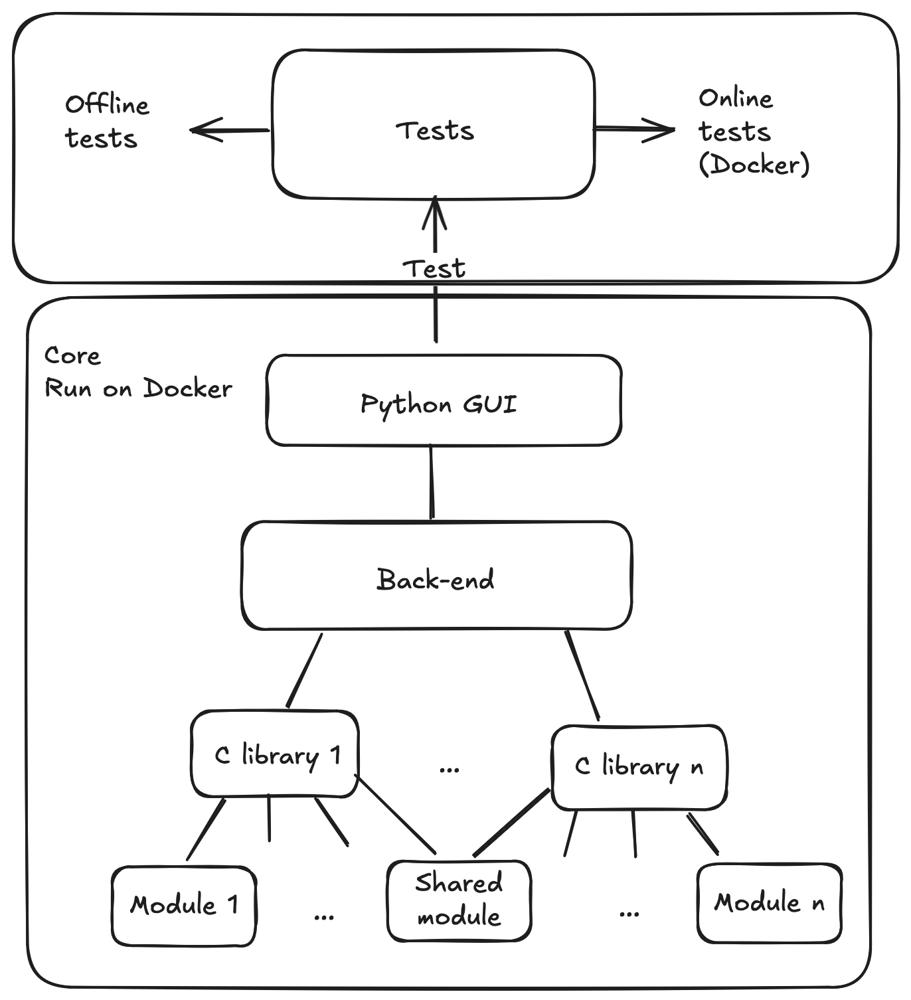

# Gilfi

## ✨ Gilfi is a swiss army knife for Crypto and Pentesting

## 📌 Table of Contents

## Project idea



## Features

### AskGilfi 

> [!NOTE]
> Diese nachfolgenden Commands zeigen, wie der Podman Container für AskGilfi aufgebaut wird. Die Installationsautomatisierung wird im Branch `feature/ask-gilfi` entwickelt.

Podman Ollama Container installieren:
```
podman run -d -v ollama:/root/.ollama -p 11434:11434 --name ollama ollama/ollama
```
Granite pullen:
```
podman exec -it ollama ollama run granite4:350m
```
Anfrage an Granite stellen:
```
curl -X POST http://localhost:11434/api/generate -d '{
  "model": "granite4:350m",
  "prompt": "Erkläre kurz, was ein Large Language Model (LLM) ist.",
  "stream": false
  }'
```
