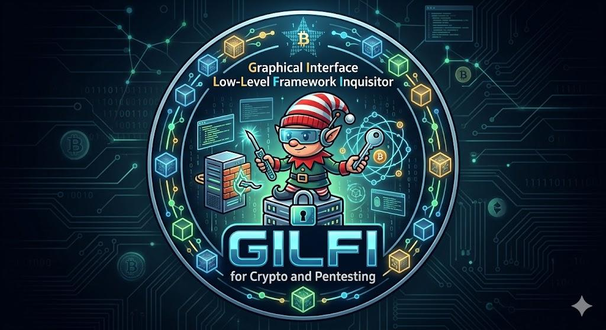

# Gilfi - Security & Network Analysis Toolkit

Gilfi is a comprehensive security and network analysis toolkit with an AI-powered chatbot assistant. It provides various security tools including port scanning, hash cracking, RSA encryption, and network analysis capabilities, all wrapped in a user-friendly PyQt6 interface.



> [!NOTE]
> Gilfi follows a client-server architecture with clear separation between frontend (PyQt6) and backend (FastAPI).

## Table of Contents

- [Features](#features)
- [Architecture](#architecture)
- [Project Structure](#project-structure)
- [Prerequisites](#prerequisites)
- [Quick Start](#quick-start)
- [Backend API](#backend-api)
- [Ask Gilfi AI Assistant](#ask-gilfi-ai-assistant)
- [Testing](#testing)
- [Documentation](#documentation)
- [Development](#development)
- [Docker Deployment](#docker-deployment)
- [License](#license)
- [Troubleshooting](#troubleshooting)

## Features

- **Port Scanner**: Scan network ports to identify open services
- **Network Scanner**: Discover devices on your network
- **Hash Module**: Generate and identify various hash types (MD5, SHA-1, SHA-256, etc.)
- **Hash Cracker**: Advanced password hash cracking with 60+ Hashcat/John the Ripper-inspired transformation rules
- **Password Analyzer & Generator**: Comprehensive password strength analysis and cryptographically secure password generation
- **RSA Encryption**: Encrypt and decrypt messages using RSA cryptography
- **Ask Gilfi**: AI-powered chatbot assistant for security-related questions (powered by Ollama)

## Architecture

Gilfi follows a client-server architecture with clear separation between frontend and backend:

```
┌───────────────────────────────────────────────────────────────┐
│                     Frontend (PyQt6)                          │
│  ┌──────────────┐  ┌──────────────┐  ┌──────────────┐         │
│  │ Main Window  │  │  Tool Pages  │  │ Chat Widget  │         │
│  └──────┬───────┘  └──────┬───────┘  └──────┬───────┘         │
│         │                  │                │                 │
│         └──────────────────┴────────────────┘                 │
│                            │                                  │
│                   ┌────────▼────────┐                         │
│                   │   API Client    │                         │
│                   └────────┬────────┘                         │
└────────────────────────────┼──────────────────────────────────┘
                             │ HTTP/REST
                             │ (localhost:8000)
┌────────────────────────────▼──────────────────────────────────┐
│                    Backend (FastAPI)                          │
│  ┌──────────────────────────────────────────────────────┐     │
│  │              API Server (api_server.py)              │     │
│  └───┬──────────────┬──────────────┬──────────────┬─────┘     │
│      │              │              │              │           │
│  ┌───▼────┐    ┌───▼────┐    ┌───▼────┐       ┌───▼────┐      │
│  │  Hash  │    │Network │    │  RSA   │       │  Chat  │      │
│  │ Module │    │ Module │    │ Module │       │ Module │      │
│  └────────┘    └────────┘    └────────┘       └───┬────┘      │
│                                                   │           │
│                                             ┌─────▼─────┐     │
│                                             │  Ollama   │     │
│                                             │  Service  │     │
│                                             └───────────┘     │
└───────────────────────────────────────────────────────────────┘
```

<details>
<summary><b>Component Overview</b></summary>

### Frontend (PyQt6 GUI)
- User interface with modular tool pages
- API client for backend communication
- Real-time chat interface for AI assistant

### Backend (FastAPI Server)
- RESTful API endpoints for all features
- Modular architecture with independent modules
- Async request handling for better performance

### Hash Module
- Hash generation (MD5, SHA-1, SHA-256, SHA-512, etc.)
- Hash type identification
- Advanced dictionary-based hash cracking with 60+ transformation rules
- Hashcat/John the Ripper-inspired wordlist shuffler
- Performance optimizations (caching, batching, early termination)

### Password Analyzer Module
- Comprehensive password strength analysis (VERY_WEAK to VERY_STRONG)
- Scoring system (0-100) based on multiple security criteria
- Character analysis and pattern detection
- Cryptographically secure password generation
- Customizable password generation options
- Real-time strength feedback

### Network Module
- Network device discovery
- Port scanning with service detection
- Hostname resolution

### Ask Gilfi Module
- Ollama integration for local LLM
- Custom-trained security assistant model
- Context-aware responses

</details>

<details>
<summary><b>Communication Flow</b></summary>

1. User interacts with PyQt6 frontend
2. Frontend sends HTTP requests to FastAPI backend
3. Backend processes requests through appropriate modules
4. Results are returned as JSON responses
5. Frontend displays results to user

</details>

<details>
<summary><b>Deployment Options</b></summary>

- **Development**: Frontend and backend run as separate Python processes
- **Production**: Backend containerized with Docker, frontend runs natively
- **Full Docker**: Both frontend and backend can be containerized (optional)

</details>

## Project Structure

```
Gilfi/
├── src/
│   ├── backend/              # Backend API server
│   │   ├── api_server.py     # FastAPI server
│   │   ├── hash-module/      # Hash generation, identification, and cracking
│   │   ├── networking-module/ # Network and port scanning
│   │   └── ask-gilfi-module/ # AI chatbot with Ollama integration
│   └── frontend/             # PyQt6 GUI application
│       ├── main.py           # Application entry point
│       ├── api_client.py     # Backend API client
│       ├── modules/          # Feature modules
│       └── ui/               # UI components
├── tests/                    # Test suites
├── data/                     # Application data (wordlists, assets)
├── documentation/            # Project documentation
└── docker-compose.backend.yaml # Docker setup for backend
```

## Prerequisites

> [!IMPORTANT]
> Ensure you have Python 3.8+ and a container runtime (Docker or Podman) installed before proceeding.

<details>
<summary><b>Required Software</b></summary>

### 1. Python 3.8 or Higher
- **macOS**: `brew install python3`
- **Linux (Ubuntu/Debian)**: `sudo apt install python3 python3-pip python3-venv`
- **Windows**: Download from [python.org](https://www.python.org/downloads/)

### 2. Container Runtime (choose one)

**Docker (Recommended)**:
- **macOS**: `brew install --cask docker` or download [Docker Desktop](https://www.docker.com/products/docker-desktop)
- **Linux**: `sudo apt install docker.io docker-compose`
- **Windows**: Download [Docker Desktop](https://www.docker.com/products/docker-desktop)

**OR Podman**:
- **macOS**: `brew install podman podman-compose`
- **Linux**: `sudo apt install podman podman-compose`
- **Windows**: Download [Podman Desktop](https://podman.io/getting-started/installation)

### 3. Python Virtual Environment (Recommended)
```bash
python3 -m venv gilfi
source gilfi/bin/activate  # Linux/Mac
# gilfi\Scripts\activate   # Windows
```

</details>

<details>
<summary><b>Python Dependencies</b></summary>

The following packages will be installed via `requirements.txt`:
- PyQt6==6.11.0 (GUI Framework)
- pyqt6_sip==13.11.1 (PyQt6 Support)
- Requests==2.33.1 (HTTP Client)

</details>

<details>
<summary><b>System Requirements</b></summary>

- **RAM**: Minimum 4GB (8GB recommended for AI chatbot)
- **Disk Space**: ~2GB for Ollama models
- **OS**: Linux, macOS, or Windows

</details>

<details>
<summary><b>Port Requirements</b></summary>

The following ports must be available:
- **8000**: Backend API Server
- **11434**: System Ollama (if installed separately)
- **11435**: Local Ollama (Frontend)
- **11436**: Docker Ollama (Backend)

</details>

## Quick Start

> [!TIP]
> Using Docker is the recommended approach for running the backend as it handles all dependencies automatically.

### Option 1: Using Docker (Recommended)

<details>
<summary><b>Step-by-Step Instructions</b></summary>

1. **Start the Backend**:
   ```bash
   # Linux/Mac
   ./backend-docker.sh

   # Windows
   docker-compose -f docker-compose.backend.yaml up --build
   ```

2. **Start the Frontend**:
   ```bash
   # Linux/Mac
   ./run-gilfi.sh

   # Windows
   run-gilfi.bat
   ```

</details>

### Option 2: Manual Setup

<details>
<summary><b>Step-by-Step Instructions</b></summary>

1. **Install Dependencies**:
   ```bash
   pip install -r requirements.txt
   ```

2. **Start the Backend**:
   ```bash
   cd src/backend
   python api_server.py
   ```

3. **Start the Frontend** (in a new terminal):
   ```bash
   cd src/frontend
   python main.py
   ```

</details>

## Backend API

The backend runs on `http://localhost:8000` and provides the following endpoints:

> [!NOTE]
> API documentation is available at `http://localhost:8000/docs` when the backend is running.

<details>
<summary><b>Available Endpoints</b></summary>

### General
- `GET /health` - Health check
- `GET /api/modules` - List available modules

### Hash Module
- `POST /api/hash/generate` - Generate hashes
- `POST /api/hash/identify` - Identify hash types
- `POST /api/hash/crack` - Crack password hashes (with advanced rule-based transformations)

### Password Module
- `POST /api/password/analyze` - Analyze password strength
- `POST /api/password/generate` - Generate secure random passwords

### Network Module
- `POST /api/networking/port_scanner` - Scan ports on a target

### RSA Module
- `POST /api/rsa/encrypt` - RSA encryption/decryption

### AI Assistant
- `POST /api/askgilfi/query` - AI chatbot interactions

</details>

## Ask Gilfi AI Assistant

The AI chatbot uses Ollama with a custom-trained model. The backend automatically manages the Ollama service and model loading. The chatbot can answer security-related questions and provide guidance on using the toolkit.

> [!WARNING]
> First startup may take time as the Ollama service initializes and downloads the model. Ensure you have sufficient system resources (8GB RAM recommended).

## Testing

Run the infrastructure tests:

```bash
# Linux/Mac
cd tests/infrastructure
./run_tests.sh

# Windows
cd tests\infrastructure
run_tests.bat
```

## Documentation

- [Backend README](src/backend/README.md) - Backend architecture and API details
- [Hash Module README](src/backend/hash-module/README.md) - Hash module documentation
- [Test Infrastructure README](tests/infrastructure/README.md) - Testing documentation
- [User Stories](documentation/user-stories/) - Feature requirements and user stories

## Development

<details>
<summary><b>Backend Development</b></summary>

The backend is built with FastAPI and can be run in development mode:

```bash
cd src/backend
uvicorn api_server:app --reload --host 0.0.0.0 --port 8000
```

</details>

<details>
<summary><b>Frontend Development</b></summary>

The frontend uses PyQt6. To run in development mode:

```bash
cd src/frontend
python main.py
```

</details>

## Docker Deployment

The backend can be deployed using Docker:

```bash
docker-compose -f docker-compose.backend.yaml up --build
```

This will:
- Build the backend container
- Start the FastAPI server
- Initialize the Ollama service
- Load the Ask Gilfi AI model

## License

See [LICENSE](LICENSE) file for details.

## Troubleshooting

<details>
<summary><b>Backend won't start</b></summary>

- Ensure port 8000 is not in use
- Check Docker is running (if using Docker)
- Verify all dependencies are installed

</details>

<details>
<summary><b>Frontend can't connect to backend</b></summary>

- Ensure backend is running on `http://localhost:8000`
- Check firewall settings
- Verify API endpoint in `src/frontend/api_client.py`

</details>

<details>
<summary><b>AI chatbot not responding</b></summary>

- Wait for Ollama service to fully initialize (first startup may take time)
- Check backend logs for Ollama status
- Ensure sufficient system resources (RAM/CPU)

</details>

---

> [!TIP]
> For more detailed information, check out the [documentation](documentation/) folder or visit the API docs at `http://localhost:8000/docs` when running the backend.
