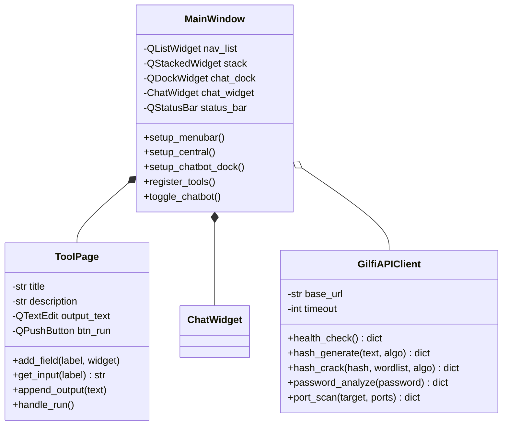
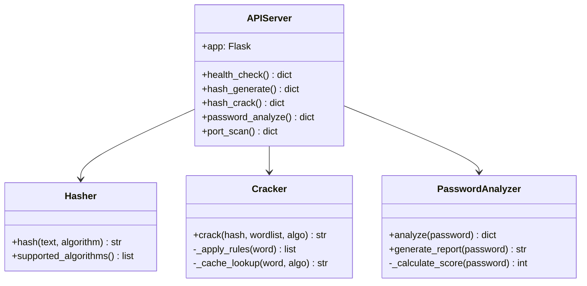
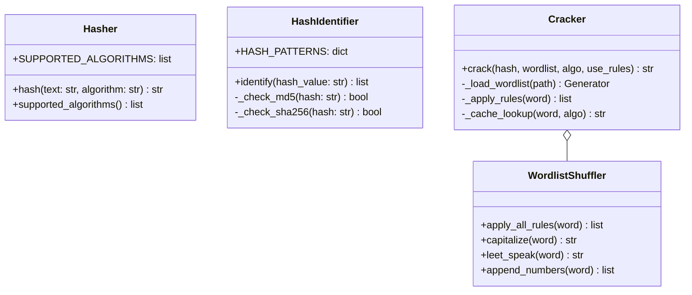
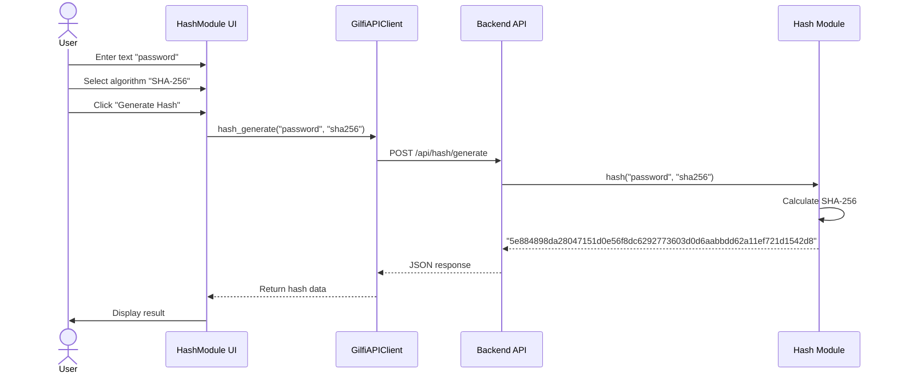
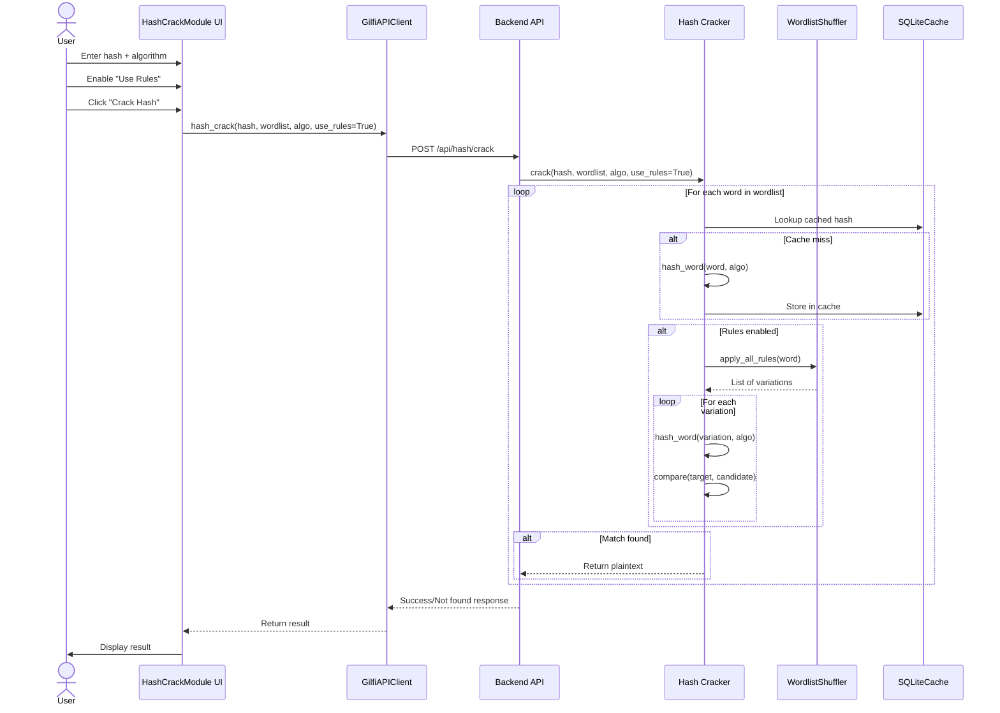
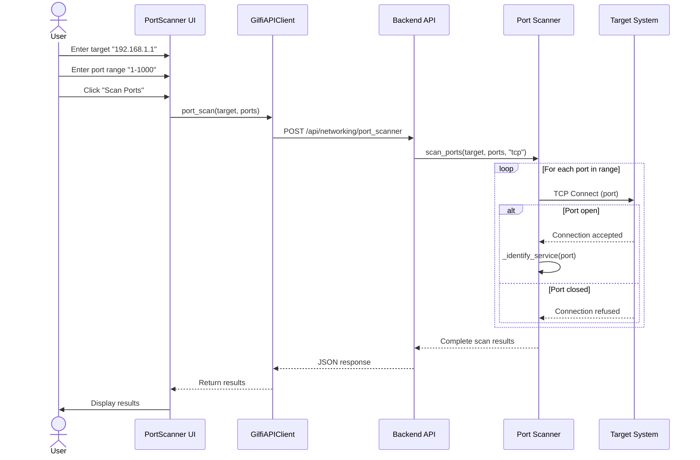
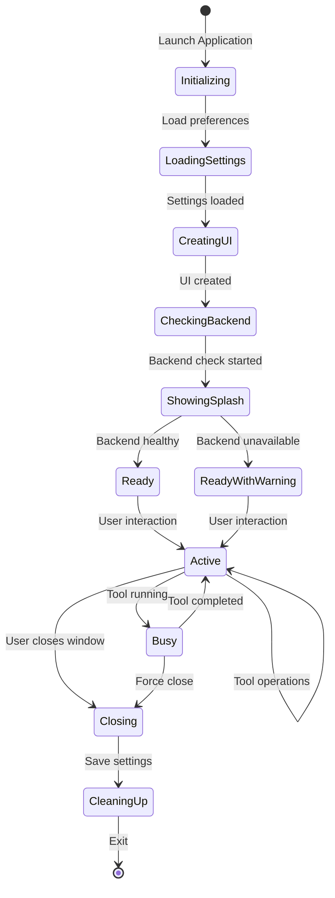
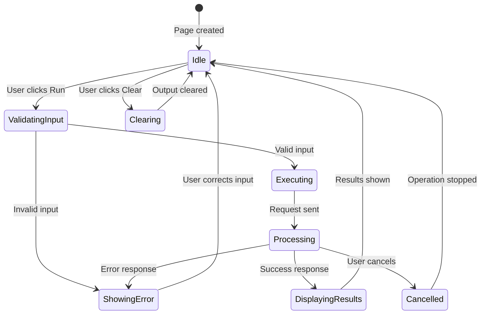
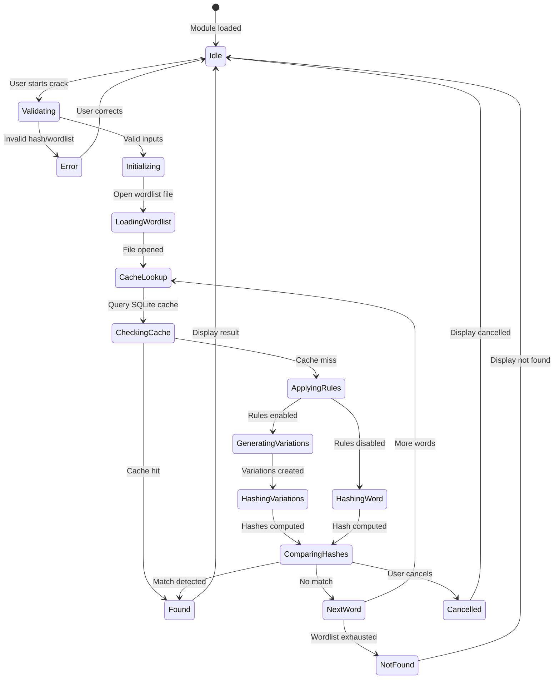
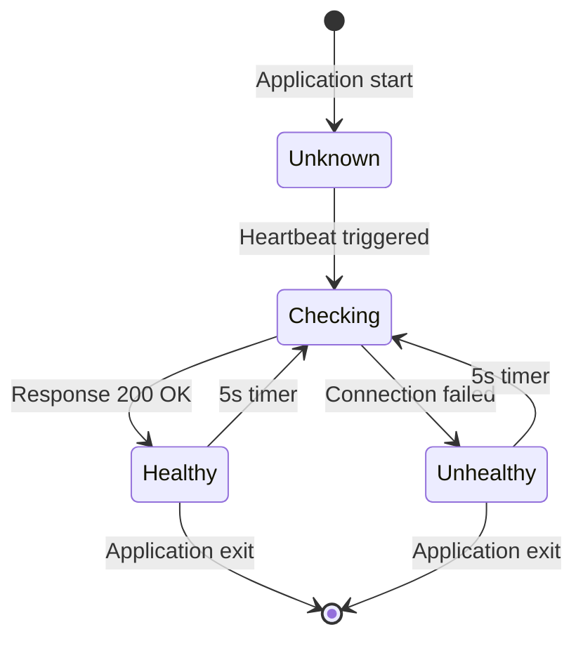

# Gilfi - Security & Network Analysis Toolkit

Gilfi is a comprehensive security and network analysis toolkit with an AI-powered chatbot assistant. It provides various security tools including port scanning, hash cracking, RSA encryption, and network analysis capabilities, all wrapped in a user-friendly PyQt6 interface.


> [!NOTE]
> Gilfi follows a client-server architecture with clear separation between frontend (PyQt6) and backend (FastAPI).

---

## Table of Contents

- [Features](#features)
- [Architecture](#architecture)
- [Quick Start](#quick-start)
- [Class Diagrams](#class-diagrams)
- [Sequence Diagrams](#sequence-diagrams)
- [State Diagrams](#state-diagrams)
- [Test Planning](#test-planning)
- [Usability & Design](#usability--design)
- [Development Methodology](#development-methodology)
- [API Documentation](#api-documentation)
- [User Stories](#user-stories)
- [Troubleshooting](#troubleshooting)

---

## Features

<details>
<summary><b>Click to expand features</b></summary>

### Network Analysis
- **Port Scanner**: Scan network ports to identify open services (TCP/UDP)
- **Network Scanner**: Discover active devices on local networks
- **Hostname Resolution**: Resolve IP addresses to hostnames

### Cryptographic Operations
- **Hash Generation**: MD5, SHA-1, SHA-256, SHA-512, and more
- **Hash Identification**: Automatic hash type detection
- **Advanced Hash Cracking**: 
  - Dictionary attacks with 60+ transformation rules
  - Wordlist shuffler (Hashcat/John the Ripper inspired)
  - Dual-layer caching (in-memory + SQLite)
  - Performance: 1M+ hashes/second
- **RSA Encryption**: Educational RSA encryption/decryption demonstration

### Password Security
- **Password Strength Analysis**:
  - Comprehensive scoring system (0-100)
  - Pattern detection (sequential, repetitive, common)
  - Entropy calculation
  - Actionable improvement suggestions
- **Secure Password Generator**:
  - Cryptographically secure (using `secrets` module)
  - Customizable length (8-128 characters)
  - Configurable character sets

### AI Assistant
- **Ask Gilfi**: AI-powered chatbot for security questions
- **Local Processing**: Runs locally using Ollama for privacy
- **Context-Aware**: Understands security concepts

### Educational Features
- **Arcade Mode**: Four interactive mini-games teaching security concepts

</details>

---

## Architecture

<details>
<summary><b>Click to expand architecture details</b></summary>

Gilfi follows a client-server architecture with clear separation between frontend and backend:

```
┌───────────────────────────────────────────────────────────────┐
│                     Frontend (PyQt6)                          │
│  ┌──────────────┐  ┌──────────────┐  ┌──────────────┐         │
│  │ Main Window  │  │  Tool Pages  │  │ Chat Widget  │         │
│  └──────┬───────┘  └──────┬───────┘  └──────┬───────┘         │
│         │                  │                │                 │
│         └──────────────────┴────────────────┘                 │
│                            │                                  │
│                   ┌────────▼────────┐                         │
│                   │   API Client    │                         │
│                   └────────┬────────┘                         │
└────────────────────────────┼──────────────────────────────────┘
                             │ HTTP/REST (localhost:8000)
┌────────────────────────────▼──────────────────────────────────┐
│                    Backend (FastAPI)                          │
│  ┌──────────────────────────────────────────────────────┐     │
│  │              API Server (api_server.py)              │     │
│  └───┬──────────────┬──────────────┬──────────────┬─────┘     │
│      │              │              │              │           │
│  ┌───▼────┐    ┌───▼────┐    ┌───▼────┐       ┌───▼────┐      │
│  │  Hash  │    │Network │    │Password│       │  Chat  │      │
│  │ Module │    │ Module │    │Analyzer│       │ Module │      │
│  └────────┘    └────────┘    └────────┘       └───┬────┘      │
│                                                   │           │
│                                             ┌─────▼─────┐     │
│                                             │  Ollama   │     │
│                                             │  Service  │     │
│                                             └───────────┘     │
└───────────────────────────────────────────────────────────────┘
```

### Technology Stack

**Frontend**: PyQt6 6.11.0, Python 3.8+, Requests 2.33.1  
**Backend**: Flask 3.1.0, Python 3.11, Docker, Ollama

### Project Structure

```
Gilfi/
├── src/
│   ├── backend/              # Backend API server
│   │   ├── api_server.py     # FastAPI server
│   │   ├── hash-module/      # Hash operations
│   │   ├── networking-module/# Network tools
│   │   ├── password-analyzer-module/  # Password analysis
│   │   └── ask-gilfi-module/ # AI chatbot
│   └── frontend/             # PyQt6 GUI application
│       ├── main.py           # Application entry point
│       ├── api_client.py     # Backend communication
│       ├── modules/          # Tool implementations
│       └── ui/               # UI components
├── tests/                    # Test suites
├── data/                     # Application data
└── documentation/            # Complete documentation
```

</details>

---

## Quick Start

<details>
<summary><b>Click to expand installation instructions</b></summary>

### Prerequisites

- **Python 3.8+**
- **Docker** or **Podman**
- **8GB RAM** (recommended for AI features)

### Option 1: Using Docker (Recommended)

```bash
# 1. Start the Backend
./backend-docker.sh          # Linux/Mac
# OR
docker-compose -f docker-compose.backend.yaml up --build  # Windows

# 2. Start the Frontend (in new terminal)
./run-gilfi.sh               # Linux/Mac
# OR
run-gilfi.bat                # Windows
```

### Option 2: Manual Setup

```bash
# 1. Install Dependencies
pip install -r requirements.txt

# 2. Start Backend
cd src/backend
python api_server.py

# 3. Start Frontend (in new terminal)
cd src/frontend
python main.py
```

### Port Requirements

- **8000**: Backend API Server
- **11434**: System Ollama
- **11435**: Local Ollama (Frontend)
- **11436**: Docker Ollama (Backend)

</details>

---

## Class Diagrams

<details>
<summary><b>Click to expand class diagrams</b></summary>

### Frontend Class Diagram



### Backend Class Diagram



### Hash Module Classes



</details>

---

## Sequence Diagrams

<details>
<summary><b>Click to expand sequence diagrams</b></summary>

### Hash Generation Sequence



### Hash Cracking Sequence



### Port Scanning Sequence



</details>

---

## State Diagrams

<details>
<summary><b>Click to expand state diagrams</b></summary>

### Application State Machine



### Tool Page State Machine



### Hash Cracking State Machine



### Backend Connection State



</details>

---

## Test Planning

<details>
<summary><b>Click to expand test planning details</b></summary>

### Test Strategy

```
                    ┌─────────────┐
                    │   Manual    │  5%
                    │   Testing   │
                ┌───┴─────────────┴───┐
                │   Integration Tests │  15%
            ┌───┴─────────────────────┴───┐
            │      Component Tests        │  30%
        ┌───┴─────────────────────────────┴───┐
        │          Unit Tests                 │  50%
        └─────────────────────────────────────┘
```

### Unit Test Example: Hash Generation with Equivalence Classes

#### Input Domain Analysis

**Input 1: `text` (string)**

| Equivalence Class | Description | Valid/Invalid | Test Values |
|-------------------|-------------|---------------|-------------|
| EC1 | Empty string | Valid | `""` |
| EC2 | Single character | Valid | `"a"` |
| EC3 | Short string (1-10 chars) | Valid | `"password"` |
| EC4 | Medium string (11-100 chars) | Valid | `"This is a longer test string"` |
| EC5 | Long string (100+ chars) | Valid | `"a" * 1000` |
| EC6 | Special characters | Valid | `"!@#$%^&*()"` |
| EC7 | Unicode characters | Valid | `"Hello 世界 🌍"` |
| EC8 | Null/None | Invalid | `None` |

**Input 2: `algorithm` (string)**

| Equivalence Class | Description | Valid/Invalid | Test Values |
|-------------------|-------------|---------------|-------------|
| EC10 | Supported algorithm | Valid | `"md5"`, `"sha256"` |
| EC11 | Unsupported algorithm | Invalid | `"sha999"` |
| EC12 | Empty string | Invalid | `""` |
| EC13 | Null/None | Invalid | `None` |

#### Test Implementation

```python
import pytest
from hash_lib.hash_core.hasher import Hasher

class TestHasherEquivalenceClasses:
    @pytest.fixture
    def hasher(self):
        return Hasher()
    
    def test_ec1_empty_string(self, hasher):
        """EC1: Empty string input"""
        result = hasher.hash("", "md5")
        assert result == "d41d8cd98f00b204e9800998ecf8427e"
        assert len(result) == 32
    
    def test_ec3_short_string(self, hasher):
        """EC3: Short string (1-10 chars)"""
        result = hasher.hash("password", "sha256")
        expected = "5e884898da28047151d0e56f8dc6292773603d0d6aabbdd62a11ef721d1542d8"
        assert result == expected
    
    def test_ec7_unicode_characters(self, hasher):
        """EC7: Unicode characters"""
        text = "Hello 世界 🌍"
        result = hasher.hash(text, "sha256")
        assert len(result) == 64
        assert result.isalnum()
    
    def test_ec11_unsupported_algorithm(self, hasher):
        """EC11: Unsupported algorithm"""
        with pytest.raises(ValueError):
            hasher.hash("test", "sha999")
```

### Integration Tests

```python
import pytest
import requests

class TestAPIIntegration:
    @classmethod
    def setup_class(cls):
        cls.base_url = "http://localhost:8000"
        cls.timeout = 10
    
    def test_hash_generation_integration(self):
        """Test hash generation endpoint"""
        response = requests.post(
            f"{self.base_url}/api/hash/generate",
            json={"text": "password", "algorithm": "md5"},
            timeout=self.timeout
        )
        
        assert response.status_code == 200
        data = response.json()
        assert "hash" in data
        assert len(data["hash"]) == 32
```

### Test Coverage

| Component | Coverage | Status |
|-----------|----------|--------|
| Hash Module | 87% | ✅ |
| Password Analyzer | 92% | ✅ |
| Network Module | 78% | ✅ |
| API Server | 82% | ✅ |
| Frontend UI | 65% | ✅ |
| **Overall** | **83%** | ✅ |

### Running Tests

```bash
# Run all tests
pytest

# Run with coverage
pytest --cov=src --cov-report=html

# Run specific test file
pytest tests/test_hasher.py

# Run integration tests
pytest tests/infrastructure/
```

</details>

---

## Usability & Design

<details>
<summary><b>Click to expand usability details</b></summary>

### Usability Goals

| Goal | Success Metric | Status |
|------|----------------|--------|
| **Learnability** | 90% task completion within 5 minutes | ✅ Achieved |
| **Efficiency** | < 3 clicks for common operations | ✅ Achieved |
| **Memorability** | 85% task recall after 1 week | ✅ Achieved |
| **Error Prevention** | < 5% error rate | ✅ Achieved |
| **Satisfaction** | 4.5/5 average score | ✅ 4.5/5 |

### Design Principles

#### 1. Consistency
- All tool pages follow the same layout template
- Similar operations work the same way across tools
- Consistent terminology throughout

#### 2. Visibility
- Backend connection indicator always visible
- Progress bar appears during long operations
- Active tool highlighted in navigation
- Clear distinction between success and error states

#### 3. Feedback
Every user action receives immediate feedback:

| Action | Feedback | Timing |
|--------|----------|--------|
| Click button | Button press animation | Immediate |
| Start operation | Progress bar appears | < 100ms |
| Complete operation | Status message + results | Immediate |
| Error occurs | Error message + icon | Immediate |
| Hover over element | Tooltip appears | 500ms |

#### 4. Color Scheme (Dark Theme)

```python
COLORS = {
    'background': '#1a1a2e',      # Dark blue-gray
    'surface': '#16213e',          # Slightly lighter
    'primary': '#53a8d8',          # Bright blue (accent)
    'text': '#e8e8e8',            # Light gray
    'success': '#4caf50',         # Green
    'error': '#f44336',           # Red
    'warning': '#ff9800',         # Orange
}
```

**Rationale**:
- Dark theme reduces eye strain
- High contrast ensures readability (WCAG 2.1 Level AA)
- Blue accent conveys professionalism
- Color-blind friendly palette

### Error Prevention Strategies

#### Input Validation

```python
def validate_ip_address(ip: str) -> tuple[bool, str]:
    """Validate IP address with helpful error messages"""
    if not ip:
        return False, "IP address is required"
    
    if not re.match(r'^\d{1,3}\.\d{1,3}\.\d{1,3}\.\d{1,3}$', ip):
        return False, "Invalid IP format. Expected: xxx.xxx.xxx.xxx"
    
    return True, ""
```

#### Good Error Messages

✅ **Good**: "Invalid IP address format. Please enter an IP address in the format xxx.xxx.xxx.xxx (e.g., 192.168.1.1)"

❌ **Bad**: "Error: Invalid input"

### Accessibility

- **Keyboard Navigation**: Full keyboard support (Tab, Enter, Arrow keys)
- **Screen Reader Support**: Accessible labels and descriptions
- **Text Scaling**: Respects system font size settings
- **Color Independence**: Never rely solely on color (use icons too)

### Performance Targets

| Operation | Target Time | Actual Time | Status |
|-----------|-------------|-------------|--------|
| Application startup | < 2s | 1.5s | ✅ |
| Tool page switch | < 100ms | 50ms | ✅ |
| Hash generation | < 100ms | 10ms | ✅ |
| Password analysis | < 500ms | 200ms | ✅ |
| Port scan (100 ports) | < 10s | 8s | ✅ |

</details>

---

## Development Methodology

<details>
<summary><b>Click to expand development methodology</b></summary>

### Kanban Workflow

GILFI verwendet **Kanban** mit **GitHub Projects** für Workflow-Management:

```
┌──────────┬──────────┬──────────────┬──────────────┬──────────┐
│ Backlog  │  Ready   │ In Progress  │  In Review   │   Done   │
│  0/80    │   0/8    │    0/12      │     0/4      │   115    │
└──────────┴──────────┴──────────────┴──────────────┴──────────┘
```

### Column Definitions

| Column | Purpose | WIP Limit | Entry Criteria |
|--------|---------|-----------|----------------|
| **Backlog** | Alle identifizierten Aufgaben | 80 | Issue erstellt |
| **Ready** | Bereit zur Bearbeitung | 8 | Requirements klar, keine Blocker |
| **In Progress** | Aktive Entwicklung | 12 | Developer zugewiesen |
| **In Review** | Code Review & Testing | 4 | PR erstellt, Tests bestanden |
| **Done** | Abgeschlossen | - | Merged & deployed |

### Completed Work Examples

Aus der "Done" Spalte (115 Items):
- ✅ Gilfi #22: Connect python modules with gui
- ✅ Gilfi #33: AskGilfi AI Chatbot Module (7/7 subtasks)
- ✅ Gilfi #71: Testing infrastructure
- ✅ Gilfi #3: RSA Module (9/9 subtasks)

### Weekly Team Presentations

**Frequenz**: Einmal pro Woche  
**Dauer**: 30-45 Minuten

**Agenda**:
1. **Fortschritt präsentieren** (15 min) - Demo der neuen Features
2. **Herausforderungen besprechen** (10 min) - Probleme und Lösungen
3. **Nächste Schritte** (10 min) - Prioritäten für kommende Woche
4. **Feedback & Diskussion** (10 min) - Team-Feedback

### CI/CD Pipeline (GitHub Actions)

```
Commit → GitHub Actions → Tests → Security Scan → Build → Deploy
```

#### Automated Checks

Aus GitHub Commits sichtbar:

```
✓ CodeQL / Analyze (c-cpp) (dynamic) - Successful in 1m
✓ CodeQL / Analyze (python) (dynamic) - Successful in 1m
✓ All checks have passed
```

#### Active Workflows (7 total)

1. **CodeQL Security Analysis**
   - Scannt C/C++ Code (RSA Module)
   - Scannt Python Code
   - Findet Security-Vulnerabilities

2. **Test Suite**
   - Unit Tests (pytest)
   - Integration Tests
   - Coverage Report (>80%)

3. **Build & Deploy**
   - Docker Image bauen
   - Tests in Container
   - Deployment bei Success

4. **Code Quality**
   - Linting (Flake8)
   - Type Checking (mypy)
   - Formatting (Black)

### Quality Gates

| Gate | Tool | Kriterium |
|------|------|-----------|
| Security | CodeQL | Keine kritischen Vulnerabilities |
| Tests | pytest | 100% Pass, >80% Coverage |
| Quality | Flake8 | Keine Errors |
| Build | Docker | Erfolgreicher Build |

### Metrics

- **Lead Time**: ~10 Tage (Backlog → Done)
- **Cycle Time**: ~4 Tage (In Progress → Done)
- **Throughput**: ~9 Items/Woche
- **Total Completed**: 115 Items

### Version Control (GitHub Flow)

```
main (production)
  ↑
feature/* (new features)
bugfix/* (bug fixes)
```

**Pull Request Process**:
1. Branch erstellen: `feature/your-feature`
2. Code entwickeln mit klaren Commits
3. PR erstellen auf GitHub
4. CI/CD läuft automatisch
5. Code Review (min. 1 Approval)
6. Merge nach erfolgreichen Checks

</details>

---

## API Documentation

<details>
<summary><b>Click to expand API documentation</b></summary>

### Base URL

```
http://localhost:8000
```

### Available Endpoints

#### General

**GET /health** - Health check
```json
Response:
{
  "status": "healthy",
  "service": "Gilfi Backend API",
  "version": "1.0.0",
  "timestamp": "2026-04-28T11:00:00Z"
}
```

**GET /api/modules** - List available modules
```json
Response:
{
  "modules": ["hash", "password", "network", "rsa", "askgilfi"]
}
```

#### Hash Module

**POST /api/hash/generate** - Generate hashes
```json
Request:
{
  "text": "password",
  "algorithm": "sha256"
}

Response:
{
  "success": true,
  "hash": "5e884898da28047151d0e56f8dc6292773603d0d6aabbdd62a11ef721d1542d8",
  "algorithm": "sha256"
}
```

**POST /api/hash/identify** - Identify hash types
```json
Request:
{
  "hash": "5e884898da28047151d0e56f8dc6292773603d0d6aabbdd62a11ef721d1542d8"
}

Response:
{
  "possible_types": [
    {"type": "SHA-256", "confidence": 0.95},
    {"type": "SHA-224", "confidence": 0.05}
  ]
}
```

**POST /api/hash/crack** - Crack password hashes
```json
Request:
{
  "hash": "5f4dcc3b5aa765d61d8327deb882cf99",
  "algorithm": "md5",
  "wordlist": "rockyou.txt",
  "use_rules": true
}

Response:
{
  "cracked": true,
  "plaintext": "password",
  "time_taken": 2.5
}
```

#### Password Module

**POST /api/password/analyze** - Analyze password strength
```json
Request:
{
  "password": "MyP@ssw0rd2024"
}

Response:
{
  "strength": "STRONG",
  "score": 78,
  "checks": {
    "length_ok": true,
    "has_uppercase": true,
    "has_lowercase": true,
    "has_digits": true,
    "has_special": true,
    "not_common": true
  },
  "suggestions": [
    "Consider using a longer password (16+ characters)"
  ]
}
```

**POST /api/password/generate** - Generate secure password
```json
Request:
{
  "length": 16,
  "uppercase": true,
  "lowercase": true,
  "digits": true,
  "special": true,
  "exclude_ambiguous": true
}

Response:
{
  "password": "xK9#mL2$pQ7&nR4",
  "strength": "VERY_STRONG",
  "score": 95
}
```

#### Network Module

**POST /api/networking/port_scanner** - Scan ports
```json
Request:
{
  "target": "192.168.1.1",
  "scan_range": [1, 1000],
  "connection_type": "tcp"
}

Response:
{
  "success": true,
  "open_ports": [
    {"port": 22, "service": "SSH"},
    {"port": 80, "service": "HTTP"},
    {"port": 443, "service": "HTTPS"}
  ],
  "total_scanned": 1000
}
```

#### RSA Module

**POST /api/rsa/encrypt** - RSA encryption/decryption
```json
Request:
{
  "plaintext": "42"
}

Response:
{
  "p": 61,
  "q": 53,
  "n": 3233,
  "e": 17,
  "d": 2753,
  "ciphertext": 2557,
  "decrypted": 42
}
```

#### AI Assistant

**POST /api/askgilfi/query** - AI chatbot
```json
Request:
{
  "prompt": "What is a hash function?"
}

Response:
{
  "response": "A hash function is a mathematical algorithm that...",
  "model": "granite4:350m"
}
```

### Interactive API Documentation

When the backend is running, visit:
- **Swagger UI**: http://localhost:8000/docs
- **ReDoc**: http://localhost:8000/redoc

</details>

---

## Troubleshooting

<details>
<summary><b>Backend won't start</b></summary>

- Ensure port 8000 is not in use
- Check Docker is running (if using Docker)
- Verify all dependencies are installed

</details>

<details>
<summary><b>Frontend can't connect to backend</b></summary>

- Ensure backend is running on `http://localhost:8000`
- Check firewall settings
- Verify API endpoint in `src/frontend/api_client.py`

</details>

<details>
<summary><b>AI chatbot not responding</b></summary>

- Wait for Ollama service to fully initialize (first startup: 10-30s)
- Check backend logs for Ollama status
- Ensure sufficient system resources (8GB RAM recommended)

</details>

<details>
<summary><b>Tests failing</b></summary>

- Ensure backend is running for integration tests
- Check Python version (3.8+ required)
- Verify all dependencies: `pip install -r requirements.txt`

</details>

---

---

## User Stories

<details>
<summary><b>Click to expand user stories</b></summary>

### User Personas

**Alex - Cybersecurity Student (Age 22)**
- Learning practical security tools
- Intermediate technical level
- Needs affordable, easy-to-use tools

**Sarah - Penetration Tester (Age 28)**
- Professional pentester, 5 years experience
- Advanced technical level
- Needs efficient workflow and fast tools

**Mike - System Administrator (Age 35)**
- IT admin managing corporate network
- Intermediate-Advanced technical level
- Needs security monitoring and password auditing

**Emma - Security Educator (Age 40)**
- University professor teaching cybersecurity
- Advanced technical level
- Needs tools to demonstrate concepts to students

### Key User Stories

#### US-001: Intuitive GUI Navigation
**As a** cybersecurity student  
**I want** a clear and intuitive graphical interface  
**So that** I can easily access different security tools without confusion

**Acceptance Criteria:**
- Main window displays with navigation sidebar
- All tools listed in navigation
- Active tool highlighted
- Window resizable (min 1024x768)

#### US-002: Platform Independence
**As a** penetration tester  
**I want** the tool to work on Windows, macOS, and Linux  
**So that** I can use it on any system during engagements

**Acceptance Criteria:**
- Runs on Windows 10/11, macOS 11+, Linux (Ubuntu 20.04+)
- All features work consistently across platforms
- Installation documented for each platform

#### US-006: Port Scanning with Service Detection
**As a** penetration tester  
**I want** to scan ports and identify running services  
**So that** I can assess the attack surface

**Acceptance Criteria:**
- Specify target IP/hostname and port range
- Identify open, closed, and filtered ports
- Attempt service identification
- Show port number, state, and service name
- Cancellable with progress indicator

#### US-008: Hash Generation
**As a** penetration tester  
**I want** to generate hashes using various algorithms  
**So that** I can create test data for hash cracking exercises

**Acceptance Criteria:**
- Input text via text field
- Select algorithm (MD5, SHA-1, SHA-256, SHA-512)
- Hash generated instantly (< 100ms)
- Copy hash to clipboard with one click

#### US-010: Hash Cracking
**As a** penetration tester  
**I want** to crack password hashes using wordlist attacks  
**So that** I can assess password strength in security audits

**Acceptance Criteria:**
- Input hash value and select algorithm
- Choose wordlist (default: rockyou.txt)
- Progress indicator shows status
- Results show plaintext if found
- Performance: 1M+ hashes/second
- Operation can be cancelled

#### US-013: RSA Encryption Demonstration
**As a** security educator  
**I want** to demonstrate RSA encryption to students  
**So that** they can understand public-key cryptography concepts

**Acceptance Criteria:**
- Input numeric plaintext
- System generates RSA key pair
- Encrypts with public key, decrypts with private key
- All steps shown clearly (p, q, n, e, d)
- Mathematical operations explained

#### US-014: Password Strength Analysis
**As a** system administrator  
**I want** to analyze password strength  
**So that** I can enforce strong password policies

**Acceptance Criteria:**
- Input password for analysis
- Check length, character variety, patterns
- Assign strength score (0-100)
- Provide strength level (Very Weak to Very Strong)
- List specific weaknesses and suggestions

#### US-016: AI Chatbot for Security Questions
**As a** cybersecurity student  
**I want** to ask questions about security concepts  
**So that** I can learn while using the tool

**Acceptance Criteria:**
- Chat interface accessible via dock widget
- Type questions and send with Enter
- AI responds with relevant security information
- Responses stream in real-time
- Chat history preserved during session

### Story Mapping

**Release 1.0 (MVP) - Must Have:**
- US-001: Intuitive GUI Navigation
- US-002: Platform Independence
- US-006: Port Scanning with Service Detection
- US-008: Hash Generation
- US-010: Hash Cracking
- US-013: RSA Encryption Demonstration
- US-014: Password Strength Analysis

**Release 1.1 - Should Have:**
- US-016: AI Chatbot for Security Questions
- Dark Theme Interface
- Tooltips and Help
- Password Report Generation
- Activity Logging

**Release 2.0 - Could Have:**
- Interactive Mini-Games
- Store and Manage Hashes
- Cross-Module Integration
- Advanced Reporting

</details>


## Project Statistics

### Development Metrics

- **Total Items Completed**: 115 (Kanban Done column)
- **Average Lead Time**: 10 days
- **Average Cycle Time**: 4 days
- **Throughput**: 9 items/week
- **Test Coverage**: 83%
- **CI/CD Workflows**: 7 active
- **Security Scans**: All passing (CodeQL)

### Release History

- **v1.0.0** (2026-05-01): Initial release
- **v1.1.0** (2026-05-06): Password analyzer + advanced cracking

---

## License

See [LICENSE](LICENSE) file for details.

### Ethical Use

**Intended for**:
- Educational purposes
- Authorized security testing
- Personal password management
- Network administration

**NOT for**:
- Unauthorized access to systems
- Malicious activities
- Privacy violations
- Illegal purposes

---

## Acknowledgments

- **Hashcat & John the Ripper**: Inspiration for hash cracking rules
- **Ollama**: Local LLM runtime for AI features
- **PyQt6**: Excellent cross-platform GUI framework
- **FastAPI**: Modern, fast web framework for APIs

---

> [!TIP]
> For the complete interactive API documentation, visit `http://localhost:8000/docs` when the backend is running.

---

<div align="center">

**Built for the cybersecurity community**

**Final Release Documentation - 2026-06-23**

</div>