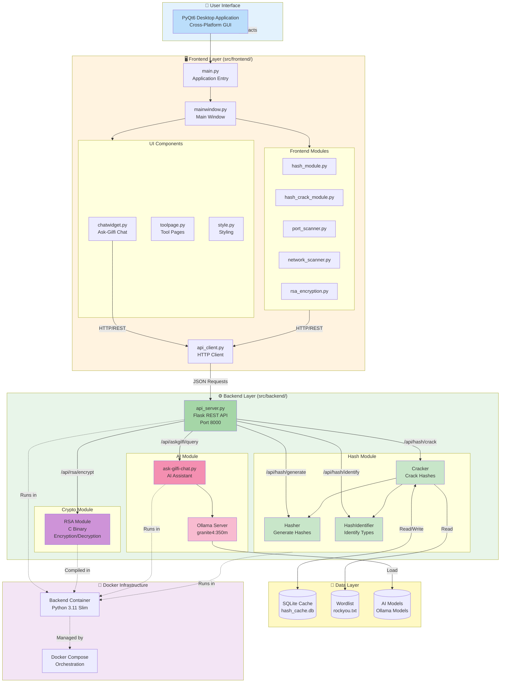
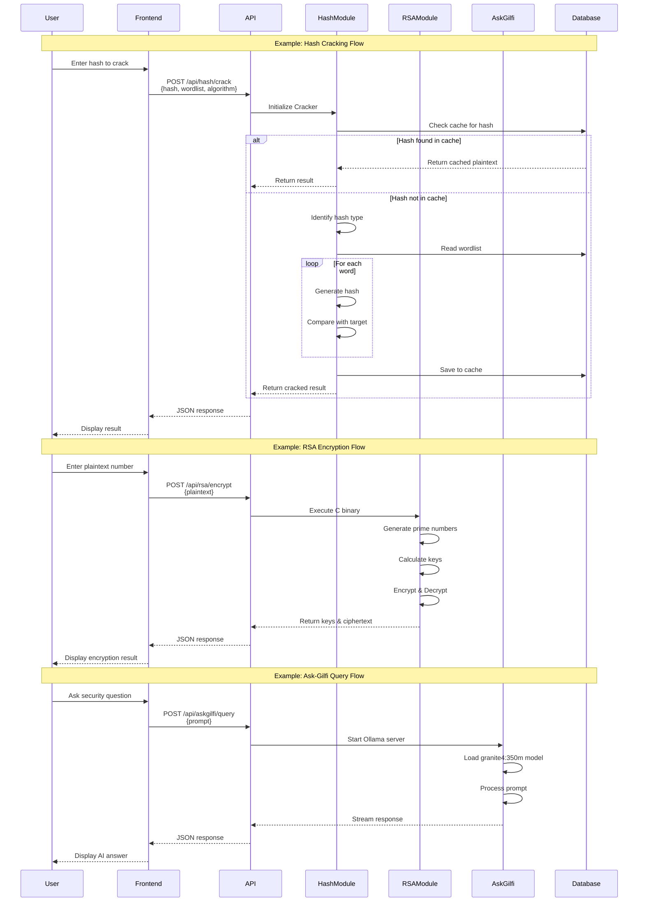
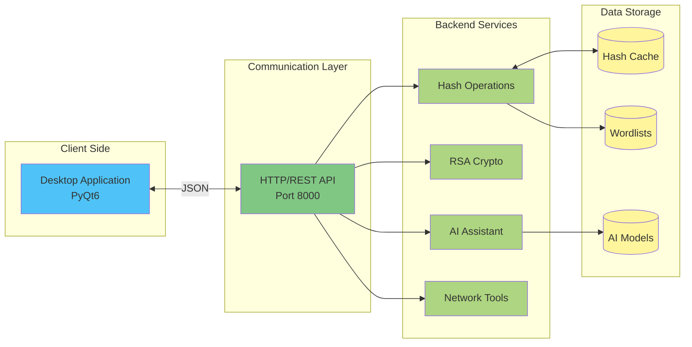
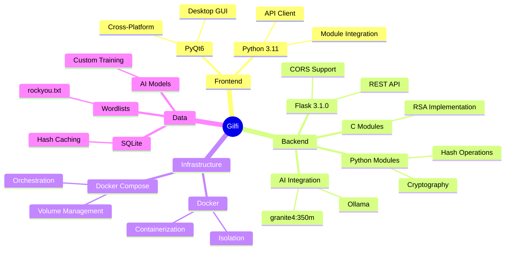

# Gilfi

## ✨ Gilfi is a swiss army knife for Crypto and Pentesting

## 📌 Table of Contents

## Installation

Go to the [Releases](https://github.com/Mr-Robotiko/Gilfi/releases) page of Gilfi.

> [!IMPORTANT]
> You need to have [Podman](https://podman.io/docs/installation) installed in order to install Gilfi. From there, it's easy.

## Project Architecture

### High-Level System Flowchart



### Detailed Data Flow



### Component Interaction Map



### Technology Stack Overview



### Deployment Architecture

```mermaid
flowchart TB
    subgraph Host["Host Machine"]
        subgraph FrontendProc["Frontend Process"]
            GUI[PyQt6 Application<br/>Native Window]
        end
        
        subgraph DockerEnv["Docker Environment"]
            subgraph BackendContainer["Backend Container"]
                Flask[Flask API Server<br/>:8000]
                Hash[Hash Module]
                RSA[RSA Binary]
                AI[Ask-Gilfi + Ollama]
            end
            
            subgraph Volumes["Docker Volumes"]
                DataVol[/app/data<br/>Wordlists]
                ModelsVol[/app/backend/ask-gilfi-module/models<br/>AI Models]
            end
        end
    end
    
    GUI -->|HTTP localhost:8000| Flask
    Flask --> Hash
    Flask --> RSA
    Flask --> AI
    Hash --> DataVol
    AI --> ModelsVol
    
    style Host fill:#e1f5fe
    style FrontendProc fill:#b3e5fc
    style DockerEnv fill:#f3e5f5
    style BackendContainer fill:#e1bee7
    style Volumes fill:#fff9c4
```


### Key Features Flow

1. **Hash Operations**: Generate → Identify → Crack (with caching)
2. **RSA Encryption**: Generate Keys → Encrypt → Decrypt
3. **AI Assistant**: Query → Process → Stream Response
4. **Network Tools**: Scan → Analyze → Report

For detailed class diagrams and technical documentation, see:
- [Backend Architecture](src/backend/README.md)
- [Backend Class Diagrams](documentation/class-diagrams/backend-architecture.md)
- [Frontend Documentation](src/frontend/README.md)

## Features

### AskGilfi 

> [!NOTE]
> The following commands demonstrate how to set up the Podman container for AskGilfi. The installation automation is being developed in the branch `feature/ask-gilfi`.

Install Podman Ollama Container:
```
podman run -d -v ollama:/root/.ollama -p 11434:11434 --name ollama ollama/ollama
```
Pull Granite:
```
podman exec -it ollama ollama run granite4:350m
```
Send request to Granite:
```
curl -X POST http://localhost:11434/api/generate -d '{
  "model": "granite4:350m",
  "prompt": "Erkläre kurz, was ein Large Language Model (LLM) ist.",
  "stream": false
  }'
```

## Architecture Diagram

```
┌─────────────────────────────────────┐
│         Frontend (Local)            │
│                                     │
│  ┌──────────────────────────────┐   │
│  │   PyQt6 GUI Application      │   │
│  │   (src/frontend/main.py)     │   │
│  └──────────────┬───────────────┘   │
│                 │                   │
│  ┌──────────────▼───────────────┐   │
│  │   API Client                 │   │
│  │   (src/frontend/api_client.py)│  │
│  └──────────────┬───────────────┘   │
└─────────────────┼───────────────────┘
                  │ HTTP/REST
                  │ (localhost:8000)
┌─────────────────▼───────────────────┐
│    Backend (Docker Container)       │
│                                     │
│  ┌──────────────────────────────┐   │
│  │   Flask REST API Server      │   │
│  │   (src/backend/api_server.py)│   │
│  └──────────────┬───────────────┘   │
│                 │                   │
│  ┌──────────────▼───────────────┐   │
│  │   Backend Modules:           │   │
│  │   • Hash Module (Python)     │   │
│  │   • RSA Module (C)           │   │
│  │   • Ask-Gilfi (Python+Ollama)│   │
│  └──────────────────────────────┘   │
└─────────────────────────────────────┘
```