# Gilfi - System Architecture Documentation

## Document Information
- **Version**: 1.0
- **Date**: 2026-04-28
- **Status**: Active
- **Authors**: Gilfi Development Team

## Table of Contents
1. [Architecture Overview](#architecture-overview)
2. [System Context](#system-context)
3. [Container Architecture](#container-architecture)
4. [Component Architecture](#component-architecture)
5. [Class Diagrams](#class-diagrams)
6. [Sequence Diagrams](#sequence-diagrams)
7. [Deployment Architecture](#deployment-architecture)
8. [Data Flow](#data-flow)
9. [Technology Stack](#technology-stack)

---

## 1. Architecture Overview

### 1.1 Architecture Style
Gilfi follows a **Client-Server Architecture** with the following characteristics:
- **Separation of Concerns**: Frontend (presentation) and backend (business logic) are independent
- **RESTful Communication**: HTTP/JSON for all client-server interactions
- **Modular Design**: Each security tool is an independent, pluggable module
- **Containerization**: Backend runs in Docker for consistent deployment

### 1.2 Architecture Principles
1. **Modularity**: Each component has a single, well-defined responsibility
2. **Loose Coupling**: Components interact through well-defined interfaces
3. **High Cohesion**: Related functionality is grouped together
4. **Scalability**: Architecture supports horizontal scaling
5. **Testability**: Components can be tested independently
6. **Maintainability**: Clear structure facilitates updates and bug fixes

### 1.3 Quality Attributes
- **Performance**: Response time < 2s for most operations
- **Reliability**: 99%+ uptime for backend services
- **Usability**: Intuitive interface requiring minimal training
- **Security**: Input validation, no sensitive data exposure
- **Portability**: Cross-platform support (Windows, macOS, Linux)

---

## 2. System Context

### 2.1 System Context Diagram

```
┌─────────────────────────────────────────────────────────────────┐
│                        External Context                         │
└─────────────────────────────────────────────────────────────────┘

    ┌──────────────┐                                ┌──────────────┐
    │   End User   │                                │   Network    │
    │  (Student,   │                                │  (Target     │
    │  Pentester,  │                                │   Systems)   │
    │   SysAdmin)  │                                │              │
    └──────┬───────┘                                └──────┬───────┘
           │                                               │
           │ Uses GUI                                      │ Scans
           │                                               │
    ┌──────▼───────────────────────────────────────────────▼──────┐
    │                                                             │
    │                    Gilfi Security Toolkit                   │
    │                                                             │
    │  ┌─────────────────┐              ┌─────────────────┐       │
    │  │    Frontend     │◄────REST────►│     Backend     │       │
    │  │  (PyQt6 GUI)    │   API/JSON   │  (Flask API)    │       │
    │  └─────────────────┘              └─────────────────┘       │
    │                                                             │
    └───────────────────────────┬─────────────────────────────────┘
                                │
                                │ Uses
                                │
                    ┌───────────▼──────────┐
                    │   Ollama Service     │
                    │  (Local LLM for AI)  │
                    └──────────────────────┘
```

### 2.2 External Interfaces

#### User Interface
- **Type**: Graphical User Interface (GUI)
- **Technology**: PyQt6
- **Access**: Local desktop application
- **Users**: Students, penetration testers, system administrators, educators

#### Network Interface
- **Type**: TCP/IP networking
- **Protocols**: ICMP (ping), TCP (port scanning), DNS
- **Access**: Local network and internet
- **Purpose**: Network discovery and port scanning

#### AI Service Interface
- **Type**: HTTP REST API
- **Technology**: Ollama
- **Access**: localhost:11435
- **Purpose**: AI-powered chatbot responses

---

## 3. Container Architecture

### 3.1 Container Diagram

```
┌────────────────────────────────────────────────────────────────────┐
│                         User's Computer                            │
│                                                                    │
│  ┌───────────────────────────────────────────────────────────────┐ │
│  │                    Frontend Container                         │ │
│  │                   (Native Application)                        │ │
│  │                                                               │ │
│  │  ┌────────────┐  ┌────────────┐  ┌────────────┐               │ │
│  │  │    Main    │  │    UI      │  │   Modules  │               │ │
│  │  │   Window   │  │ Components │  │  (Tools)   │               │ │
│  │  └─────┬──────┘  └────────────┘  └────────────┘               │ │
│  │        │                                                      │ │
│  │        │         ┌────────────┐                               │ │
│  │        └────────►│API Client  │                               │ │
│  │                  └─────┬──────┘                               │ │
│  └────────────────────────┼──────────────────────────────────────┘ │
│                           │ HTTP/REST                              │
│                           │ localhost:8000                         │
│  ┌────────────────────────▼──────────────────────────────────────┐ │
│  │                    Backend Container                          │ │
│  │                   (Docker Container)                          │ │
│  │                                                               │ │
│  │  ┌────────────┐  ┌────────────┐  ┌────────────┐               │ │
│  │  │   Flask    │  │   Hash     │  │  Network   │               │ │
│  │  │ API Server │──┤   Module   │  │   Module   │               │ │
│  │  └─────┬──────┘  └────────────┘  └────────────┘               │ │
│  │        │                                                      │ │
│  │        │         ┌────────────┐  ┌────────────┐               │ │
│  │        └────────►│  Password  │  │    RSA     │               │ │
│  │                  │  Analyzer  │  │   Module   │               │ │
│  │                  └────────────┘  └────────────┘               │ │
│  │                                                               │ │
│  │                  ┌────────────┐                               │ │
│  │                  │ Ask-Gilfi  │                               │ │
│  │                  │   Module   │                               │ │
│  │                  └─────┬──────┘                               │ │
│  └────────────────────────┼──────────────────────────────────────┘ │
│                           │ HTTP                                   │
│                           │ localhost:11436                        │
│  ┌────────────────────────▼──────────────────────────────────────┐ │
│  │                  Ollama Container                             │ │
│  │                 (Optional, for AI)                            │ │
│  │                                                               │ │
│  │  ┌────────────┐  ┌────────────┐                               │ │
│  │  │   Ollama   │  │   Custom   │                               │ │
│  │  │   Server   │──┤   Model    │                               │ │
│  │  └────────────┘  │ (granite4) │                               │ │
│  │                  └────────────┘                               │ │
│  └───────────────────────────────────────────────────────────────┘ │
│                                                                    │
└────────────────────────────────────────────────────────────────────┘
```

### 3.2 Container Responsibilities

#### Frontend Container (Native Application)
- **Technology**: Python 3.8+, PyQt6
- **Responsibilities**:
  - User interface rendering
  - User input validation
  - API request orchestration
  - Result visualization
  - Local state management
- **Communication**: HTTP REST to backend

#### Backend Container (Docker)
- **Technology**: Python 3.11, Flask
- **Responsibilities**:
  - API endpoint handling
  - Business logic execution
  - Module orchestration
  - Data processing
  - Error handling
- **Communication**: HTTP REST from frontend, HTTP to Ollama

#### Ollama Container (Optional)
- **Technology**: Ollama runtime, granite4:350m model
- **Responsibilities**:
  - LLM inference
  - Natural language processing
  - Security knowledge responses
- **Communication**: HTTP REST from backend

---

## 4. Component Architecture

### 4.1 Frontend Components

```
┌─────────────────────────────────────────────────────────────────┐
│                        Frontend Layer                           │
├─────────────────────────────────────────────────────────────────┤
│                                                                 │
│  ┌────────────────────────────────────────────────────────────┐ │
│  │                      main.py                               │ │
│  │                 (Application Entry)                        │ │
│  └────────────────────────┬───────────────────────────────────┘ │
│                           │                                     │
│  ┌────────────────────────▼───────────────────────────────────┐ │
│  │                   MainWindow                               │ │
│  │              (QMainWindow subclass)                        │ │
│  │                                                            │ │
│  │  - Navigation sidebar (QListWidget)                        │ │
│  │  - Content area (QStackedWidget)                           │ │
│  │  - Menu bar                                                │ │
│  │  - Status bar                                              │ │
│  │  - Chatbot dock (QDockWidget)                              │ │
│  └───┬─────────────────┬─────────────────┬────────────────────┘ │
│      │                 │                 │                      │
│  ┌───▼────────┐   ┌────▼─────┐   ┌───────▼─────┐                │
│  │  ToolPage  │   │ChatWidget│   │ api_client  │                │
│  │ (Template) │   │ (AI Chat)│   │(HTTP Client)│                │
│  └───┬────────┘   └──────────┘   └──────┬──────┘                │
│      │                                  │                       │
│  ┌───▼──────────────────────────────────▼────────────────────┐  │
│  │                    Tool Modules                           │  │
│  │                                                           │  │
│  │  ┌──────────┐  ┌──────────┐  ┌──────────┐  ┌──────────┐   │  │
│  │  │ Network  │  │   Port   │  │   Hash   │  │   RSA    │   │  │
│  │  │ Scanner  │  │ Scanner  │  │  Module  │  │ Encrypt  │   │  │
│  │  └──────────┘  └──────────┘  └──────────┘  └──────────┘   │  │
│  │                                                           │  │
│  │  ┌──────────┐  ┌──────────┐                               │  │
│  │  │   Hash   │  │  Arcade  │                               │  │
│  │  │  Crack   │  │  (Games) │                               │  │
│  │  └──────────┘  └──────────┘                               │  │
│  └───────────────────────────────────────────────────────────┘  │ 
│                                                                 │
└─────────────────────────────────────────────────────────────────┘
```

### 4.2 Backend Components

```
┌─────────────────────────────────────────────────────────────────┐
│                        Backend Layer                            │
├─────────────────────────────────────────────────────────────────┤
│                                                                 │
│  ┌────────────────────────────────────────────────────────────┐ │
│  │                   api_server.py                            │ │
│  │                  (Flask Application)                       │ │
│  │                                                            │ │
│  │  - Route handlers                                          │ │
│  │  - Request validation                                      │ │
│  │  - Response formatting                                     │ │
│  │  - Error handling                                          │ │
│  │  - CORS configuration                                      │ │
│  └───┬─────────────┬────────────┬─────────────┬───────────────┘ │
│      │             │            │             │                 │
│  ┌───▼────────┐ ┌──▼──────┐ ┌───▼────────┐ ┌──▼──────────┐      │
│  │   Hash     │ │Network  │ │ Password   │ │ Ask-Gilfi   │      │
│  │  Module    │ │ Module  │ │  Analyzer  │ │   Module    │      │
│  └───┬────────┘ └──┬──────┘ └───┬────────┘ └──┬──────────┘      │
│      │             │            │             │                 │
│  ┌───▼────────────────────────────────────────▼──────────────┐  │
│  │                    hash_lib Package                       │  │
│  │                                                           │  │
│  │  ┌──────────┐  ┌───────────┐  ┌──────────┐                │  │
│  │  │  Hasher  │  │Identifier │  │ Cracker  │                │  │
│  │  │ (hash_   │  │ (hash_    │  │ (hash_   │                │  │
│  │  │  core)   │  │identifier)│  │ cracker) │                │  │
│  │  └──────────┘  └───────────┘  └──────────┘                │  │
│  └───────────────────────────────────────────────────────────┘  │
│                                                                 │
│  ┌────────────────────────────────────────────────────────────┐ │
│  │                 password_lib Package                       │ │
│  │                                                            │ │
│  │  ┌───────────────────────────────────────────────────────┐ │ │
│  │  │              PasswordAnalyzer                         │ │ │
│  │  │  - analyze()                                          │ │ │
│  │  │  - generate_report()                                  │ │ │
│  │  │  - Pattern detection (regex)                          │ │ │
│  │  └───────────────────────────────────────────────────────┘ │ │
│  └────────────────────────────────────────────────────────────┘ │
│                                                                 │
│  ┌────────────────────────────────────────────────────────────┐ │
│  │                   RSA Module (C)                           │ │
│  │                                                            │ │
│  │  - Prime generation                                        │ │
│  │  - Key pair generation                                     │ │
│  │  - Encryption/Decryption                                   │ │
│  │  - Modular exponentiation                                  │ │
│  └────────────────────────────────────────────────────────────┘ │
│                                                                 │
└─────────────────────────────────────────────────────────────────┘
```

---

## 5. Class Diagrams

### 5.1 Frontend Class Diagram

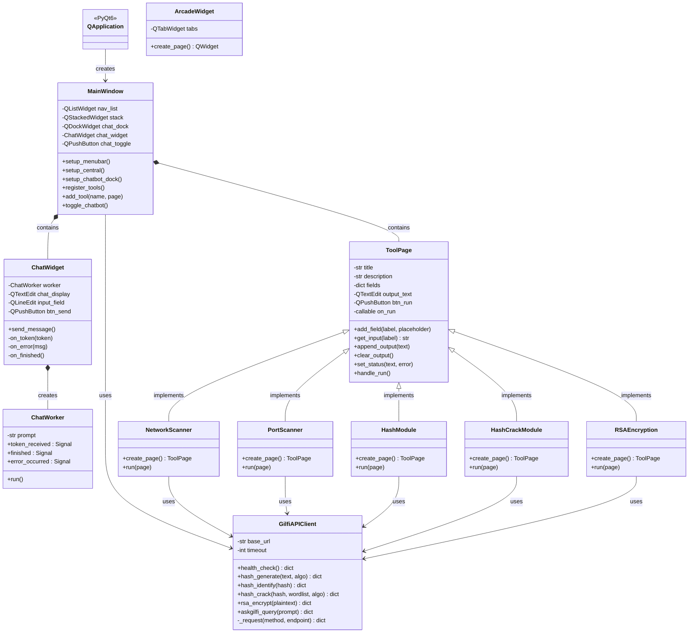

### 5.2 Backend Class Diagram

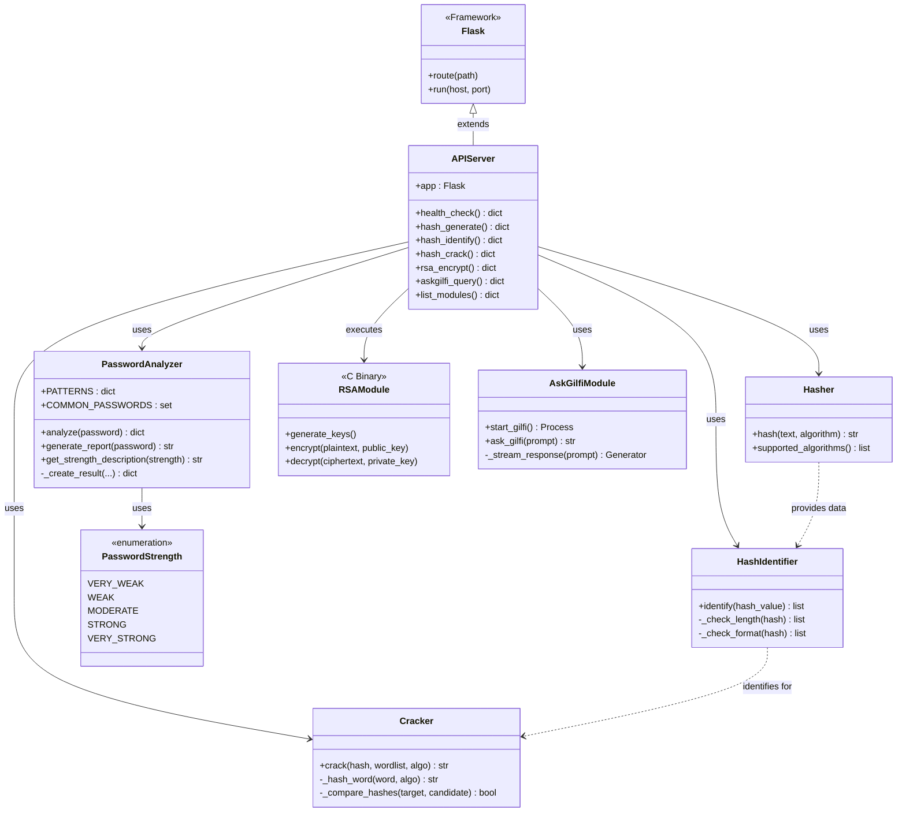

### 5.3 Hash Module Class Diagram (Detailed)

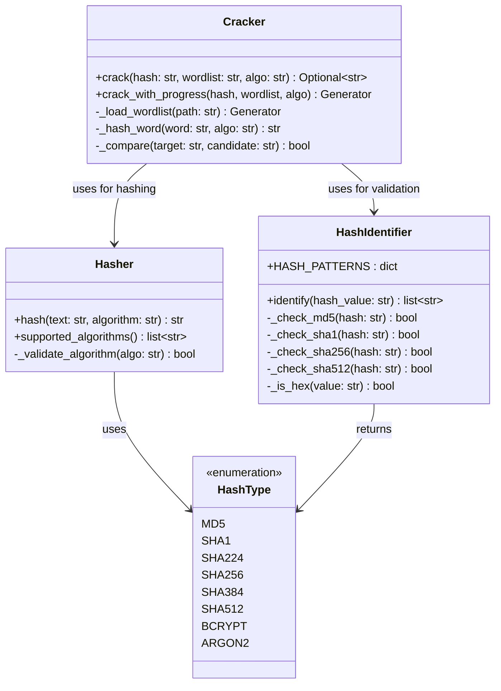

---

## 6. Sequence Diagrams

### 6.1 Hash Generation Sequence

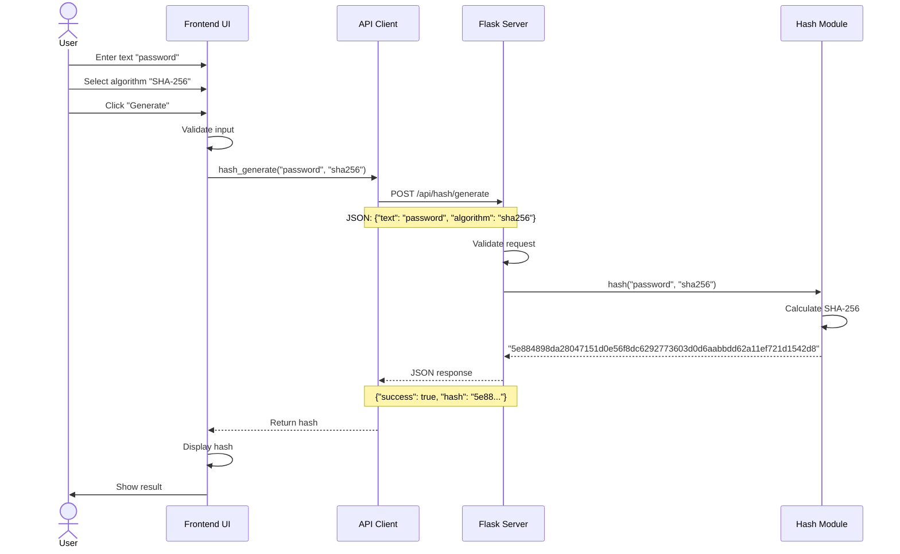

### 6.2 Hash Cracking Sequence

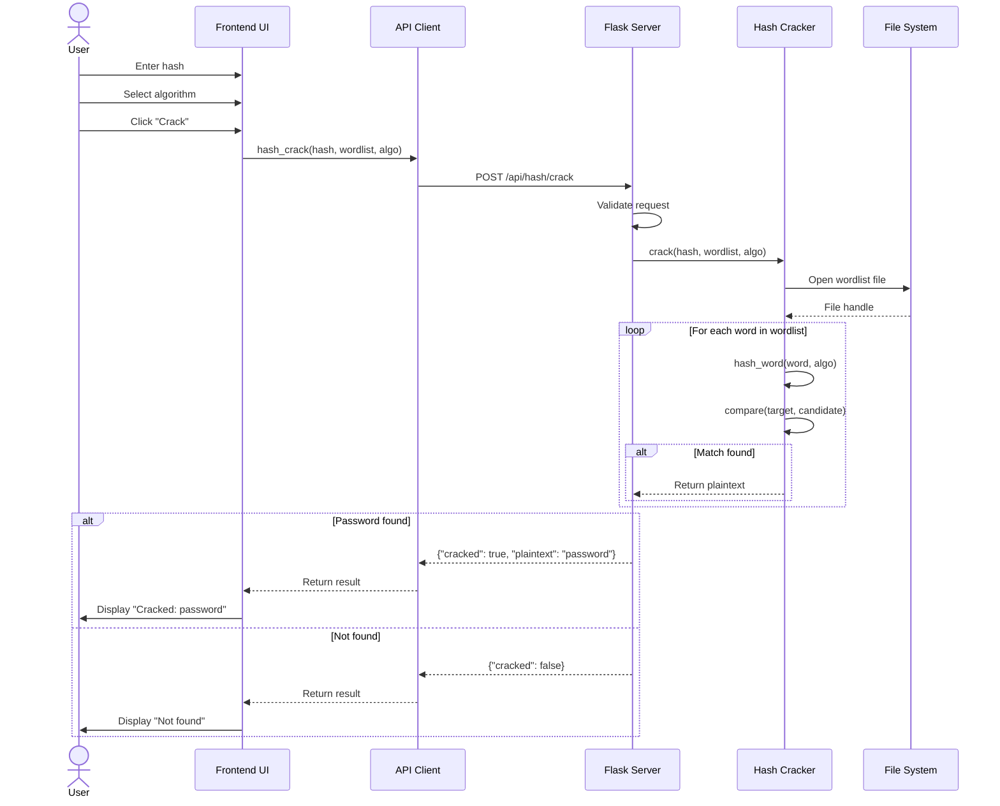

### 6.3 Port Scanning Sequence

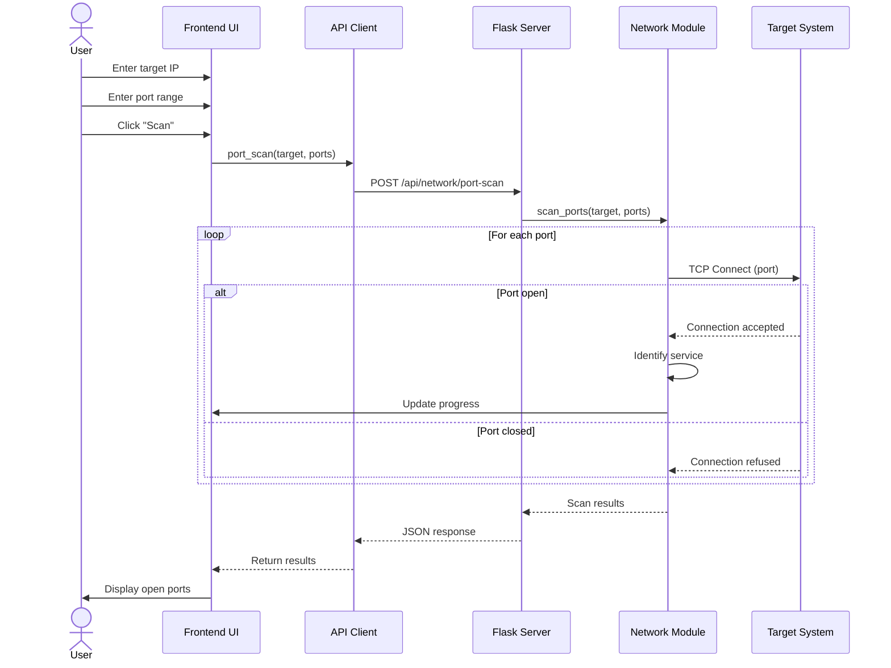

### 6.4 AI Chatbot Interaction Sequence

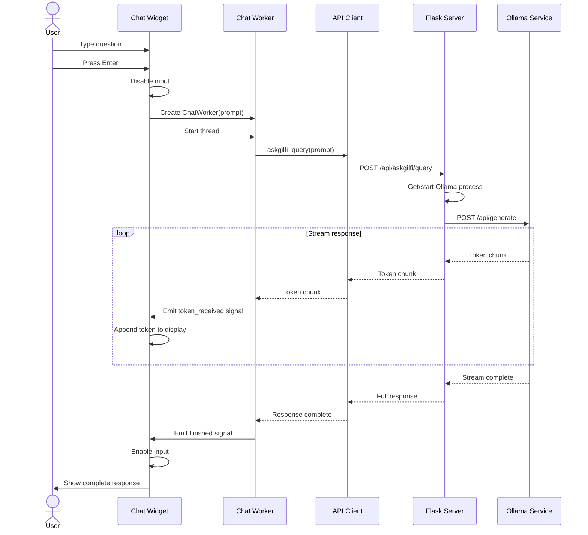

### 6.5 Password Analysis Sequence

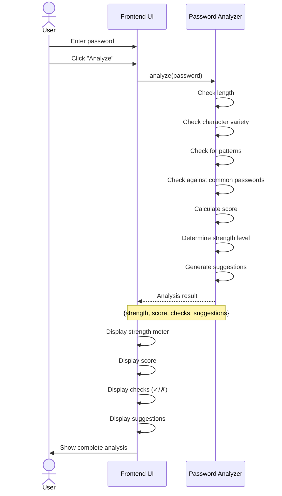

---

## 7. Deployment Architecture

### 7.1 Development Deployment

```
┌─────────────────────────────────────────────────────────────┐
│                    Developer Machine                        │
│                                                             │
│  ┌────────────────────────────────────────────────────────┐ │
│  │  Frontend (Native)                                     │ │
│  │  python src/frontend/main.py                           │ │
│  │  Port: N/A (native GUI)                                │ │
│  └────────────────────┬───────────────────────────────────┘ │
│                       │ HTTP                                │
│                       │ localhost:8000                      │
│  ┌────────────────────▼───────────────────────────────────┐ │
│  │  Backend (Native or Docker)                            │ │
│  │  python src/backend/api_server.py                      │ │
│  │  OR: docker-compose up                                 │ │
│  │  Port: 8000                                            │ │
│  └────────────────────┬───────────────────────────────────┘ │
│                       │ HTTP                                │
│                       │ localhost:11436                     │
│  ┌────────────────────▼───────────────────────────────────┐ │
│  │  Ollama (Optional)                                     │ │
│  │  ollama serve                                          │ │
│  │  Port: 11436                                           │ │
│  └────────────────────────────────────────────────────────┘ │
└─────────────────────────────────────────────────────────────┘
```

### 7.2 Production Deployment

```
┌─────────────────────────────────────────────────────────────┐
│                      User Machine                           │
│                                                             │
│  ┌────────────────────────────────────────────────────────┐ │
│  │  Frontend (Installed Application)                      │ │
│  │  Gilfi.exe / Gilfi.app / gilfi                         │ │
│  └────────────────────┬───────────────────────────────────┘ │
│                       │ HTTP                                │
│                       │ localhost:8000                      │
│  ┌────────────────────▼───────────────────────────────────┐ │
│  │  Backend (Docker Container)                            │ │
│  │  gilfi-backend:latest                                  │ │
│  │  - Auto-starts on system boot                          │ │
│  │  - Health monitoring                                   │ │
│  │  - Auto-restart on failure                             │ │
│  │  Port: 8000                                            │ │
│  │                                                        │ │
│  │  Includes:                                             │ │
│  │  - Flask API Server                                    │ │
│  │  - All security modules                                │ │
│  │  - Ollama service                                      │ │
│  │  - Wordlist data                                       │ │
│  └────────────────────────────────────────────────────────┘ │
└─────────────────────────────────────────────────────────────┘
```

### 7.3 Deployment Diagram

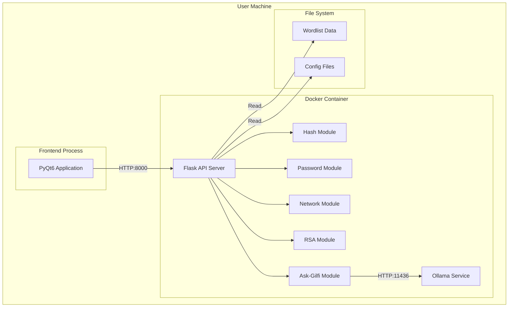

---

## 8. Data Flow

### 8.1 Request-Response Flow

```
User Input → Frontend Validation → API Client → HTTP Request →
Backend Validation → Module Processing → Response Generation →
HTTP Response → API Client → Frontend Display → User Output
```

### 8.2 Data Flow Diagram

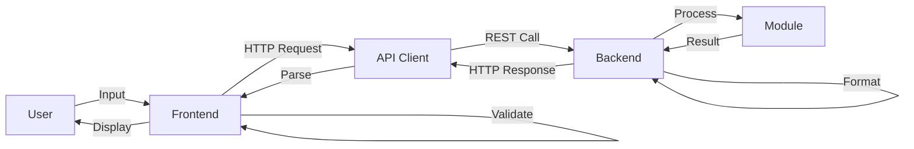

### 8.3 Error Flow

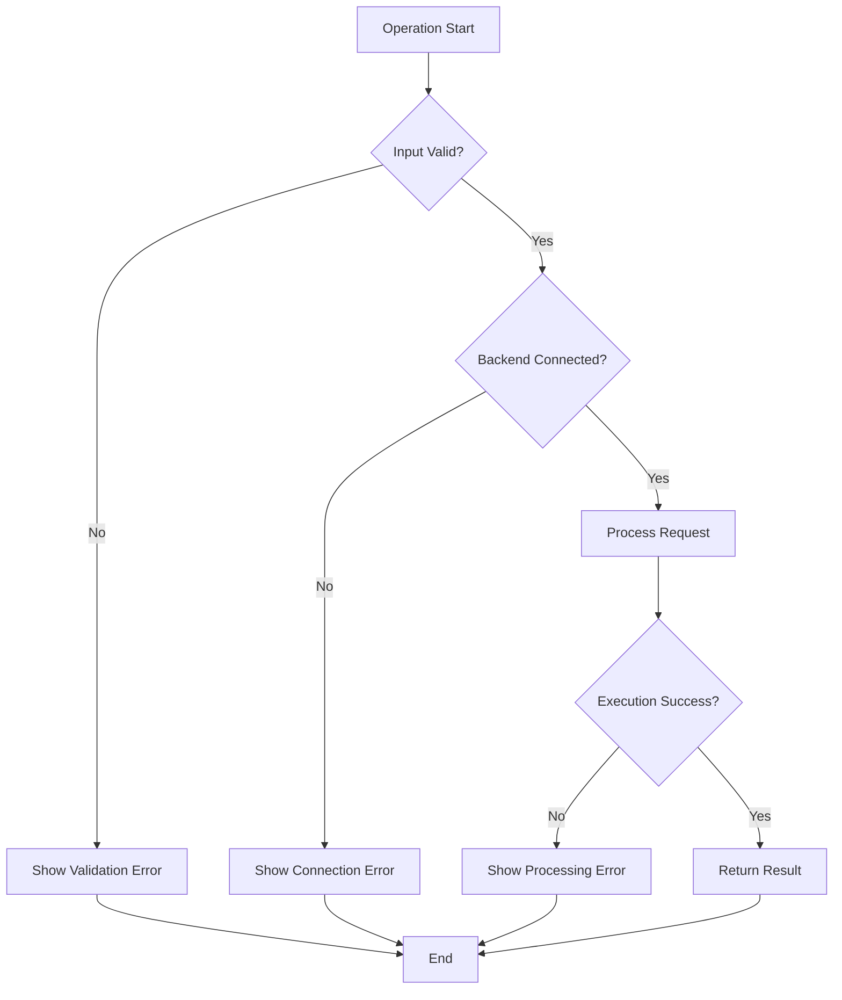

---

## 9. Technology Stack

### 9.1 Frontend Stack

| Layer | Technology | Version | Purpose |
|-------|-----------|---------|---------|
| GUI Framework | PyQt6 | 6.11.0 | User interface |
| Language | Python | 3.8+ | Application logic |
| HTTP Client | Requests | 2.33.1 | API communication |
| Threading | QThread | Built-in | Async operations |
| Styling | QSS | Built-in | UI theming |

### 9.2 Backend Stack

| Layer | Technology | Version | Purpose |
|-------|-----------|---------|---------|
| Web Framework | Flask | 3.1.0 | REST API |
| Language | Python | 3.11 | Business logic |
| CORS | Flask-CORS | Latest | Cross-origin support |
| Cryptography | hashlib | Built-in | Hash operations |
| Networking | socket | Built-in | Network operations |
| AI Runtime | Ollama | Latest | LLM inference |

### 9.3 Infrastructure Stack

| Component | Technology | Purpose |
|-----------|-----------|---------|
| Container Runtime | Docker/Podman | Backend deployment |
| Base Image | python:3.11-slim | Container base |
| Orchestration | Docker Compose | Multi-container setup |
| Build Tool | GCC | RSA module compilation |

### 9.4 Development Stack

| Tool | Purpose |
|------|---------|
| Git | Version control |
| pytest | Unit testing |
| Black | Code formatting |
| Flake8 | Linting |
| mypy | Type checking |

---

## 10. Architecture Decisions

### 10.1 Key Decisions

#### Decision 1: Client-Server Architecture
**Rationale**: Separates concerns, enables independent scaling, facilitates testing

#### Decision 2: RESTful API
**Rationale**: Standard protocol, language-agnostic, easy to test and document

#### Decision 3: Docker Containerization
**Rationale**: Consistent deployment, dependency isolation, easy distribution

#### Decision 4: Modular Backend
**Rationale**: Independent development, easy testing, flexible deployment

#### Decision 5: PyQt6 for GUI
**Rationale**: Cross-platform, native look, rich widget set, Python integration

### 10.2 Trade-offs

| Decision | Advantages | Disadvantages |
|----------|-----------|---------------|
| Client-Server | Scalability, separation | Network dependency |
| Docker Backend | Consistency, isolation | Overhead, complexity |
| Python | Rapid development, libraries | Performance vs compiled |
| Local AI | Privacy, offline | Resource intensive |

---

**Document Version**: 1.0  
**Last Updated**: 2026-04-28  
**Next Review**: 2026-05-28