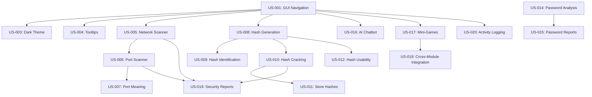

# Gilfi - User Stories

## Document Information
- **Version**: 1.0
- **Date**: 2026-04-28
- **Status**: Active

## Table of Contents
1. [Introduction](#introduction)
2. [User Personas](#user-personas)
3. [Epic Stories](#epic-stories)
4. [Detailed User Stories](#detailed-user-stories)
5. [Story Mapping](#story-mapping)

---

## 1. Introduction

This document contains user stories for the Gilfi Security & Network Analysis Toolkit. Each story follows the format:

**As a** [user type]  
**I want** [goal]  
**So that** [benefit]

Stories are prioritized using MoSCoW method:
- **Must Have**: Critical for MVP
- **Should Have**: Important but not critical
- **Could Have**: Desirable but not necessary
- **Won't Have**: Out of scope for current release

---

## 2. User Personas

### Persona 1: Alex - Cybersecurity Student
- **Age**: 22
- **Background**: Computer Science student specializing in cybersecurity
- **Goals**: Learn practical security tools, prepare for certifications
- **Technical Level**: Intermediate
- **Pain Points**: Expensive commercial tools, complex setup procedures

### Persona 2: Sarah - Penetration Tester
- **Age**: 28
- **Background**: Professional pentester with 5 years experience
- **Goals**: Quick security assessments, efficient workflow
- **Technical Level**: Advanced
- **Pain Points**: Switching between multiple tools, slow hash cracking

### Persona 3: Mike - System Administrator
- **Age**: 35
- **Background**: IT admin managing corporate network
- **Goals**: Monitor network security, audit passwords
- **Technical Level**: Intermediate-Advanced
- **Pain Points**: Limited security tools, time constraints

### Persona 4: Emma - Security Educator
- **Age**: 40
- **Background**: University professor teaching cybersecurity
- **Goals**: Demonstrate security concepts to students
- **Technical Level**: Advanced
- **Pain Points**: Complex tools difficult for students, lack of visual feedback

---

## 3. Epic Stories

### Epic 1: User Interface and Experience
**Goal**: Provide an intuitive, professional GUI for all security tools

### Epic 2: Network Analysis
**Goal**: Enable comprehensive network discovery and port scanning

### Epic 3: Cryptographic Operations
**Goal**: Support hash generation, identification, and cracking

### Epic 4: Encryption and Decryption
**Goal**: Demonstrate RSA encryption concepts

### Epic 5: Password Security
**Goal**: Analyze and improve password strength

### Epic 6: AI Assistance
**Goal**: Provide intelligent help through chatbot

### Epic 7: Educational Features
**Goal**: Make learning security concepts engaging and interactive

---

## 4. Detailed User Stories

### Epic 1: User Interface and Experience

#### US-001: Intuitive GUI Navigation
**Priority**: Must Have  
**Story Points**: 5  
**Persona**: Alex (Student)

**Story**:  
As a cybersecurity student,  
I want a clear and intuitive graphical interface,  
So that I can easily access different security tools without confusion.

**Acceptance Criteria**:
- [ ] Main window displays with navigation sidebar on the left
- [ ] All available tools are listed in the navigation
- [ ] Clicking a tool loads its interface in the main content area
- [ ] Active tool is visually highlighted in navigation
- [ ] Window is resizable with minimum size 1024x768
- [ ] Application remembers window size and position

**Technical Notes**:
- Use QListWidget for navigation
- Use QStackedWidget for content area
- Implement QSettings for persistence

**Test Scenarios**:
1. Launch application → Main window appears with all tools listed
2. Click "Port Scanner" → Port scanner interface loads
3. Resize window → Layout adjusts appropriately
4. Close and reopen → Window size/position restored

---

#### US-002: Platform Independence
**Priority**: Must Have  
**Story Points**: 8  
**Persona**: Sarah (Pentester)

**Story**:  
As a penetration tester,  
I want the tool to work on Windows, macOS, and Linux,  
So that I can use it on any system during engagements.

**Acceptance Criteria**:
- [ ] Application runs on Windows 10/11
- [ ] Application runs on macOS 11+
- [ ] Application runs on Linux (Ubuntu 20.04+)
- [ ] All features work consistently across platforms
- [ ] Installation process is documented for each platform
- [ ] No platform-specific bugs in core functionality

**Technical Notes**:
- Use PyQt6 for cross-platform GUI
- Test on all three platforms
- Use platform-agnostic file paths

**Test Scenarios**:
1. Install on Windows → All features work
2. Install on macOS → All features work
3. Install on Linux → All features work
4. Compare behavior → Consistent across platforms

---

#### US-003: Dark Theme Interface
**Priority**: Should Have  
**Story Points**: 3  
**Persona**: Alex (Student)

**Story**:  
As a user who works long hours,  
I want a dark-themed interface,  
So that I can reduce eye strain during extended use.

**Acceptance Criteria**:
- [ ] Application uses dark color scheme by default
- [ ] All text is readable with sufficient contrast
- [ ] Theme is consistent across all modules
- [ ] No white flashes during navigation
- [ ] Colors follow accessibility guidelines (WCAG AA)

**Technical Notes**:
- Define global QSS stylesheet
- Use color palette: #1a1a2e (background), #53a8d8 (accent)
- Test contrast ratios

**Test Scenarios**:
1. Launch application → Dark theme applied
2. Navigate between tools → No white flashes
3. Check text readability → All text clearly visible
4. Use for 30 minutes → No eye strain reported

---

#### US-004: Tooltips and Help
**Priority**: Should Have  
**Story Points**: 3  
**Persona**: Alex (Student)

**Story**:  
As a beginner user,  
I want helpful tooltips on UI elements,  
So that I can understand what each feature does without reading documentation.

**Acceptance Criteria**:
- [ ] All input fields have descriptive tooltips
- [ ] All buttons have tooltips explaining their function
- [ ] Tooltips appear on hover after 500ms
- [ ] Tooltips are concise (< 100 characters)
- [ ] Technical terms are explained in simple language

**Technical Notes**:
- Use QWidget.setToolTip()
- Keep tooltips brief and actionable
- Test tooltip timing

**Test Scenarios**:
1. Hover over "Algorithm" dropdown → Tooltip explains hash algorithms
2. Hover over "Scan" button → Tooltip explains what will be scanned
3. Hover over input field → Tooltip shows expected format

---

### Epic 2: Network Analysis

#### US-005: Network Device Discovery
**Priority**: Must Have  
**Story Points**: 8  
**Persona**: Mike (SysAdmin)

**Story**:  
As a system administrator,  
I want to scan my network to discover all connected devices,  
So that I can maintain an inventory of network assets.

**Acceptance Criteria**:
- [ ] User can specify IP range or use auto-detect
- [ ] Scanner discovers all responsive devices
- [ ] Results show IP address and hostname
- [ ] Scan completes within 30 seconds for /24 subnet
- [ ] Results are displayed in real-time as devices are found
- [ ] User can export results to CSV

**Technical Notes**:
- Use ICMP ping for discovery
- Implement threading for parallel scanning
- Backend endpoint: POST /api/network/scan

**Test Scenarios**:
1. Scan 192.168.1.0/24 → All devices discovered
2. Scan with 10 devices → Results appear in real-time
3. Scan completes → Total count matches actual devices
4. Export results → CSV file contains all discovered devices

---

#### US-006: Port Scanning with Service Detection
**Priority**: Must Have  
**Story Points**: 13  
**Persona**: Sarah (Pentester)

**Story**:  
As a penetration tester,  
I want to scan ports on a target and identify running services,  
So that I can assess the attack surface.

**Acceptance Criteria**:
- [ ] User can specify target IP/hostname
- [ ] User can specify port range (default: common ports)
- [ ] Scanner identifies open, closed, and filtered ports
- [ ] Scanner attempts service identification
- [ ] Results show port number, state, and service name
- [ ] Scan can be cancelled by user
- [ ] Progress indicator shows scan status

**Technical Notes**:
- Use TCP connect scan
- Implement service fingerprinting
- Backend endpoint: POST /api/network/port-scan
- Support both IPv4 and IPv6

**Test Scenarios**:
1. Scan localhost ports 1-1000 → Open ports identified
2. Scan web server → Port 80/443 identified as HTTP/HTTPS
3. Cancel mid-scan → Scan stops immediately
4. Scan invalid host → Error message displayed

---

#### US-007: Port Meaning Information
**Priority**: Could Have  
**Story Points**: 3  
**Persona**: Alex (Student)

**Story**:  
As a student learning networking,  
I want to see what each port number is commonly used for,  
So that I can understand the significance of open ports.

**Acceptance Criteria**:
- [ ] Port scan results include service descriptions
- [ ] Common ports (1-1024) have detailed descriptions
- [ ] User can click port for more information
- [ ] Information includes protocol and typical usage

**Technical Notes**:
- Maintain port-to-service mapping database
- Use IANA port assignments
- Display in tooltip or info dialog

**Test Scenarios**:
1. Scan finds port 22 → Shows "SSH - Secure Shell"
2. Scan finds port 3306 → Shows "MySQL Database"
3. Click port 80 → Info dialog explains HTTP

---

### Epic 3: Cryptographic Operations

#### US-008: Hash Generation
**Priority**: Must Have  
**Story Points**: 5  
**Persona**: Sarah (Pentester)

**Story**:  
As a penetration tester,  
I want to generate hashes from text using various algorithms,  
So that I can create test data for hash cracking exercises.

**Acceptance Criteria**:
- [ ] User can input text via text field
- [ ] User can select algorithm (MD5, SHA-1, SHA-256, SHA-512)
- [ ] Hash is generated instantly (< 100ms)
- [ ] Hash is displayed in hexadecimal format
- [ ] User can copy hash to clipboard with one click
- [ ] Multiple hashes can be generated in sequence

**Technical Notes**:
- Backend endpoint: POST /api/hash/generate
- Use Python hashlib
- Support algorithms: md5, sha1, sha224, sha256, sha384, sha512

**Test Scenarios**:
1. Input "password" + SHA-256 → Correct hash generated
2. Generate hash → Copy button copies to clipboard
3. Change algorithm → New hash generated immediately
4. Input empty string → Appropriate error message

---

#### US-009: Hash Type Identification
**Priority**: Must Have  
**Story Points**: 5  
**Persona**: Sarah (Pentester)

**Story**:  
As a penetration tester,  
I want to identify the type of a hash I've found,  
So that I can choose the correct algorithm for cracking.

**Acceptance Criteria**:
- [ ] User can paste hash value
- [ ] System analyzes hash length and format
- [ ] System returns list of possible hash types
- [ ] Results are ordered by likelihood
- [ ] Common hash types are identified correctly (MD5, SHA family)

**Technical Notes**:
- Backend endpoint: POST /api/hash/identify
- Pattern matching based on length and character set
- Return confidence scores

**Test Scenarios**:
1. Input MD5 hash → Identifies as "MD5" (possibly MD4, MD2)
2. Input SHA-256 hash → Identifies as "SHA-256"
3. Input invalid hash → Error message displayed
4. Input hash with spaces → Spaces trimmed automatically

---

#### US-010: Hash Cracking
**Priority**: Must Have  
**Story Points**: 13  
**Persona**: Sarah (Pentester)

**Story**:  
As a penetration tester,  
I want to crack password hashes using wordlist attacks,  
So that I can assess password strength in security audits.

**Acceptance Criteria**:
- [ ] User can input hash value
- [ ] User can select hash algorithm
- [ ] User can choose wordlist (default: rockyou.txt)
- [ ] System attempts to match hash against wordlist
- [ ] Progress indicator shows cracking status
- [ ] Results show plaintext if found
- [ ] Operation can be cancelled
- [ ] Performance: 1M+ hashes/second

**Technical Notes**:
- Backend endpoint: POST /api/hash/crack
- Implement efficient hash comparison
- Use threading for performance
- Support large wordlists (100M+ entries)

**Test Scenarios**:
1. Crack MD5 of "password" → Found in rockyou.txt
2. Crack strong password → Not found, appropriate message
3. Cancel during cracking → Operation stops immediately
4. Crack with invalid algorithm → Error message displayed

---

#### US-011: Store and Manage Hashes
**Priority**: Could Have  
**Story Points**: 8  
**Persona**: Sarah (Pentester)

**Story**:  
As a penetration tester,  
I want to save hashes I'm working on,  
So that I can return to them later without re-entering.

**Acceptance Criteria**:
- [ ] User can save hash with label
- [ ] User can view list of saved hashes
- [ ] User can load saved hash into cracker
- [ ] User can delete saved hashes
- [ ] Hashes persist between sessions

**Technical Notes**:
- Store in local SQLite database
- Encrypt stored hashes
- Implement CRUD operations

**Test Scenarios**:
1. Save hash with label "Test1" → Hash saved
2. Close and reopen app → Saved hash still available
3. Load saved hash → Hash populated in cracker
4. Delete saved hash → Hash removed from list

---

#### US-012: Hash Usability Improvements
**Priority**: Should Have  
**Story Points**: 3  
**Persona**: Alex (Student)

**Story**:  
As a student,  
I want the hash module to be easy to use,  
So that I can focus on learning rather than figuring out the interface.

**Acceptance Criteria**:
- [ ] Clear labels for all input fields
- [ ] Example hashes provided for testing
- [ ] Algorithm dropdown shows common algorithms first
- [ ] Results are formatted for readability
- [ ] Error messages are helpful and specific

**Technical Notes**:
- Add example button that fills in sample data
- Group algorithms by family (MD5, SHA-1, SHA-2)
- Format output with line breaks

**Test Scenarios**:
1. Click "Example" button → Sample hash loaded
2. Select algorithm → Dropdown shows organized list
3. Generate hash → Result is clearly formatted
4. Enter invalid input → Specific error message shown

---

### Epic 4: Encryption and Decryption

#### US-013: RSA Encryption Demonstration
**Priority**: Must Have  
**Story Points**: 13  
**Persona**: Emma (Educator)

**Story**:  
As a security educator,  
I want to demonstrate RSA encryption to students,  
So that they can understand public-key cryptography concepts.

**Acceptance Criteria**:
- [ ] User can input numeric plaintext
- [ ] System generates RSA key pair
- [ ] System encrypts plaintext with public key
- [ ] System decrypts ciphertext with private key
- [ ] All steps are shown clearly (key generation, encryption, decryption)
- [ ] Mathematical operations are explained

**Technical Notes**:
- Backend endpoint: POST /api/rsa/encrypt
- Use C implementation for performance
- Display intermediate values (p, q, n, e, d)

**Test Scenarios**:
1. Input "42" → Keys generated, encrypted, decrypted correctly
2. Verify decryption → Plaintext matches original
3. View keys → Public and private keys displayed
4. Run multiple times → Different keys each time

---

### Epic 5: Password Security

#### US-014: Password Strength Analysis
**Priority**: Must Have  
**Story Points**: 8  
**Persona**: Mike (SysAdmin)

**Story**:  
As a system administrator,  
I want to analyze password strength,  
So that I can enforce strong password policies.

**Acceptance Criteria**:
- [ ] User can input password for analysis
- [ ] System checks length, character variety, patterns
- [ ] System assigns strength score (0-100)
- [ ] System provides strength level (Very Weak to Very Strong)
- [ ] System lists specific weaknesses found
- [ ] System provides improvement suggestions

**Technical Notes**:
- Use password_lib.analyzer module
- Check against common password list
- Detect patterns (sequential, repetitive)

**Test Scenarios**:
1. Analyze "password" → Very Weak, suggestions provided
2. Analyze "P@ssw0rd123!" → Moderate, some suggestions
3. Analyze "xK9#mL2$pQ7&nR4" → Very Strong, no suggestions
4. Analyze empty string → Error message

---

#### US-015: Password Report Generation
**Priority**: Should Have  
**Story Points**: 5  
**Persona**: Mike (SysAdmin)

**Story**:  
As a system administrator,  
I want to generate detailed password analysis reports,  
So that I can document password policy compliance.

**Acceptance Criteria**:
- [ ] Report includes all analysis metrics
- [ ] Report is formatted for readability
- [ ] Report can be copied to clipboard
- [ ] Report can be exported to file
- [ ] Report includes visual indicators (✓/✗)

**Technical Notes**:
- Use analyzer.generate_report() method
- Format as plain text or markdown
- Add export to PDF (future)

**Test Scenarios**:
1. Analyze password → Generate report
2. Copy report → Clipboard contains formatted text
3. Export report → File saved successfully
4. Report content → All metrics included

---

### Epic 6: AI Assistance

#### US-016: AI Chatbot for Security Questions
**Priority**: Should Have  
**Story Points**: 13  
**Persona**: Alex (Student)

**Story**:  
As a cybersecurity student,  
I want to ask questions about security concepts,  
So that I can learn while using the tool.

**Acceptance Criteria**:
- [ ] Chat interface accessible via dock widget
- [ ] User can type questions and send with Enter
- [ ] AI responds with relevant security information
- [ ] Responses stream in real-time
- [ ] Chat history is preserved during session
- [ ] AI understands context of previous messages

**Technical Notes**:
- Use Ollama with custom security model
- Backend endpoint: POST /api/askgilfi/query
- Implement streaming response
- Use QThread for async communication

**Test Scenarios**:
1. Ask "What is a hash function?" → Relevant explanation
2. Ask follow-up question → Context maintained
3. Send message → Response streams token by token
4. Close and reopen chat → History cleared

---

### Epic 7: Educational Features

#### US-017: Interactive Mini-Games
**Priority**: Could Have  
**Story Points**: 21  
**Persona**: Emma (Educator)

**Story**:  
As a security educator,  
I want interactive games that teach security concepts,  
So that students can learn through hands-on practice.

**Acceptance Criteria**:
- [ ] Four games available: Crack the Code, Hash Hunter, Survive the Cracker, Factorize
- [ ] Each game teaches a specific concept
- [ ] Games provide immediate feedback
- [ ] Games have multiple difficulty levels
- [ ] Games can integrate with main modules
- [ ] Games track progress/score

**Technical Notes**:
- Implement as separate tab in Arcade module
- Use QTabWidget for game selection
- Connect to backend for hash cracking game

**Test Scenarios**:
1. Play Crack the Code → Caesar cipher puzzle works
2. Play Hash Hunter → Correct hash identified
3. Play Survive the Cracker → Password cracked/survived
4. Play Factorize → Correct factors found

---

#### US-018: Cross-Module Integration
**Priority**: Could Have  
**Story Points**: 5  
**Persona**: Alex (Student)

**Story**:  
As a student,  
I want games to connect with real security tools,  
So that I can see how concepts apply in practice.

**Acceptance Criteria**:
- [ ] Hash Hunter can send hash to Hash Module
- [ ] Hash Hunter can send hash to Hash Crack Module
- [ ] Target module opens with pre-filled data
- [ ] Integration is seamless (one-click)
- [ ] User can return to game after using module

**Technical Notes**:
- Implement _send_to_module() helper
- Navigate to target module programmatically
- Pre-fill input fields

**Test Scenarios**:
1. In Hash Hunter, click "Identify" → Hash Module opens with hash
2. In Hash Hunter, click "Crack" → Hash Crack Module opens with hash
3. Use module → Can return to game
4. Integration fails gracefully if module unavailable

---

### Epic 8: Reporting and Logging

#### US-019: Generate Security Reports
**Priority**: Should Have  
**Story Points**: 13  
**Persona**: Sarah (Pentester)

**Story**:  
As a penetration tester,  
I want to generate reports of my security assessments,  
So that I can document findings for clients.

**Acceptance Criteria**:
- [ ] User can generate report from any module
- [ ] Report includes timestamp and module used
- [ ] Report includes all input parameters
- [ ] Report includes all results
- [ ] Report can be exported as PDF or HTML
- [ ] Report includes Gilfi branding

**Technical Notes**:
- Implement report generator class
- Use template engine for formatting
- Support multiple export formats

**Test Scenarios**:
1. Complete port scan → Generate report
2. Export as PDF → PDF file created
3. Export as HTML → HTML file created
4. Report content → All data included

---

#### US-020: Activity Logging
**Priority**: Should Have  
**Story Points**: 5  
**Persona**: Mike (SysAdmin)

**Story**:  
As a system administrator,  
I want all security operations logged,  
So that I can maintain an audit trail.

**Acceptance Criteria**:
- [ ] All operations are logged with timestamp
- [ ] Logs include user action and result
- [ ] Logs can be viewed within application
- [ ] Logs can be exported to file
- [ ] Sensitive data is not logged (passwords, keys)

**Technical Notes**:
- Use Python logging module
- Log to file and console
- Implement log viewer UI

**Test Scenarios**:
1. Perform scan → Operation logged
2. View logs → Recent operations visible
3. Export logs → Log file created
4. Check log content → No sensitive data present

---

## 5. Story Mapping

### Release 1.0 (MVP) - Must Have Stories
```
┌─────────────────────────────────────────────────────────┐
│ Epic 1: UI/UX                                           │
├─────────────────────────────────────────────────────────┤
│ US-001: Intuitive GUI Navigation                        │
│ US-002: Platform Independence                           │
└─────────────────────────────────────────────────────────┘

┌─────────────────────────────────────────────────────────┐
│ Epic 2: Network Analysis                                │
├─────────────────────────────────────────────────────────┤
│ US-005: Network Device Discovery                        │
│ US-006: Port Scanning with Service Detection            │
└─────────────────────────────────────────────────────────┘

┌─────────────────────────────────────────────────────────┐
│ Epic 3: Cryptographic Operations                        │
├─────────────────────────────────────────────────────────┤
│ US-008: Hash Generation                                 │
│ US-009: Hash Type Identification                        │
│ US-010: Hash Cracking                                   │
└─────────────────────────────────────────────────────────┘

┌─────────────────────────────────────────────────────────┐
│ Epic 4: Encryption                                      │
├─────────────────────────────────────────────────────────┤
│ US-013: RSA Encryption Demonstration                    │
└─────────────────────────────────────────────────────────┘

┌─────────────────────────────────────────────────────────┐
│ Epic 5: Password Security                               │
├─────────────────────────────────────────────────────────┤
│ US-014: Password Strength Analysis                      │
└─────────────────────────────────────────────────────────┘
```

### Release 1.1 - Should Have Stories
```
┌─────────────────────────────────────────────────────────┐
│ US-003: Dark Theme Interface                            │
│ US-004: Tooltips and Help                               │
│ US-012: Hash Usability Improvements                     │
│ US-015: Password Report Generation                      │
│ US-016: AI Chatbot for Security Questions               │
│ US-019: Generate Security Reports                       │
│ US-020: Activity Logging                                │
└─────────────────────────────────────────────────────────┘
```

### Release 2.0 - Could Have Stories
```
┌─────────────────────────────────────────────────────────┐
│ US-007: Port Meaning Information                        │
│ US-011: Store and Manage Hashes                         │
│ US-017: Interactive Mini-Games                          │
│ US-018: Cross-Module Integration                        │
└─────────────────────────────────────────────────────────┘
```

---

## 6. Story Dependencies



---

## 7. Acceptance Criteria Summary

### Definition of Done
A user story is considered "Done" when:
- [ ] All acceptance criteria are met
- [ ] Code is reviewed and approved
- [ ] Unit tests written and passing (>80% coverage)
- [ ] Integration tests passing
- [ ] Documentation updated
- [ ] No critical bugs
- [ ] Deployed to test environment
- [ ] User acceptance testing completed

### Testing Requirements
Each story must include:
- Unit tests for business logic
- Integration tests for API endpoints
- UI tests for user interactions
- Performance tests where applicable
- Security tests for sensitive operations

---

**Document Status**: Active  
**Last Review**: 2026-04-28  
**Next Review**: 2026-05-28
