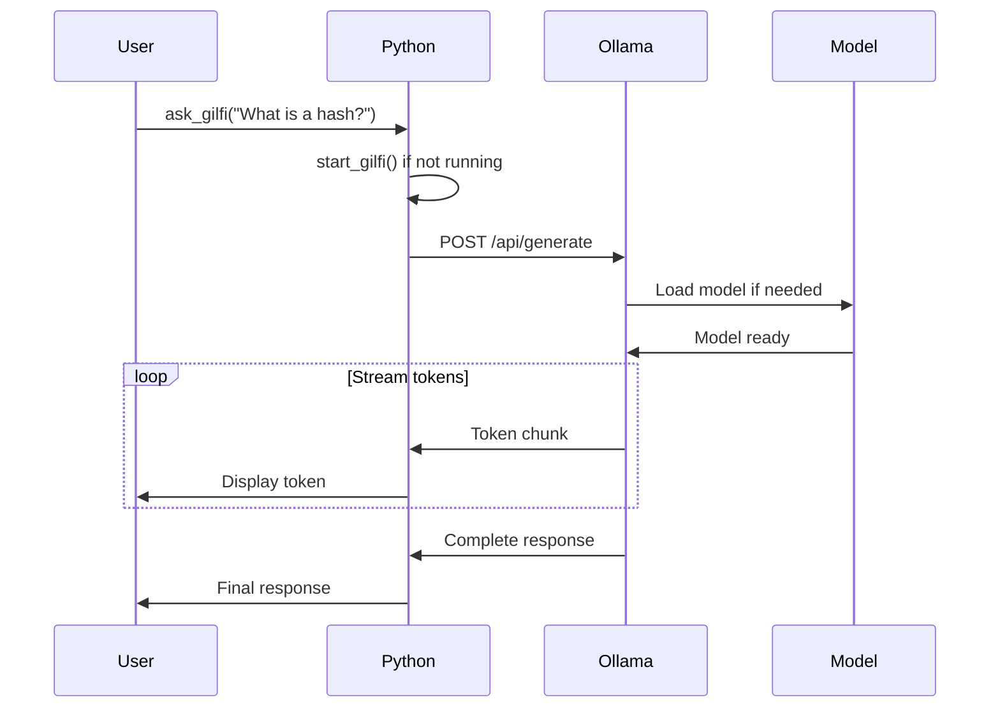

# Ask-Gilfi Module - AI Chatbot Documentation

## Overview

The Ask-Gilfi Module is an AI-powered chatbot assistant that provides security-related guidance and answers questions about cybersecurity concepts. It uses Ollama with a custom-trained model to deliver context-aware responses while running entirely locally for privacy.

## Table of Contents

1. [Installation](#installation)
2. [Features](#features)
3. [Architecture](#architecture)
4. [Usage Examples](#usage-examples)
5. [API Reference](#api-reference)
6. [Model Information](#model-information)
7. [Configuration](#configuration)
8. [Troubleshooting](#testing)

---

## Installation

### Prerequisites

- Python 3.8+
- Ollama runtime
- 4GB+ RAM (8GB recommended)
- 2GB disk space for model

### Ollama Installation

#### Linux
```bash
curl -fsSL https://ollama.com/install.sh | sh
```

#### macOS
```bash
brew install ollama
```

#### Windows
Download from [ollama.com](https://ollama.com/download)

### Module Setup

The module includes platform-specific Ollama binaries:

```
ask-gilfi-module/
├── bin/
│   ├── linux/ollama
│   ├── mac/ollama
│   └── windows/ollama.exe
├── ask-gilfi-chat.py
└── Modelfile
```

### Quick Start

```bash
# Set executable permissions (Linux/Mac)
chmod +x bin/linux/ollama  # or bin/mac/ollama

# Start Ollama service
./bin/linux/ollama serve

# In another terminal, create model
ollama create ask-gilfi -f Modelfile

# Test the chatbot
python ask-gilfi-chat.py
```

---

## Features

### Core Capabilities

1. **Security Knowledge Base**
   - Cryptography concepts
   - Network security
   - Password security
   - Common vulnerabilities
   - Best practices

2. **Interactive Chat**
   - Natural language understanding
   - Context-aware responses
   - Follow-up question handling
   - Multi-turn conversations

3. **Local Processing**
   - No cloud dependencies
   - Complete privacy
   - Offline operation
   - Fast response times

4. **Streaming Responses**
   - Token-by-token streaming
   - Real-time feedback
   - Cancellable operations

---

## Architecture

### Component Structure

```
┌─────────────────────────────────────────────────────┐
│                  Frontend/Backend                   │
│                                                     │
│  ┌────────────────────────────────────────────────┐ │
│  │         ask-gilfi-chat.py                      │ │
│  │  - start_gilfi()                               │ │
│  │  - ask_gilfi(prompt)                           │ │
│  │  - stream_response(prompt)                     │ │
│  └────────────────┬───────────────────────────────┘ │
│                   │ HTTP API                        │
│                   │ localhost:11436                 │
│  ┌────────────────▼───────────────────────────────┐ │
│  │         Ollama Service                         │ │
│  │  - Model loading                               │ │
│  │  - Inference engine                            │ │
│  │  - Response generation                         │ │
│  └────────────────┬───────────────────────────────┘ │
│                   │                                 │
│  ┌────────────────▼───────────────────────────────┐ │
│  │      Ask-Gilfi Model (granite4:350m)           │ │
│  │  - Security-focused training                   │ │
│  │  - 350M parameters                             │ │
│  │  - Optimized for Q&A                           │ │
│  └────────────────────────────────────────────────┘ │
└─────────────────────────────────────────────────────┘
```

### Process Flow



---

## Usage Examples

### Basic Usage

```python
from ask_gilfi_chat import start_gilfi, ask_gilfi

# Start Ollama service
process = start_gilfi()

# Ask a question
response = ask_gilfi("What is a hash function?")
print(response)

# Output:
# A hash function is a mathematical algorithm that takes an input
# and returns a fixed-size string of bytes. The output is typically
# a 'digest' that is unique to each unique input...
```

### Multiple Questions

```python
from ask_gilfi_chat import start_gilfi, ask_gilfi

process = start_gilfi()

questions = [
    "What is encryption?",
    "How does SHA-256 work?",
    "What makes a password strong?"
]

for question in questions:
    print(f"\nQ: {question}")
    response = ask_gilfi(question)
    print(f"A: {response}\n")
```

---

## API Reference

### Functions

#### `start_gilfi() -> subprocess.Popen`

Start the Ollama service process.

**Returns**:
- `subprocess.Popen`: Process object for the Ollama service

**Raises**:
- `FileNotFoundError`: If Ollama binary not found
- `PermissionError`: If binary not executable

**Example**:
```python
process = start_gilfi()
print(f"Ollama PID: {process.pid}")
```

**Notes**:
- Automatically detects platform (Linux/Mac/Windows)
- Sets appropriate environment variables
- Runs on port 11436 by default
- Process runs in background

---

#### `ask_gilfi(prompt: str) -> str`

Send a question to the chatbot and get a complete response.

**Parameters**:
- `prompt` (str): Question or prompt for the chatbot

**Returns**:
- `str`: Complete response from the model
- `None`: If service is unavailable

**Raises**:
- `requests.ConnectionError`: If Ollama service not running
- `requests.Timeout`: If request times out

**Example**:
```python
response = ask_gilfi("What is two-factor authentication?")
if response:
    print(response)
else:
    print("Service unavailable")
```

---

### HTTP API Endpoints

The Ollama service exposes HTTP endpoints:

#### Generate Response

```http
POST http://localhost:11436/api/generate
Content-Type: application/json

{
  "model": "ask-gilfi",
  "prompt": "What is a hash function?",
  "stream": false
}
```

**Response**:
```json
{
  "model": "ask-gilfi",
  "created_at": "2026-04-28T11:00:00Z",
  "response": "A hash function is...",
  "done": true
}
```

#### Stream Response

```http
POST http://localhost:11436/api/generate
Content-Type: application/json

{
  "model": "ask-gilfi",
  "prompt": "What is encryption?",
  "stream": true
}
```

**Response** (Server-Sent Events):
```
data: {"model":"ask-gilfi","response":"Encryption"}
data: {"model":"ask-gilfi","response":" is"}
data: {"model":"ask-gilfi","response":" the"}
...
data: {"model":"ask-gilfi","done":true}
```

---

## Model Information

### Ask-Gilfi Model

**Base Model**: granite4:350m  
**Parameters**: 350 million  
**Size**: ~200MB  
**Training**: Fine-tuned on security Q&A dataset

### Model Capabilities

**Strong Areas**:
- Cryptography basics
- Network security concepts
- Password security
- Common vulnerabilities
- Security best practices

**Limitations**:
- Not a replacement for security experts
- May not have latest vulnerability information
- Limited to training data knowledge
- Cannot execute code or perform scans

### Model Configuration

The model is configured via `Modelfile`:

```dockerfile
FROM granite4:350m

# Set parameters
PARAMETER temperature 0.7
PARAMETER top_p 0.9
PARAMETER top_k 40

# System prompt
SYSTEM """
You are Ask-Gilfi, a helpful cybersecurity assistant. You provide
clear, accurate information about security concepts, cryptography,
network security, and best practices. Keep responses concise and
educational.
"""
```

### Customizing the Model

To modify the model behavior:

1. Edit `Modelfile`
2. Recreate the model:
```bash
ollama create ask-gilfi -f Modelfile
```

**Parameters**:
- `temperature`: Creativity (0.0-1.0, default: 0.7)
- `top_p`: Nucleus sampling (0.0-1.0, default: 0.9)
- `top_k`: Top-k sampling (1-100, default: 40)

---

## Configuration

### Environment Variables

```bash
# Ollama service port
export OLLAMA_PORT=11436

# Model storage location
export OLLAMA_MODELS=/path/to/models

# Host binding
export OLLAMA_HOST=0.0.0.0:11436

# GPU acceleration (if available)
export OLLAMA_GPU=1
```

### Python Configuration

```python
# In ask-gilfi-chat.py

# Ollama API endpoint
OLLAMA_URL = "http://localhost:11436"

# Request timeout
TIMEOUT = 30  # seconds

# Model name
MODEL_NAME = "ask-gilfi"
```
---

## Troubleshooting

### Common Issues

#### Issue: "Ollama service not responding"

**Symptoms**: Connection errors, timeouts

**Solutions**:
```bash
# Check if Ollama is running
ps aux | grep ollama

# Check port availability
lsof -i :11436

# Restart service
pkill ollama
./bin/linux/ollama serve
```

---

#### Issue: "Model not found"

**Symptoms**: "model 'ask-gilfi' not found" error

**Solutions**:
```bash
# List available models
ollama list

# Create model if missing
ollama create ask-gilfi -f Modelfile

# Verify model exists
ollama list | grep ask-gilfi
```

---

#### Issue: "Out of memory"

**Symptoms**: Service crashes, slow responses

**Solutions**:
- Close other applications
- Use smaller model (future)
- Increase system RAM
- Enable swap space

```bash
# Check memory usage
free -h

# Monitor Ollama memory
top -p $(pgrep ollama)
```

---

#### Issue: "Permission denied" on binary

**Symptoms**: Cannot execute Ollama binary

**Solutions**:
```bash
# Linux/Mac
chmod +x bin/linux/ollama

# Verify permissions
ls -l bin/linux/ollama
# Should show: -rwxr-xr-x
```

---

#### Issue: Slow response times

**Symptoms**: Responses take > 30 seconds

**Solutions**:
1. **Use GPU**: Enable CUDA if available
2. **Reduce temperature**: Lower creativity for faster responses
3. **Shorter prompts**: Be concise in questions
4. **Check CPU**: Ensure system not overloaded

```python
# Optimize for speed
PARAMETER temperature 0.3  # Lower = faster
PARAMETER top_k 20         # Smaller = faster
```

---

## Advanced Usage

### Custom System Prompt

```python
def ask_with_context(question, context=""):
    """Ask question with additional context"""
    prompt = f"""
Context: {context}

Question: {question}

Please provide a detailed answer based on the context.
"""
    return ask_gilfi(prompt)

# Usage
context = "We are discussing password security for a corporate environment."
answer = ask_with_context("What password policy should we implement?", context)
```
---

## Security Considerations

### Privacy

✅ **Advantages**:
- All processing happens locally
- No data sent to cloud services
- Complete privacy and confidentiality
- Offline operation possible

⚠️ **Considerations**:
- Model training data is fixed
- No real-time threat intelligence
- Cannot access external resources

### Limitations

**What Ask-Gilfi CAN do**:
- Explain security concepts
- Provide general guidance
- Answer educational questions
- Suggest best practices

**What Ask-Gilfi CANNOT do**:
- Perform actual security scans
- Access live threat databases
- Execute code or commands
- Guarantee 100% accuracy

### Responsible Use

- Verify critical information from authoritative sources
- Don't rely solely on AI for security decisions
- Use as educational tool, not replacement for experts
- Keep model updated with latest version

---

## Testing

### Development Setup

```bash
# Clone repository
git clone https://github.com/yourusername/gilfi.git
cd gilfi/src/backend/ask-gilfi-module

# Install dependencies
pip install requests
```

### Testing

```bash
# Test basic functionality
python ask-gilfi-chat.py

# Test with different questions
python -c "from ask_gilfi_chat import *; print(ask_gilfi('test'))"
```

---


**Version**: 1.0.0  
**Model Version**: ask-gilfi-4:350m  
**Last Updated**: 2026-04-28  
**Maintained By**: Gilfi Development Team