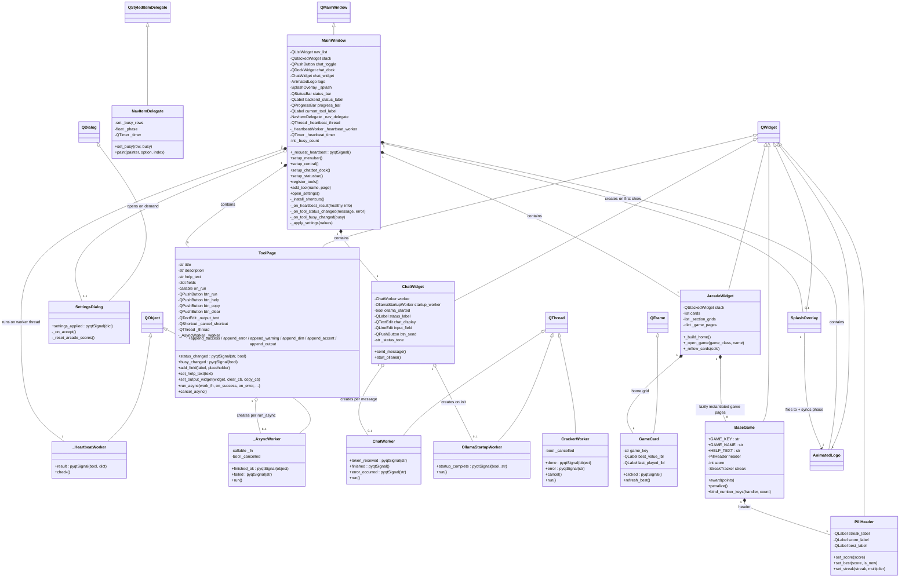
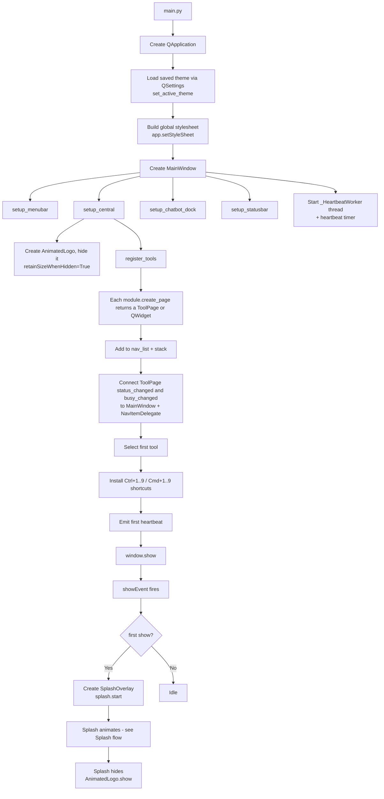
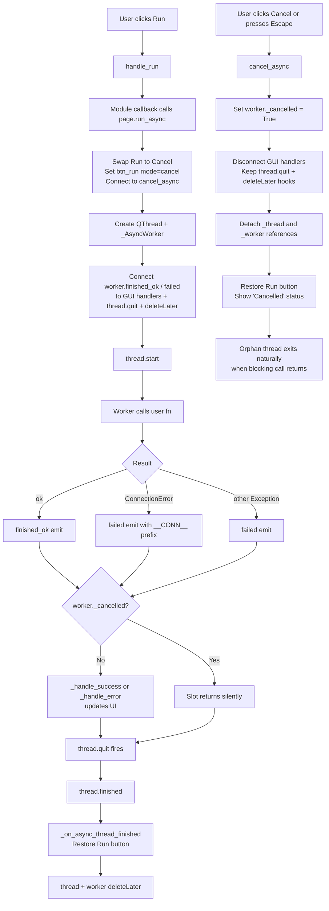
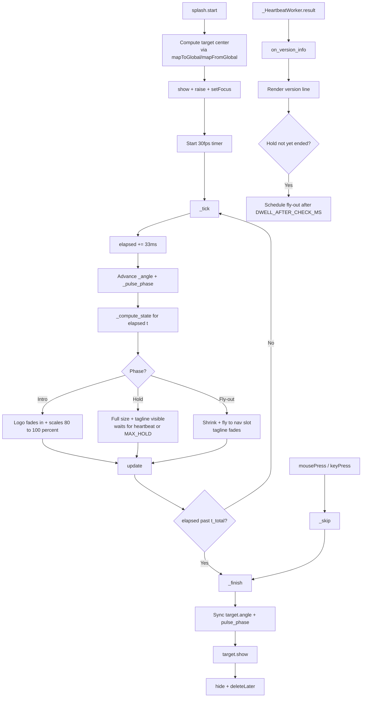
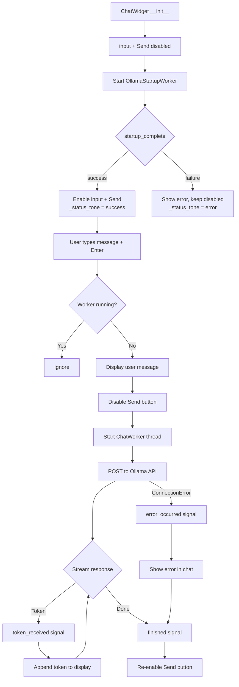

# Gilfi — Frontend Documentation

## Table of Contents

- [Overview](#overview)
- [Directory Structure](#directory-structure)
- [Setup](#setup)
- [Architecture](#architecture)
- [Class Diagram](#class-diagram)
- [Component Overview](#component-overview)
- [Tool Modules](#tool-modules)
- [Arcade](#arcade)
- [Flow Charts](#flow-charts)
- [Module Interface](#module-interface)
- [Cross-Module Communication](#cross-module-communication)
- [Threading Model](#threading-model)
- [Theme System](#theme-system)
- [Settings](#settings)
- [Status Bar](#status-bar)
- [Keyboard Shortcuts](#keyboard-shortcuts)
- [Cross-Platform Notes](#cross-platform-notes)

---

## Overview

The Gilfi frontend is a PyQt6 desktop application that provides a unified GUI for all Gilfi security tools. It follows a modular plugin-style architecture: every tool implements a simple `create_page()` interface and is registered in the main navigation list.

The frontend runs **natively** on the user's machine and talks to the backend over HTTP through a central `GilfiAPIClient`. The Ask Gilfi chatbot connects to a locally-spawned Ollama service.

Cross-platform target: Windows, macOS and Linux. The codebase avoids platform-specific Qt features and uses property-driven QSS plus platform-conditional modifier keys.

## Directory Structure

```
src/frontend/
├── main.py                      # Application entry point
├── api_client.py                # HTTP client for backend communication
├── ui/
│   ├── __init__.py
│   ├── mainwindow.py            # Main window with navigation, status bar, chatbot dock
│   ├── splash_overlay.py        # Startup splash that animates the logo into the nav
│   ├── animated_logo.py         # Circular logo widget with pulsing glow + scanner arcs
│   ├── toolpage.py              # Reusable widget template for tool modules
│   ├── chatwidget.py            # Ask Gilfi chat interface (Ollama API)
│   ├── theme.py                 # Theme system (dark/light/hacker) + global QSS template
│   ├── settings_dialog.py       # User preferences dialog
│   └── nav_delegate.py          # Custom delegate that animates a "busy" dot on nav items
└── modules/
    ├── __init__.py
    ├── port_scanner.py          # Port scanning with sortable result table
    ├── rsa_encryption.py        # RSA encryption / decryption
    ├── hash_module.py           # Hash generation and identification
    ├── hash_crack_module.py     # Dictionary-based hash cracking
    ├── password_analyzer.py     # Password strength analysis + secure password generation
    └── arcade.py                # Eight mini-games that showcase the modules
```

> **Asset dependency:** `animated_logo.py` reads `<project-root>/data/assets/logo.jpeg` at startup. If the file is missing or unreadable, the widget falls back to a text rendering of "GILFI" — the GUI still works.

## Setup

### Dependencies

```bash
pip install -r requirements.txt
```

This installs `PyQt6`, `pyqt6-sip` and `requests`.

### Run

```bash
cd src/frontend
python main.py
```

The frontend starts standalone. Modules that need the backend surface a clear error in their output area when it isn't reachable; everything that runs locally (Crack the Code, Hash Hunter, Factorize!, Password Anatomy, Hash Speed Sort, RSA Speedrun, the splash) keeps working.

### Backend & Ollama relationship

| Service | Default URL | Used by |
|---|---|---|
| Backend API | `http://localhost:8000` | RSA Encryption, Hash Crack Module, Hash Module, Password Analyzer, Port Scanner, Survive the Cracker (Arcade) — via `api_client.py` |
| Ollama | `http://localhost:11435` | Ask Gilfi chatbot — via `ChatWidget` streaming requests |

Both services are optional — the GUI launches and renders the splash regardless. The backend URL is configurable through Settings → Backend → Base URL; the change takes effect immediately, no restart needed.

Ollama is bootstrapped from inside the frontend itself: on launch, `ChatWidget` spawns an `OllamaStartupWorker` that calls into the bundled Ollama binary (resolved via the project's `ask-gilfi-module`) and brings up a server on `:11435`. That means the chat dock is normally usable without manual Ollama setup, as long as the project layout is intact.

For setting up the actual backend container, see the **project root `README.md`**.

## Architecture

```
┌──────────────────────────────────────────────────────────────────────┐
│                              main.py                                 │
│                       (Application Entry)                            │
│                                │                                     │
│   load saved theme via QSettings → set_active_theme()                │
│   build_stylesheet() → app.setStyleSheet(...)                        │
│                                │                                     │
│                  ┌─────────────▼──────────────┐                      │
│                  │         MainWindow         │                      │
│                  │       (QMainWindow)        │                      │
│                  └──┬───────┬───────┬─────┬───┘                      │
│                     │       │       │     │                          │
│        ┌────────────▼─┐ ┌───▼────┐ ┌▼─────▼──────┐ ┌───────────────┐ │
│        │  QListWidget │ │QStack- │ │ QStatusBar  │ │ QDockWidget   │ │
│        │  (nav_list)  │ │ ed-    │ │             │ │ (chatDock)    │ │
│        │              │ │Widget  │ │ ● backend   │ │               │ │
│        │ - Port       │ │        │ │ ▤ progress  │ │ ChatWidget    │ │
│        │ - RSA        │ │  Tool  │ │ │           │ │               │ │
│        │ - Hash       │◄┤  Pages │ │ │           │ │               │ │
│        │ - HashCrack  │ │        │ │ │           │ │               │ │
│        │ - Password   │ │        │ └─┼───────────┘ └───────┬───────┘ │
│        │ - Arcade     │ │        │   │                     │         │
│        └──────┬───────┘ └───┬────┘   │                     │         │
│               │             │        │                     │         │
│               │ NavItem-    │ status / busy signals        │ stream  │
│               │ Delegate    │                              │         │
│               │ (pulsing    │  ┌──────────────────┐        │         │
│               │   dot)      │  │ _HeartbeatWorker │        │         │
│               │             │  │   /health        │        │         │
│               │             │  └────────┬─────────┘        │         │
│               │             │           │                  │         │
│               │             └─►  GilfiAPIClient  ◄─────────┘         │
│               │                         │                            │
│               │                         ▼                            │
│               │                  localhost:8000      localhost:11435 │
│               │                  (Backend API)         (Ollama)      │
│               │                                                      │
│               │  theme_module.signals().theme_changed                │
│               └──── propagates palette refresh ──── all widgets      │
└──────────────────────────────────────────────────────────────────────┘
```

The left navigation (`QListWidget`) controls which page is shown in the `QStackedWidget`. A custom `NavItemDelegate` paints a pulsing dot next to any tool that is currently running a background job. The status bar shows backend connectivity on the left, an indeterminate progress bar while any tool page is busy, and the current tool name on the right.

The Ask Gilfi chatbot lives in a `QDockWidget` that can be toggled, moved, or closed independently.

All tool modules access the backend through `api_client.py`, which wraps the REST endpoints exposed by the backend.

## Class Diagram



## Component Overview

| Component | File | Responsibility |
|---|---|---|
| `MainWindow` | `ui/mainwindow.py` | Top-level window, navigation, menu bar, tool registration, chatbot dock, status bar, heartbeat machinery, splash trigger, settings dialog |
| `_HeartbeatWorker` | `ui/mainwindow.py` | Background thread that pings `/health` periodically and reports backend connectivity |
| `NavItemDelegate` | `ui/nav_delegate.py` | Paints the pulsing dot next to any tool currently running a background job |
| `SplashOverlay` | `ui/splash_overlay.py` | Startup splash overlay — logo fades in big with a tagline, holds, then shrinks and flies into the nav slot. Hold phase is *dynamic* and ends as soon as the heartbeat returns |
| `AnimatedLogo` | `ui/animated_logo.py` | Circular nav-bar logo with pulsing glow and rotating scanner arcs |
| `ToolPage` | `ui/toolpage.py` | Reusable input/output template for tool modules; provides `run_async`, cancellation, status reporting, copy/clear, colored output, help dialog |
| `_AsyncWorker` | `ui/toolpage.py` | Worker that runs a blocking callable in a background thread; supports cooperative cancellation |
| `SettingsDialog` | `ui/settings_dialog.py` | User preferences: theme, splash, backend URL, heartbeat interval, reset arcade scores |
| `ChatWidget` | `ui/chatwidget.py` | Chat UI for Ask Gilfi, manages `ChatWorker` thread, theme-aware status |
| `ChatWorker` | `ui/chatwidget.py` | Background thread for streaming Ollama API responses |
| `OllamaStartupWorker` | `ui/chatwidget.py` | Background thread that boots a local Ollama server on app launch |
| `CrackerWorker` | `modules/arcade.py` | Background thread for the Survive-the-Cracker game |
| `ArcadeWidget` | `modules/arcade.py` | Card-based mini-game launcher: home page + lazy-loaded game pages in a `QStackedWidget` |
| `GameCard`, `BaseGame`, `PillHeader` | `modules/arcade.py` | Shared arcade infrastructure: home cards, common per-game base class, compact game header |
| `GilfiAPIClient` | `api_client.py` | Central HTTP client for all backend endpoints |
| `theme` module | `ui/theme.py` | Theme palettes (dark / light / hacker), global QSS template, `theme_changed` signal |

## Tool Modules

The frontend registers six tools in the navigation list. Five are standard `ToolPage`-based modules; the Arcade is a custom widget.

| Module | Backend? | Description |
|---|---|---|
| **Port Scanner** | yes | Scans TCP/UDP ports on a given target. Results render in a sortable `QTableWidget` with colour-coded open/closed states |
| **RSA Encryption** | yes | Encrypts and decrypts integer messages via the backend's RSA endpoint |
| **Hash Module** | yes | Generates and identifies hashes (MD5, SHA-1, SHA-256, ...) |
| **Hash Crack Module** | yes | Dictionary-based cracking against `rockyou.txt` |
| **Password Analyzer** | yes | Strength analysis (entropy, common-pattern detection) and cryptographically secure password generation |
| **Arcade** | partial | Eight mini-games, see below |

Each `ToolPage`-based module surfaces a `?` help button next to the title that opens a contextual dialog. Long-running operations use `ToolPage.run_async()`, which morphs the Run button into a Cancel button while the job is in flight.

## Arcade

The Arcade is a card-based launcher backed by a `QStackedWidget`. The home page shows three category sections (Cryptography, Hashing, Defense) with cards inside each. Clicking a card pushes that game's page onto the stack with a "← Back to Arcade" button at the top.

Each game inherits from `BaseGame`, which provides a compact `PillHeader` (`Game Name • Streak • Score • Best • ?`), score persistence (`QSettings`), a streak multiplier (×1.0 / ×1.5 / ×2.0 / ×2.5 / ×3.0), confetti on new bests, status-bar broadcast, last-played timestamp tracking, and a `bind_number_keys` helper for keyboard input.

| Game | Category | Backend? | Mechanic & module tie-in |
|---|---|---|---|
| **Crack the Code** | Cryptography | no | Caesar cipher slider with Easy/Medium/Hard difficulty; "Almost!" feedback when the shift is off by ±1 or ±2 |
| **Factorize!** | Cryptography | no | Factor `N = p · q` across four levels plus a 20-digit BOSS that motivates why RSA is secure; "Close! got one of the primes" feedback |
| **RSA Speedrun** | Cryptography | no | Walk through RSA by hand: `n`, `φ(n)`, `d`, `c`. Easy/Hard prime pools, optional hint that reduces step score |
| **Hash Hunter** | Hashing | no | Identify the word that produced the displayed hash; hover-preview shows each candidate's hash with the matching prefix highlighted. Algorithm progresses MD5 → SHA-1 → SHA-256 as score grows |
| **Hash Speed Sort** | Hashing | no | Rank MD5 / SHA-1 / SHA-256 / bcrypt from easiest to hardest to crack |
| **Survive the Cracker** | Hashing | yes | Type a password; it is hashed locally with SHA-256 and the hash is sent to `api_client.hash_crack`. Three outcomes: cracked, survived, or backend offline. Has its own cancel button |
| **Port Knocker** | Defense | no | Pick the standard port for a service. Easy (5 services) / Hard (15 services) |
| **Password Anatomy** | Defense | no | Identify the main weakness of a weak password. Easy / Hard difficulty; "Send to Password Analyzer" forwards the password |

## Flow Charts

### Application Startup



### Async Tool Run (with Cancel)



### Splash Overlay Flow

The splash is a child `QWidget` of `MainWindow` that covers the full client area. A single 30 fps timer drives a master clock. The **hold phase is dynamic**: the splash always shows for at least `MIN_HOLD_MS` (2500 ms), but if the backend version check returns earlier it dwells `DWELL_AFTER_CHECK_MS` (800 ms) and then begins the fly-out. If the backend doesn't respond, the splash caps the hold at `MAX_HOLD_MS` (4500 ms) and proceeds anyway. At the end the splash syncs the steady-state `AnimatedLogo`'s `_angle` and `_pulse_phase` to its own values so the scanner arcs continue from exactly the same position — no visible jump on handoff.



### Ask Gilfi Chat Flow



## Module Interface

Every standard tool module follows the same pattern. To add a new module:

**1. Create** `modules/your_module.py`:

```python
from ui.toolpage import ToolPage
import api_client


def create_page():
    page = ToolPage(
        title="Your Module",
        description="What it does.",
        help_text=(
            "Optional long-form help text shown when the user clicks the "
            "? button next to the title."
        ),
    )
    page.add_field("Some Input", "placeholder text")
    page.set_button_text("Run")
    page.on_run = run
    return page


def run(page):
    value = page.get_input("Some Input")
    if not value:
        page.set_status("Missing input", error=True)
        return

    page.clear_output()

    # Long-running calls go through run_async so the GUI stays responsive
    # and the user can cancel via the button or by pressing Escape.
    page.run_async(
        work_fn=lambda: api_client.your_endpoint(value),
        on_success=lambda result: page.append_success(f"Result: {result}"),
        running_text="Working ...",
        done_text="Done",
    )
```

**2. Register** in `ui/mainwindow.py`:

```python
from modules import your_module

# inside register_tools():
tools = [
    ...
    ("Your Module", your_module.create_page()),
]
```

### ToolPage API

#### Construction & layout
| Method | Description |
|---|---|
| `ToolPage(title, description="", help_text="", parent=None)` | Constructor. Pass `help_text` to enable the `?` button next to the title |
| `add_field(label, placeholder, span=1)` | Add a labelled `QLineEdit` to the input grid |
| `add_field_with_checkbox(label, placeholder, checkbox_placeholder, checkbox_connect_to)` | Field plus a paired checkbox (used by Port Scanner for the Range toggle) |
| `add_dropdown(row, col, options, label)` | Add a `QComboBox` at a specific grid cell |
| `set_button_text(text)` | Change the Run button label (also remembered as the default for restore after cancel) |
| `set_help_text(text)` | Update or set the help text after construction |
| `set_output_widget(widget, clear_cb=None, copy_cb=None)` | Replace the default `QTextEdit` output with a custom widget (used by Port Scanner for its result table) |

#### I/O & status
| Method | Description |
|---|---|
| `get_input(label) -> str` | Trimmed text from the named field |
| `append_output(text)` | Append a line of neutral output |
| `append_success(text)` / `append_error(text)` / `append_warning(text)` / `append_dim(text)` / `append_accent(text)` | Append coloured output; colours follow the current theme |
| `clear_output()` | Clear the output area (or call `clear_cb` for custom widgets) |
| `copy_output()` | Copy the output to the clipboard (or call `copy_cb` for custom widgets) |
| `set_status(text, error=False)` | Show a status message. Property-driven QSS handles the colour, so it follows theme changes |

#### Signals
| Signal | Payload | Use |
|---|---|---|
| `status_changed(message, is_error)` | str, bool | Mirrored in the global status bar |
| `busy_changed(busy)` | bool | Drives the global progress bar + the pulsing dot on the nav |

#### Async work & cancellation
| Method | Description |
|---|---|
| `run_async(work_fn, on_success=None, on_error=None, running_text="Running ...", done_text="Done")` | Run `work_fn` on a background thread; swaps Run for a Cancel button while in flight |
| `cancel_async()` | Cooperatively cancel a running job. Disconnects the GUI handlers and detaches state so a new run can start immediately. The HTTP call keeps running on the backend until it returns naturally. Also invoked by the `Esc` shortcut |

For non-standard pages (such as the Arcade), modules can return any `QWidget` subclass directly from `create_page()` instead of a `ToolPage`.

### Backend API client

`api_client.py` is the only place that talks HTTP. Modules call its module-level functions instead of constructing requests themselves; each function raises `ConnectionError` if the backend is unreachable so modules can render a clean error message.

| Function | Returns | Used by |
|---|---|---|
| `scan_ports(target, scan_range, ip_type='IPV4', connection_type='BOTH')` | `Dict[port, info]` | Port Scanner |
| `hash_generate(text, algorithm='sha256')` | `str` (hex digest) | Hash Module |
| `hash_identify(hash_value)` | `List[str]` (candidate types) | Hash Module |
| `hash_crack(hash_value, hash_type, wordlist='common')` | `Optional[str]` (plaintext or `None`) | Hash Crack Module, Survive the Cracker |
| `rsa_encrypt(plaintext)` | `Dict[str, Any]` | RSA Encryption |
| `password_analyze(password)` | `Dict[str, Any]` (strength report) | Password Analyzer |
| `password_generate(length=16, use_lowercase=True, use_uppercase=True, use_digits=True, use_special=True, exclude_ambiguous=True)` | `Dict[str, Any]` (generated password + metadata) | Password Analyzer |
| `health_check()` | `Dict[str, Any]` | `_HeartbeatWorker` |
| `askgilfi_query(prompt)` | `str` | not used by `ChatWidget` (which streams directly), available for one-shot calls |

The base URL defaults to `http://localhost:8000`. `get_client(base_url=...)` updates the singleton's URL live — used by the Settings dialog when the user changes the backend endpoint.

## Cross-Module Communication

The Arcade forwards data into other tool pages. For example, the Hash Hunter game sends its current target hash into the Hash Module (or the Hash Crack Module) with one click, and Password Anatomy can pipe its puzzle password into the Password Analyzer.

This is implemented in `modules/arcade.py` via a helper that walks up to the `MainWindow` and accesses the navigation and stack:

```python
def _send_to_module(widget, module_name, field_values, auto_run=False):
    """Switch to the target tool page, prefill its fields,
    and optionally trigger its run button."""
    mw = widget.window()
    # find nav entry by name, prefill ToolPage.fields, switch row,
    # optionally call page.handle_run()
```

This keeps modules independent (no direct imports between them) while still allowing them to cooperate. If a target module is missing, the call fails gracefully and shows a status-bar message.

## Threading Model

Long-running operations use `QThread` to keep the GUI responsive:

| Operation | Worker | Lifetime | Cancellable |
|---|---|---|---|
| Backend health check (every N seconds) | `_HeartbeatWorker` | Same as the app | n/a (single endpoint, fast) |
| Any `page.run_async(...)` call | `_AsyncWorker` | Per call | yes — cooperative |
| Ollama server bootstrap (on app launch) | `OllamaStartupWorker` | Once at launch | no |
| Ask Gilfi chat (Ollama streaming) | `ChatWorker` | Per message | no |
| Survive-the-Cracker hash crack | `CrackerWorker` | Per game round | yes — cooperative |

All workers follow the same pattern: the main thread creates the worker, connects signals to slots, and starts the thread. The worker emits signals that update the UI from the main thread (Qt requirement — widgets must only be touched from the thread that created them).

### Cooperative cancellation

`ToolPage.cancel_async()` and `SurviveTheCrackerGame._stop_defense()` **never** call `QThread.terminate()`. The Qt docs explicitly warn against it — terminating a thread mid-stack inside a C library (the typical case here is `requests` → `urllib3` → OpenSSL) can crash the process or deadlock.

Instead the pattern is:

1. Set a `_cancelled` flag on the worker.
2. Disconnect the GUI handler slots from the worker's signals.
3. Detach the `_thread` / `_worker` references so a new run can start immediately.
4. Leave the `worker.finished_ok → thread.quit` and `thread.finished → deleteLater` hooks intact so the orphan cleans itself up.

The blocking call keeps running on the worker thread until it returns naturally. When it does, the worker emits as usual, the slot checks `_cancelled` and returns silently, `thread.quit` fires, and the thread + worker delete themselves.

### Main-thread animations

GUI animations don't use `QThread` — they would have to bounce back to the main thread anyway because painting is main-thread-only. Instead they run on a `QTimer` directly in the main thread:

| Widget | Timer interval | Drives |
|---|---|---|
| `AnimatedLogo` | 33 ms (~30 fps) | `_angle` and `_pulse_phase` updates, scheduled `update()` |
| `SplashOverlay` | 33 ms (~30 fps) | master clock, opacity / scale / position recomputed from elapsed ms each tick |
| `NavItemDelegate` | 33 ms (~30 fps) | pulsing dot animation on busy nav rows |
| `ConfettiOverlay` (arcade) | 33 ms (~30 fps) | particle physics for new-best celebration |

Each tick is cheap (a few floats + an `update()`), so this stays smooth without blocking event handling.

## Theme System

`ui/theme.py` holds three palettes (`dark`, `light`, `hacker`) as plain dicts of colour tokens, plus a single QSS template that gets formatted against the chosen palette by `build_stylesheet()`.

### How theme switching propagates

```
SettingsDialog (user picks theme)
        │ settings_applied(values)
        ▼
MainWindow._apply_settings
        │ theme_module.set_active_theme(name)
        │   → _signals.theme_changed.emit(name)
        │ QApplication.setStyleSheet(build_stylesheet())
        ▼
Qt's cascading stylesheet engine re-paints every widget styled by
object name or dynamic property — that's most of the UI.
        ▼
Widgets that hold their own inline colours subscribe to
theme_module.signals().theme_changed and refresh manually:
        - ChatWidget         (status label colour + future log entries)
        - HashHunterGame     (hover-preview HTML span colours)
        - PortScanTable      (table item foreground colours)
        - ArcadeWidget       (card hover state polish)
```

### Styling pattern

Widgets are styled via **object names + dynamic properties**, not inline stylesheets. Example:

```python
btn = QPushButton("Cancel")
btn.setObjectName("btnRun")
btn.setProperty("mode", "cancel")
btn.style().unpolish(btn); btn.style().polish(btn)   # repolish to apply
```

The corresponding QSS rule lives in `ui/theme.py`:

```css
QPushButton#btnRun[mode="cancel"] {
    background: {error};
    color: {selection_text};
}
QPushButton#btnRun[mode="cancel"]:hover {
    background: {error_hover};
}
```

This pattern means widget state changes (success/error tone, cancel mode, hover state on `QFrame`s where `:hover` is unreliable on macOS) all flow through the same theme palette without baking colours into individual widget code.

### Palette keys

Each theme defines 19 colour tokens: `bg`, `bg_alt`, `bg_input`, `border`, `border_focus`, `text`, `text_dim`, `text_placeholder`, `accent`, `accent_strong`, `accent_hover`, `accent_pressed`, `success`, `warning`, `error`, `error_hover`, `output_text`, `selection_bg`, `selection_text`.

The three built-in themes:

| Theme | Background | Text | Accent |
|---|---|---|---|
| `dark` (default) | `#1a1a2e` deep navy | `#e0e0e0` near-white | `#53a8d8` cyan |
| `light` | `#f5f5fa` near-white | `#1a1a2e` deep navy | `#3a7ca5` steel blue |
| `hacker` | `#000000` black | `#39ff14` neon green | `#39ff14` neon green |

## Settings

`Edit → Settings ...` opens the modal `SettingsDialog`. Keys persist via `QSettings` under the application's standard OS location.

| Key | Type | Default | Behaviour |
|---|---|---|---|
| `appearance/theme` | str | `"dark"` | Active palette name. Applied immediately on accept |
| `appearance/show_splash` | bool | `True` | Whether to show the startup splash. Takes effect on next launch |
| `backend/url` | str | `"http://localhost:8000"` | Backend base URL. Pushed to `api_client.get_client(...)` on accept |
| `backend/heartbeat_interval_ms` | int | `10_000` | Interval between `/health` probes |

The Settings dialog also has a **Reset best scores …** button that wipes every key under the `arcade/` group after a confirmation dialog. This clears all per-game best scores and last-played timestamps.

## Status Bar

The status bar has four content areas:

```
┌─────────────────────────────────────────────────────────────────────┐
│ ● Backend: online    ...transient messages...     [■■■]  Tool Name  │
└─────────────────────────────────────────────────────────────────────┘
   ^                                                ^      ^
   permanent left widget                            |      permanent right
   (backend connectivity, property-driven QSS)      |      (active tool name)
                                                    |
                                       indeterminate progress bar,
                                       shown while any tool page is busy
                                       (driven by busy_changed counts)
```

Transient messages from tool pages (`set_status` → `status_changed` signal → status bar `showMessage`) appear in the middle and auto-expire after 4–6 seconds. Status bar broadcasts from the Arcade ("★ New best in Hash Hunter: 1240") use the same channel.

## Keyboard Shortcuts

All shortcuts use platform-conditional modifiers: on macOS `Ctrl` is rendered and bound as `⌘ Cmd`, on Windows / Linux as `Ctrl`. The About dialog displays the platform-native form.

| Shortcut | Action | Scope |
|---|---|---|
| `Ctrl+1` … `Ctrl+9` | Jump to the Nth tool in the navigation | Global |
| `Esc` | Cancel the running async job on the current ToolPage | Per ToolPage (and its children) |
| `1` … `9` | Click the Nth tile in the active arcade game | Hash Hunter (3×3 grid) |
| `1` … `4` | Click the Nth button in the active arcade game | Port Knocker, Password Anatomy, Hash Speed Sort |
| `Enter` | Submit the current field | Game-specific (Crack the Code, Factorize!, RSA Speedrun, Survive the Cracker) |

## Cross-Platform Notes

The codebase targets Windows, macOS and Linux without per-OS forks. Specific decisions that keep the three behaviours identical:

- **Fonts.** No hardcoded family names anywhere. UI fonts construct as `QFont()` with `setStyleHint(QFont.StyleHint.SansSerif)` so Qt picks Segoe UI on Windows, San Francisco on macOS, Cantarell/Ubuntu/DejaVu Sans on Linux. Monospace fonts in the Arcade use `setStyleHint(QFont.StyleHint.Monospace)` (falls back to Menlo / Consolas / DejaVu Sans Mono).
- **Modifier keys.** All keyboard shortcuts that use the platform's "primary modifier" are bound via the `Qt.Modifier.CTRL` enum (mapped to `⌘ Cmd` on macOS, `Ctrl` elsewhere) rather than string literals like `"Ctrl+1"`. The About dialog shows the native rendering via `QKeySequence.toString(NativeText)`.
- **Hover on `QFrame`.** The `:hover` pseudo-state is unreliable on `QFrame` on macOS. `GameCard` uses `enterEvent`/`leaveEvent` to set a `hovered` dynamic property and re-polish — that works on all three OSes.
- **No `QThread.terminate()`.** It can crash the process when the thread is blocked in a C library (urllib3 / OpenSSL on every backend call). All cancellation is cooperative.
- **No `opacity` in QSS.** Qt's stylesheet engine doesn't support it. Where a hover state needs a different shade, the palette exposes an explicit `_hover` token.
- **Menu bar.** Plain titles ("File", "Edit", etc.) — padding comes from `QMenuBar::item` in the QSS, not from leading/trailing spaces in the title string. On macOS the menu bar lives in the global system bar; Qt handles that automatically.
- **High-DPI.** Qt6 auto-scaling is enabled by default. Card sizes (230×175 px) and font point sizes scale correctly on Retina / 4K displays. The card grid auto-reflows between 1, 2, 3 and 4 columns at the 600 / 900 / 1200 px breakpoints.
- **`QSettings` storage.** Uses platform-native backing: Windows registry, macOS plist, Linux config file. No code path touches a hardcoded file path.
