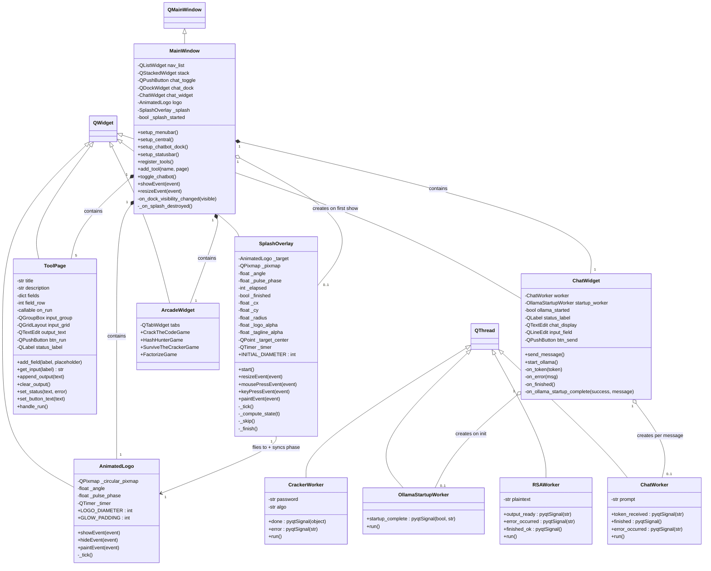
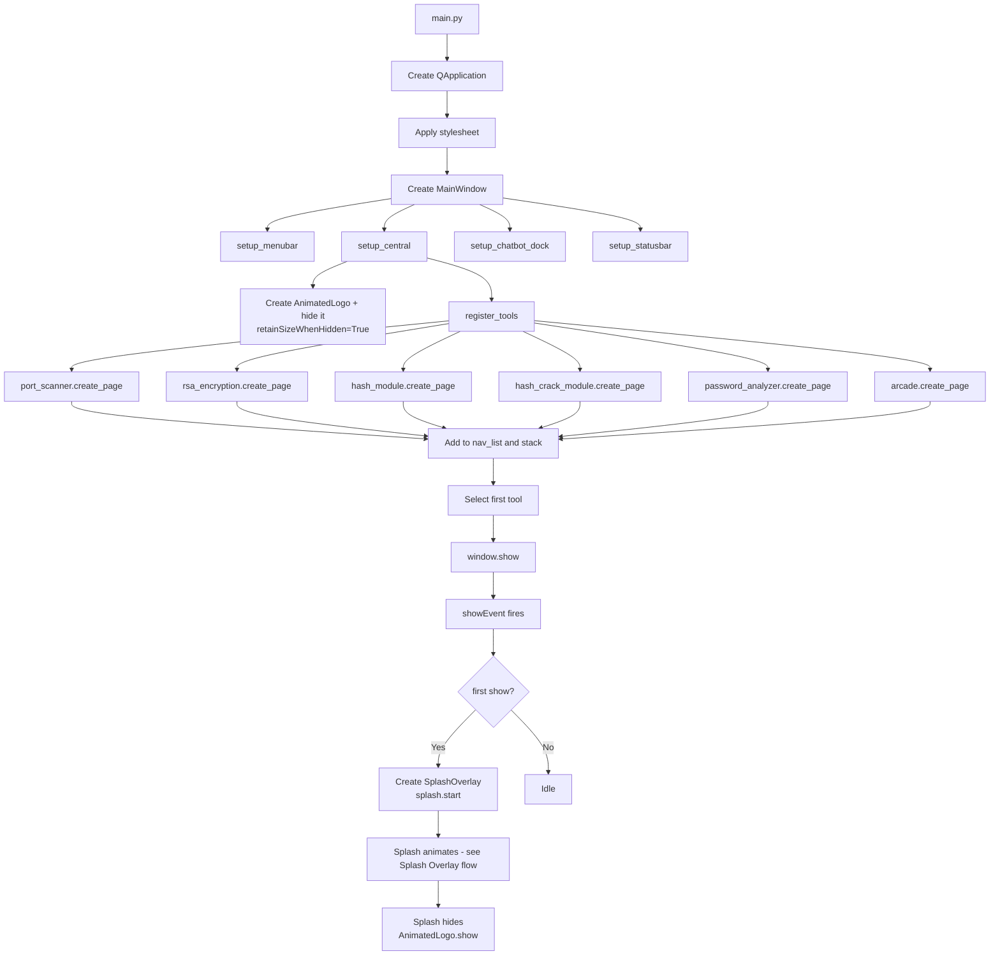
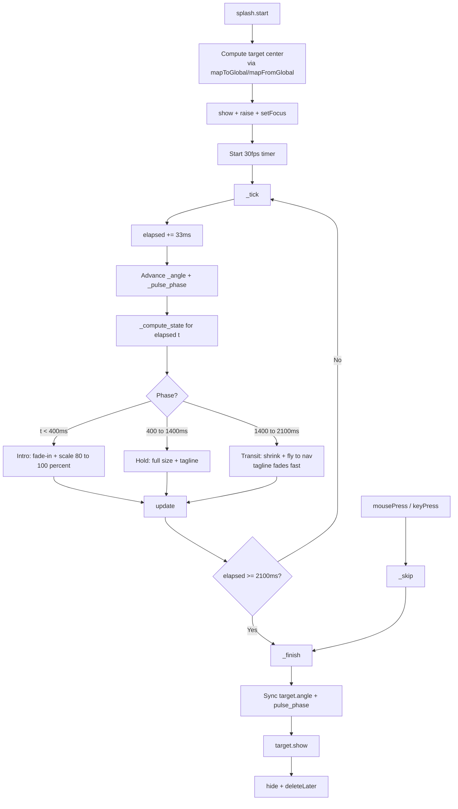
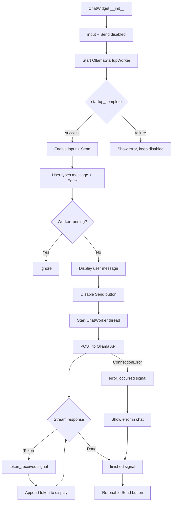

# Gilfi - Frontend Documentation

## Table of Contents

- [Overview](#overview)
- [Directory Structure](#directory-structure)
- [Setup](#setup)
- [Architecture](#architecture)
- [Class Diagram](#class-diagram)
- [Component Overview](#component-overview)
- [Tool Modules](#tool-modules)
- [Flow Charts](#flow-charts)
- [Module Interface](#module-interface)
- [Cross-Module Communication](#cross-module-communication)
- [Threading Model](#threading-model)
- [Styling](#styling)

---

## Overview

The Gilfi frontend is a PyQt6-based desktop application that provides a unified GUI for all Gilfi security tools. It follows a modular plugin-style architecture in which every tool implements a simple `create_page()` interface and gets registered in the main navigation list.

The frontend runs **natively** on the user's machine and talks to the backend over HTTP through a central `GilfiAPIClient`. The Ask Gilfi chatbot connects to a local Ollama service.

## Directory Structure

```
src/frontend/
├── main.py                      # Application entry point
├── api_client.py                # HTTP client for backend communication
├── ui/
│   ├── __init__.py
│   ├── mainwindow.py            # Main window with navigation + chatbot dock
│   ├── splash_overlay.py        # Startup splash that animates the logo into the nav
│   ├── animated_logo.py         # Circular logo widget with pulsing glow + scanner arcs
│   ├── toolpage.py              # Reusable widget template for tool modules
│   ├── chatwidget.py            # Ask Gilfi chat interface (Ollama API)
│   └── style.py                 # Global dark theme stylesheet (QSS)
└── modules/
    ├── __init__.py
    ├── network_scanner.py       # Network device discovery (in development, not registered)
    ├── port_scanner.py          # Port scanning with service detection
    ├── rsa_encryption.py        # RSA encryption / decryption
    ├── hash_module.py           # Hash generation and identification
    ├── hash_crack_module.py     # Dictionary-based hash cracking
    ├── password_analyzer.py     # Password strength analysis + secure password generation
    └── arcade.py                # Mini-games that showcase the modules
```

> **Asset dependency:** `animated_logo.py` reads `data/assets/logo.jpeg` at startup. If the file is missing or unreadable, the widget falls back to a text rendering of "GILFI" — the GUI still works.

## Setup

### Dependencies

```bash
pip install -r requirements.txt
```

This installs PyQt6, pyqt6-sip, and Requests.

### Run

```bash
cd src/frontend
python main.py
```

The frontend starts standalone. Modules that need the backend surface a clear error in their output area when it isn't reachable; everything that runs locally (Crack the Code, Hash Hunter, Factorize, the splash) keeps working.

### Backend & Ollama relationship

| Service | Endpoint | Used by |
|---|---|---|
| Backend API | `http://localhost:8000` | RSA Encryption, Hash Crack Module, Survive the Cracker (Arcade) — via `api_client.py` |
| Ollama | `http://localhost:11435` | Ask Gilfi chatbot — via `ChatWidget` streaming requests |

Both services are optional — the GUI launches and renders the splash regardless. The frontend talks to the backend over plain HTTP and surfaces a clean error in each tool's output area when it isn't reachable. Ollama is bootstrapped from inside the frontend itself: on launch, `ChatWidget` spawns an `OllamaStartupWorker` that calls into the bundled Ollama binary (resolved via the project's `ask-gilfi-module`) and brings up a server on `:11435`. That means the chat dock is normally usable without manual Ollama setup, as long as the project layout is intact.

For setting up the actual backend container, see the **project root `README.md`**.

## Architecture

```
┌──────────────────────────────────────────────────────────────┐
│                         main.py                              │
│                    (Application Entry)                       │
│                           │                                  │
│              ┌────────────▼────────────┐                     │
│              │      MainWindow         │                     │
│              │    (QMainWindow)        │                     │
│              └──┬──────────┬───────┬───┘                     │
│                 │          │       │                         │
│      ┌──────────▼──┐  ┌────▼────┐  ▼─────────────┐           │
│      │  QListWidget │ │QStacked-│  │  QDockWidget │          │
│      │  (navList)   │ │ Widget  │  │  (chatDock)  │          │
│      │              │ │         │  │              │          │
│      │ - Port       │ │  Tool   │  │  ChatWidget  │          │
│      │ - RSA        │ │  Pages  │  │              │          │
│      │ - Hash       │◄┤         │  │              │          │
│      │ - Hash Crack │ │         │  │              │          │
│      │ - Password   │ │         │  │              │          │
│      │ - Arcade     │ │         │  │              │          │
│      └──────────────┘ └────┬────┘  └──────┬───────┘          │
│                            │              │                  │
│                   ┌────────▼────────┐     │                  │
│                   │ GilfiAPIClient  │     │ stream           │
│                   └────────┬────────┘     │                  │
│                            ▼              ▼                  │
│                     localhost:8000   localhost:11435         │
│                      (Backend API)      (Ollama)             │
└──────────────────────────────────────────────────────────────┘
```

The left navigation (`QListWidget`) controls which page is shown in the `QStackedWidget`. The Ask Gilfi chatbot lives in a `QDockWidget` that can be toggled, moved, or closed independently.

All tool modules access the backend through `api_client.py`, which wraps the REST endpoints exposed by the backend.

## Class Diagram



## Component Overview

| Component | File | Responsibility |
|---|---|---|
| `MainWindow` | `ui/mainwindow.py` | Top-level window, navigation, menu bar, tool registration, chatbot dock, startup-splash trigger |
| `SplashOverlay` | `ui/splash_overlay.py` | Startup splash overlay - logo fades in big, holds with tagline, then shrinks and flies into the nav slot |
| `AnimatedLogo` | `ui/animated_logo.py` | Circular nav-bar logo with pulsing glow and rotating scanner arcs (also exposes its painting helpers as module-level functions for `SplashOverlay` to reuse) |
| `ToolPage` | `ui/toolpage.py` | Reusable input/output template for every standard tool module |
| `ChatWidget` | `ui/chatwidget.py` | Chat UI for Ask Gilfi, manages `ChatWorker` thread |
| `ChatWorker` | `ui/chatwidget.py` | Background thread for streaming Ollama API responses |
| `OllamaStartupWorker` | `ui/chatwidget.py` | Background thread that boots a local Ollama server on app launch so the chatbot is ready when the user opens the dock |
| `RSAWorker` | `modules/rsa_encryption.py` | Background thread for the RSA encrypt / decrypt API call |
| `CrackerWorker` | `modules/arcade.py` | Background thread for hash cracking calls in the arcade |
| `ArcadeWidget` | `modules/arcade.py` | Custom widget hosting four mini-games as tabs |
| `GilfiAPIClient` | `api_client.py` | Central HTTP client for all backend endpoints |
| `STYLESHEET` | `ui/style.py` | Global QSS dark theme |

## Tool Modules

The frontend registers six tools in the navigation list. Five are standard `ToolPage`-based modules; the Arcade is a custom widget. A seventh module (`network_scanner.py`) exists in the codebase but is not registered yet.

| Module | Backend? | Description |
|---|---|---|
| **Port Scanner** | yes | Scans TCP ports on a given target with service detection |
| **RSA Encryption** | yes | Encrypts and decrypts messages via the backend's RSA endpoint |
| **Hash Module** | yes | Generates and identifies hashes (MD5, SHA-1, SHA-256, ...) |
| **Hash Crack Module** | yes | Cracks password hashes via a wordlist attack |
| **Password Analyzer** | yes | Strength analysis (entropy, common-pattern detection) and cryptographically secure password generation |
| **Arcade** | partial | Four mini-games, see below |

### Arcade

The Arcade is a single navigation entry that contains four mini-games as inner tabs. It serves as a playful entry point and a live showcase of the surrounding modules.

| Game | Backend? | Showcases |
|---|---|---|
| **Crack the Code** | no | Caesar cipher puzzle - pure crypto math, no backend |
| **Hash Hunter** | no | Pick the word that produces the displayed hash; supports forwarding the hash to the Hash and Hash Crack modules |
| **Survive the Cracker** | yes | Type a password; it is hashed locally with SHA-256 and the hash is sent to `api_client.hash_crack` — three outcomes: cracked, survived (not in wordlist), or backend offline |
| **Factorize!** | no | Factor `N = p * q` to motivate why RSA is hard; manual level picker |

## Flow Charts

### Application Startup



### Splash Overlay Flow

The splash is a child `QWidget` of `MainWindow` that covers the full client area. A single 30 fps timer drives a master clock; opacity, scale and position for both the logo and the tagline are computed from the elapsed time on every tick. At the end the splash syncs the steady-state `AnimatedLogo`'s `_angle` and `_pulse_phase` to its own values so the scanner arcs continue from exactly the same position - no visible jump on handoff.



### Ask Gilfi Chat Flow



## Module Interface

Every standard tool module follows the same pattern. To add a new module:

**1. Create** `modules/your_module.py`:

```python
from ui.toolpage import ToolPage
import api_client

def create_page():
    page = ToolPage(
        title="Your Module",
        description="What it does."
    )
    page.add_field("Some Input", "placeholder text")
    page.set_button_text("Run")
    page.on_run = run
    return page

def run(page):
    value = page.get_input("Some Input")
    if not value:
        page.set_status("Missing input", error=True)
        return

    page.clear_output()
    page.set_status("Working ...")

    try:
        result = api_client.your_endpoint(value)
        page.append_output(f"Result: {result}")
        page.set_status("Done")
    except ConnectionError as e:
        page.set_status(f"Backend not available: {e}", error=True)
```

**2. Register** in `ui/mainwindow.py`:

```python
from modules import your_module

# inside register_tools():
tools = [
    ...
    ("Your Module", your_module.create_page()),
]
```

### ToolPage API

| Method | Description |
|---|---|
| `add_field(label, placeholder)` | Add a labeled input field |
| `get_input(label) -> str` | Get the trimmed text from a field |
| `set_button_text(text)` | Change the run button label |
| `clear_output()` | Clear the output area |
| `append_output(text)` | Append a line to output |
| `set_status(text, error=False)` | Show status message (green or red) |

For non-standard pages (such as the Arcade), modules can return any `QWidget` subclass directly from `create_page()` instead of a `ToolPage`.

### Backend API client

`api_client.py` is the only place that talks HTTP. Modules call its module-level functions instead of constructing requests themselves; each function raises `ConnectionError` if the backend is unreachable so modules can render a clean error message.

| Function | Returns | Used by |
|---|---|---|
| `scan_ports(target, scan_range, ip_type='IPV4', connection_type='BOTH')` | `Dict[port, info]` | Port Scanner |
| `hash_generate(text, algorithm='sha256')` | `str` (hex digest) | Hash Module |
| `hash_identify(hash_value)` | `List[str]` (candidate types) | Hash Module |
| `hash_crack(hash_value, hash_type, wordlist='common')` | `Optional[str]` (plaintext or `None`) | Hash Crack Module, Survive the Cracker |
| `rsa_encrypt(text, operation='encrypt')` | `Dict[str, Any]` | RSA Encryption (`operation='decrypt'` for the reverse) |
| `password_analyze(password)` | `Dict[str, Any]` (strength report) | Password Analyzer |
| `password_generate(length=16, use_lowercase=True, use_uppercase=True, use_digits=True, ...)` | `Dict[str, Any]` (generated password + metadata) | Password Analyzer |
| `askgilfi_query(prompt)` | `str` (full response, non-streaming) | not used by `ChatWidget` (which streams directly), available for one-shot calls |

The base URL defaults to `http://localhost:8000` and can be overridden via `get_client(base_url=...)` if needed.

## Cross-Module Communication

The Arcade module forwards data into other tool pages. For example, the Hash Hunter game can send its current target hash into the Hash Module or Hash Crack Module with one click.

This is implemented in `modules/arcade.py` via a helper that walks up to the `MainWindow` and accesses the navigation and stack:

```python
def _send_to_module(widget, module_name, field_values, auto_run=False):
    """Switch to the target tool page, prefill its fields,
    and optionally trigger its run button."""
    mw = widget.window()
    # find nav entry by name, prefill ToolPage.fields, switch tab,
    # optionally call page.handle_run()
```

This keeps modules independent (no direct imports of one another) while still allowing them to cooperate. If a target module is missing, the call fails gracefully and shows a status-bar message.

## Threading Model

Long-running operations use `QThread` to keep the GUI responsive:

| Operation | Thread Class | Communication |
|---|---|---|
| Ollama server bootstrap (on app launch) | `OllamaStartupWorker` | `startup_complete(success, message)` |
| RSA encryption / decryption | `RSAWorker` | `output_ready`, `error_occurred`, `finished_ok` |
| Ask Gilfi chat (Ollama API) | `ChatWorker` | `token_received`, `error_occurred`, `finished` |
| Hash cracking (Arcade) | `CrackerWorker` | `done`, `error` |

All workers follow the same pattern: the main thread creates the worker, connects signals to slots, and starts the thread. The worker emits signals that update the UI from the main thread (Qt requirement - widgets must only be touched from the thread that created them).

### Main-thread animations

GUI animations don't use `QThread` - they would have to bounce back to the main thread anyway because painting is main-thread-only. Instead they run on a `QTimer` directly in the main thread:

| Widget | Timer interval | Drives |
|---|---|---|
| `AnimatedLogo` | 33 ms (~30 fps) | `_angle` and `_pulse_phase` updates, scheduled `update()` |
| `SplashOverlay` | 33 ms (~30 fps) | master clock, opacity / scale / position recomputed from elapsed ms each tick |

Each tick is cheap (a few floats + an `update()`), so this stays smooth without blocking event handling.

## Styling

The application uses a global QSS stylesheet defined in `ui/style.py`. The theme is a dark color scheme with the following palette:

| Element | Color | Hex |
|---|---|---|
| Background | Dark navy | `#1a1a2e` |
| Navigation / Menu | Darker navy | `#16213e` |
| Accent / Borders | Deep blue | `#0f3460` |
| Primary accent | Light blue | `#53a8d8` |
| Success / Output text | Green | `#4ade80` |
| Error | Red | `#f06b78` |
| Muted text | Gray-purple | `#8a8aa0` |
| Input background | Near black | `#0f0f23` |

Widgets are styled via `objectName` selectors (e.g. `#btnRun`, `#navList`, `#chatToggle`) to keep styles scoped and avoid conflicts. The Arcade module ships its own scoped styles for the level-picker, secondary action buttons, and inner tab bar to stay visually consistent with the rest of the GUI without depending on objects defined by the global stylesheet.
