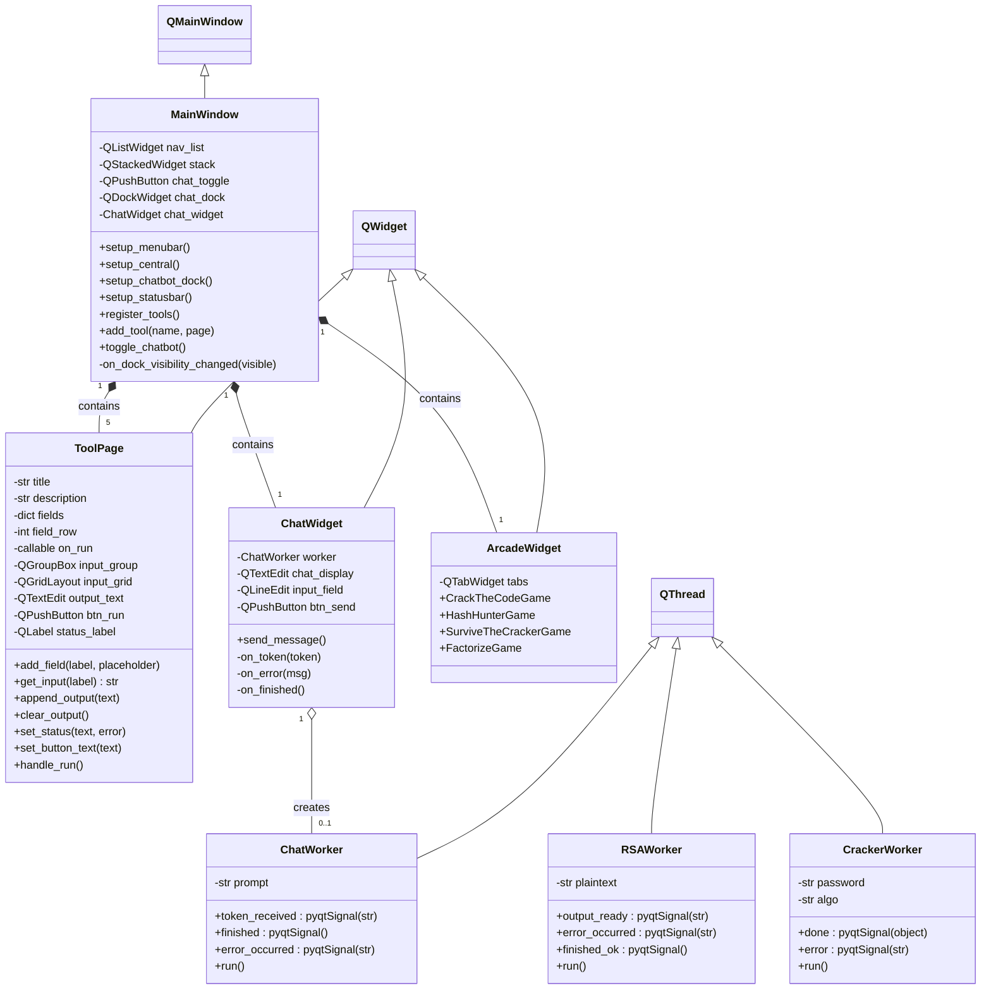
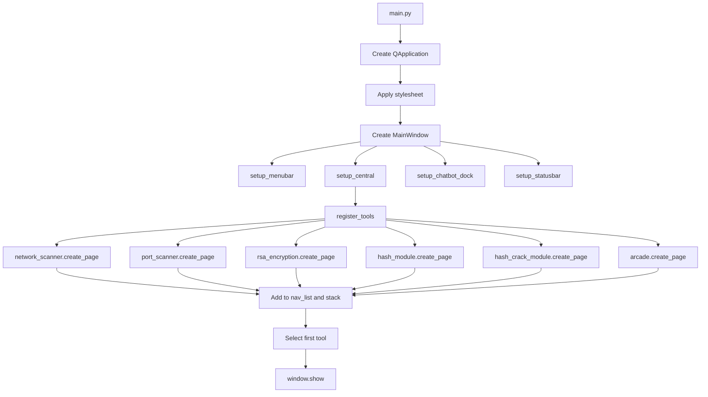
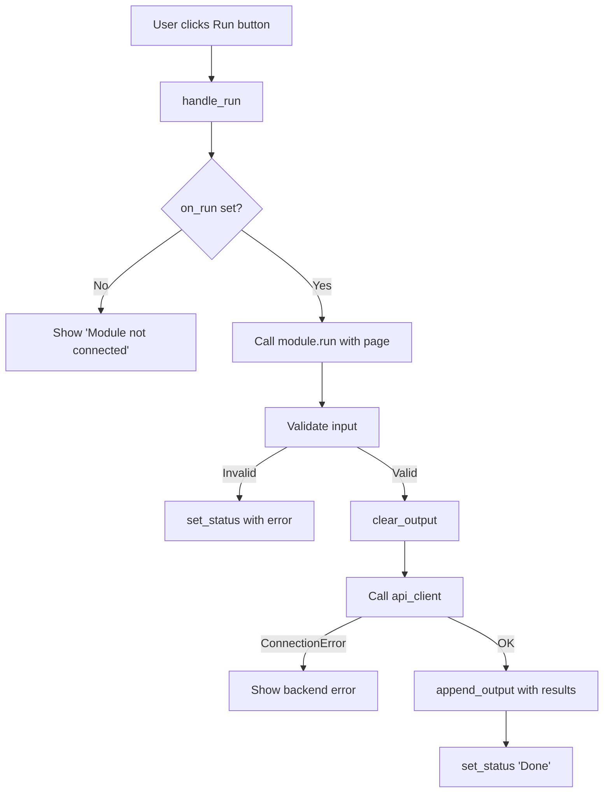
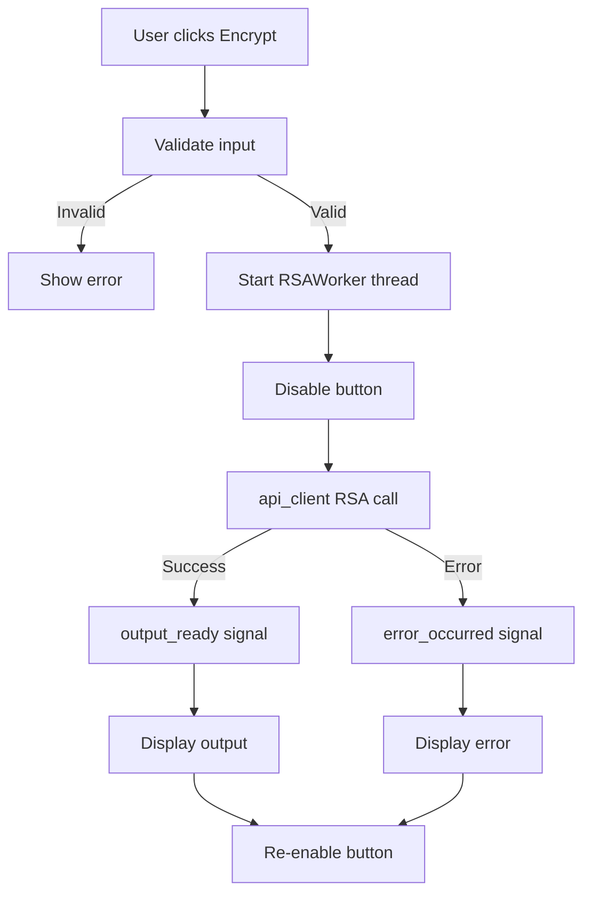
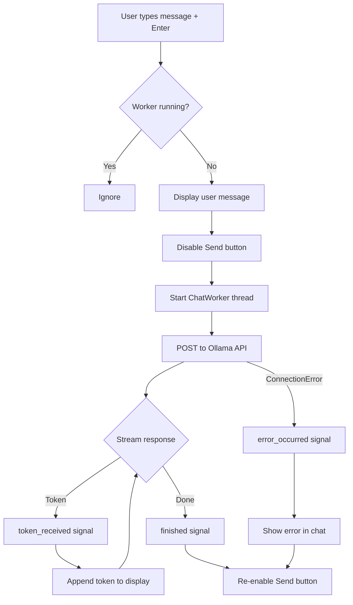
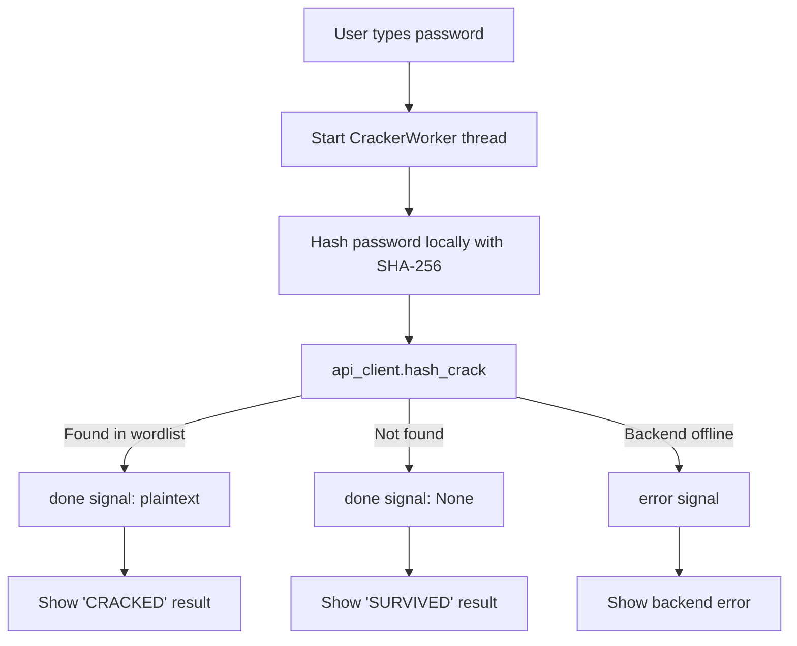

# Gilfi - Frontend Documentation

## Table of Contents

- [Overview](#overview)
- [Directory Structure](#directory-structure)
- [Setup](#setup)
- [Architecture](#architecture)
- [Class Diagram](#class-diagram)
- [Component Overview](#component-overview)
- [Tool Modules](#tool-modules)
- [Flow Charts](#flow-charts)
- [Module Interface](#module-interface)
- [Cross-Module Communication](#cross-module-communication)
- [Threading Model](#threading-model)
- [Styling](#styling)

---

## Overview

The Gilfi frontend is a PyQt6-based desktop application that provides a unified GUI for all Gilfi security tools. It follows a modular plugin-style architecture in which every tool implements a simple `create_page()` interface and gets registered in the main navigation list.

The frontend runs **natively** on the user's machine and talks to the dockerized backend over HTTP through a central `GilfiAPIClient`. The Ask Gilfi chatbot connects to a local Ollama service.

## Directory Structure

```
src/frontend/
├── main.py                      # Application entry point
├── api_client.py                # HTTP client for backend communication
├── ui/
│   ├── __init__.py
│   ├── mainwindow.py            # Main window with navigation + chatbot dock
│   ├── toolpage.py              # Reusable widget template for tool modules
│   ├── chatwidget.py            # Ask Gilfi chat interface (Ollama API)
│   └── style.py                 # Global dark theme stylesheet (QSS)
└── modules/
    ├── __init__.py
    ├── network_scanner.py       # Network device discovery
    ├── port_scanner.py          # Port scanning with service detection
    ├── rsa_encryption.py        # RSA encryption / decryption
    ├── hash_module.py           # Hash generation and identification
    ├── hash_crack_module.py     # Dictionary-based hash cracking
    └── arcade.py                # Mini-games that showcase the modules
```

## Setup

### Dependencies

```bash
pip install -r requirements.txt
```

This installs PyQt6, pyqt6-sip, and Requests.

### Run

```bash
cd src/frontend
python main.py
```

The frontend expects the backend to be reachable at `http://localhost:8000`. Start it via:

```bash
# Linux / Mac
./backend-docker.sh

# Windows
docker compose -f docker-compose.backend.yaml up -d
```

If the backend is unreachable, modules that need it will display a clear error in their output area; modules that work locally (Crack the Code, Hash Hunter, Factorize) keep working.

### Ask Gilfi Chatbot (optional)

Requires a running Ollama instance on `localhost:11435`:

```bash
# via container
podman start ollama

# or install Ollama natively: https://ollama.com
ollama pull granite4:350m
ollama create ask-gilfi -f src/backend/ask-gilfi-module/models/ask-gilfi-4:350m/modelfile.dockerfile
```

The chatbot is fully optional. The rest of the GUI works without it.

## Architecture

```
┌──────────────────────────────────────────────────────────────┐
│                         main.py                              │
│                    (Application Entry)                       │
│                           │                                  │
│              ┌────────────▼────────────┐                     │
│              │      MainWindow         │                     │
│              │    (QMainWindow)        │                     │
│              └──┬──────────┬───────┬───┘                     │
│                 │          │       │                         │
│      ┌──────────▼──┐  ┌────▼────┐  ▼─────────────┐           │
│      │  QListWidget │ │QStacked-│  │  QDockWidget │           │
│      │  (navList)   │ │ Widget  │  │  (chatDock)  │           │
│      │              │ │         │  │              │           │
│      │ - Network    │ │  Tool   │  │  ChatWidget  │           │
│      │ - Port       │ │  Pages  │  │   (Ollama)   │           │
│      │ - RSA        │◄┤         │  │              │           │
│      │ - Hash       │ │         │  │              │           │
│      │ - Hash Crack │ │         │  │              │           │
│      │ - Arcade     │ │         │  │              │           │
│      └──────────────┘ └────┬────┘  └──────────────┘           │
│                            │                                  │
│                   ┌────────▼────────┐                         │
│                   │ GilfiAPIClient  │ ──► localhost:8000      │
│                   └─────────────────┘                         │
└──────────────────────────────────────────────────────────────┘
```

The left navigation (`QListWidget`) controls which page is shown in the `QStackedWidget`. The Ask Gilfi chatbot lives in a `QDockWidget` that can be toggled, moved, or closed independently.

All tool modules access the backend through `api_client.py`, which wraps the REST endpoints exposed by the FastAPI backend.

## Class Diagram



## Component Overview

| Component | File | Responsibility |
|---|---|---|
| `MainWindow` | `ui/mainwindow.py` | Top-level window, navigation, menu bar, tool registration, chatbot dock |
| `ToolPage` | `ui/toolpage.py` | Reusable input/output template for every standard tool module |
| `ChatWidget` | `ui/chatwidget.py` | Chat UI for Ask Gilfi, manages `ChatWorker` thread |
| `ChatWorker` | `ui/chatwidget.py` | Background thread for streaming Ollama API responses |
| `RSAWorker` | `modules/rsa_encryption.py` | Background thread for running the RSA C binary |
| `CrackerWorker` | `modules/arcade.py` | Background thread for hash cracking calls in the arcade |
| `ArcadeWidget` | `modules/arcade.py` | Custom widget hosting four mini-games as tabs |
| `GilfiAPIClient` | `api_client.py` | Central HTTP client for all backend endpoints |
| `STYLESHEET` | `ui/style.py` | Global QSS dark theme |

## Tool Modules

The frontend registers six tools in the navigation list. Five are standard `ToolPage`-based modules; the Arcade is a custom widget.

| Module | Backend? | Description |
|---|---|---|
| **Network Scanner** | yes | Discovers reachable hosts on the local network |
| **Port Scanner** | yes | Scans TCP ports on a given target with service detection |
| **RSA Encryption** | yes | Encrypts and decrypts messages using a C binary on the backend |
| **Hash Module** | yes | Generates and identifies hashes (MD5, SHA-1, SHA-256, ...) |
| **Hash Crack Module** | yes | Cracks password hashes via a wordlist attack (rockyou.txt) |
| **Arcade** | partial | Four mini-games, see below |

### Arcade

The Arcade is a single navigation entry that contains four mini-games as inner tabs. It serves as a playful entry point and a live showcase of the surrounding modules.

| Game | Backend? | Showcases |
|---|---|---|
| **Crack the Code** | no | Caesar cipher puzzle - pure crypto math, no backend |
| **Hash Hunter** | no | Pick the word that produces the displayed hash; supports forwarding the hash to the Hash and Hash Crack modules |
| **Survive the Cracker** | yes | Type a password and watch the real Hash Crack module attack it live |
| **Factorize!** | no | Factor `N = p * q` to motivate why RSA is hard; manual level picker |

## Flow Charts

### Application Startup



### Tool Execution Flow (Generic)



### RSA Encryption Flow (Threaded)



### Ask Gilfi Chat Flow



### Survive the Cracker Flow (Arcade)



## Module Interface

Every standard tool module follows the same pattern. To add a new module:

**1. Create** `modules/your_module.py`:

```python
from ui.toolpage import ToolPage
import api_client

def create_page():
    page = ToolPage(
        title="Your Module",
        description="What it does."
    )
    page.add_field("Some Input", "placeholder text")
    page.set_button_text("Run")
    page.on_run = run
    return page

def run(page):
    value = page.get_input("Some Input")
    if not value:
        page.set_status("Missing input", error=True)
        return

    page.clear_output()
    page.set_status("Working ...")

    try:
        result = api_client.your_endpoint(value)
        page.append_output(f"Result: {result}")
        page.set_status("Done")
    except ConnectionError as e:
        page.set_status(f"Backend not available: {e}", error=True)
```

**2. Register** in `ui/mainwindow.py`:

```python
from modules import your_module

# inside register_tools():
tools = [
    ...
    ("Your Module", your_module.create_page()),
]
```

### ToolPage API

| Method | Description |
|---|---|
| `add_field(label, placeholder)` | Add a labeled input field |
| `get_input(label) -> str` | Get the trimmed text from a field |
| `set_button_text(text)` | Change the run button label |
| `clear_output()` | Clear the output area |
| `append_output(text)` | Append a line to output |
| `set_status(text, error=False)` | Show status message (green or red) |

For non-standard pages (such as the Arcade), modules can return any `QWidget` subclass directly from `create_page()` instead of a `ToolPage`.

## Cross-Module Communication

The Arcade module forwards data into other tool pages. For example, the Hash Hunter game can send its current target hash into the Hash Module or Hash Crack Module with one click.

This is implemented in `modules/arcade.py` via two helpers that walk up to the `MainWindow` and access the navigation and stack:

```python
def _send_to_module(widget, module_name, field_values, auto_run=False):
    """Switch to the target tool page, prefill its fields,
    and optionally trigger its run button."""
    mw = widget.window()
    # find nav entry by name, prefill ToolPage.fields, switch tab,
    # optionally call page.handle_run()
```

This keeps modules independent (no direct imports of one another) while still allowing them to cooperate. If a target module is missing, the call fails gracefully and shows a status-bar message.

## Threading Model

Long-running operations use `QThread` to keep the GUI responsive:

| Operation | Thread Class | Communication |
|---|---|---|
| RSA encryption / decryption | `RSAWorker` | `output_ready`, `error_occurred`, `finished_ok` |
| Ask Gilfi chat (Ollama API) | `ChatWorker` | `token_received`, `error_occurred`, `finished` |
| Hash cracking (Arcade) | `CrackerWorker` | `done`, `error` |

All workers follow the same pattern: the main thread creates the worker, connects signals to slots, and starts the thread. The worker emits signals that update the UI from the main thread (Qt requirement - widgets must only be touched from the thread that created them).

```
Main Thread                    Worker Thread
     │                              │
     ├── create worker ────────────►│
     ├── connect signals            │
     ├── worker.start() ──────────►│
     │                              ├── do work
     │◄── signal (token/output) ────┤
     ├── update UI                  │
     │◄── signal (finished) ────────┤
     ├── re-enable button           │
     │                              ▼
```

## Styling

The application uses a global QSS stylesheet defined in `ui/style.py`. The theme is a dark color scheme with the following palette:

| Element | Color | Hex |
|---|---|---|
| Background | Dark navy | `#1a1a2e` |
| Navigation / Menu | Darker navy | `#16213e` |
| Accent / Borders | Deep blue | `#0f3460` |
| Primary accent | Light blue | `#53a8d8` |
| Success / Output text | Green | `#4ade80` |
| Error | Red | `#f06b78` |
| Muted text | Gray-purple | `#8a8aa0` |
| Input background | Near black | `#0f0f23` |

Widgets are styled via `objectName` selectors (e.g. `#btnRun`, `#navList`, `#chatToggle`) to keep styles scoped and avoid conflicts. The Arcade module ships its own scoped styles for the level-picker, secondary action buttons, and inner tab bar to stay visually consistent with the rest of the GUI without depending on objects defined by the global stylesheet.
