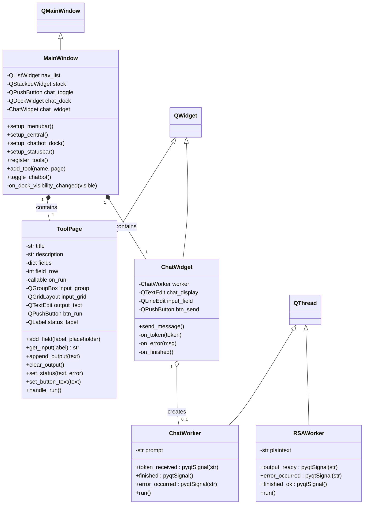
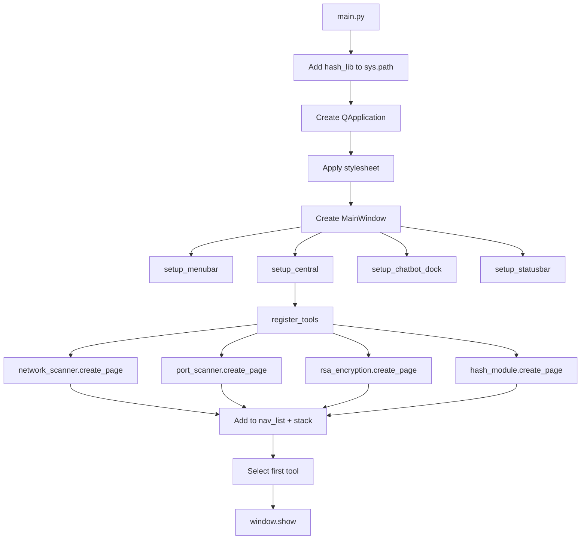
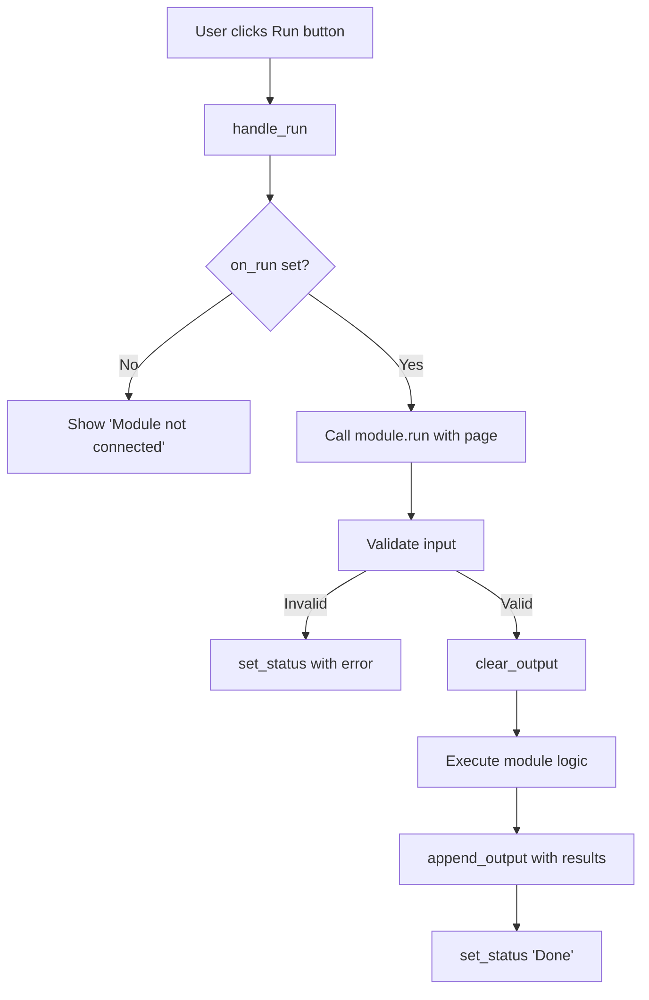
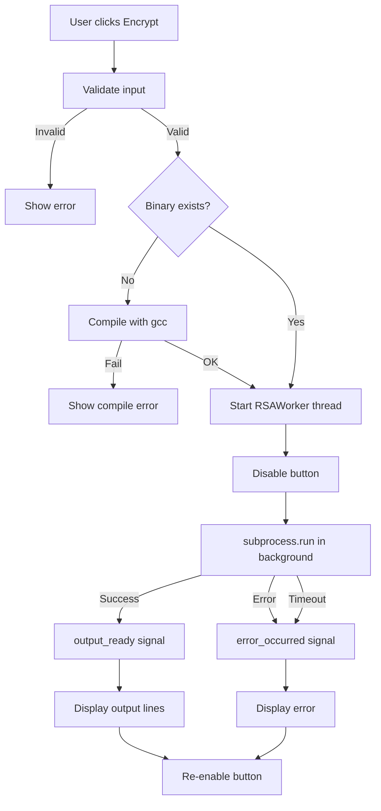
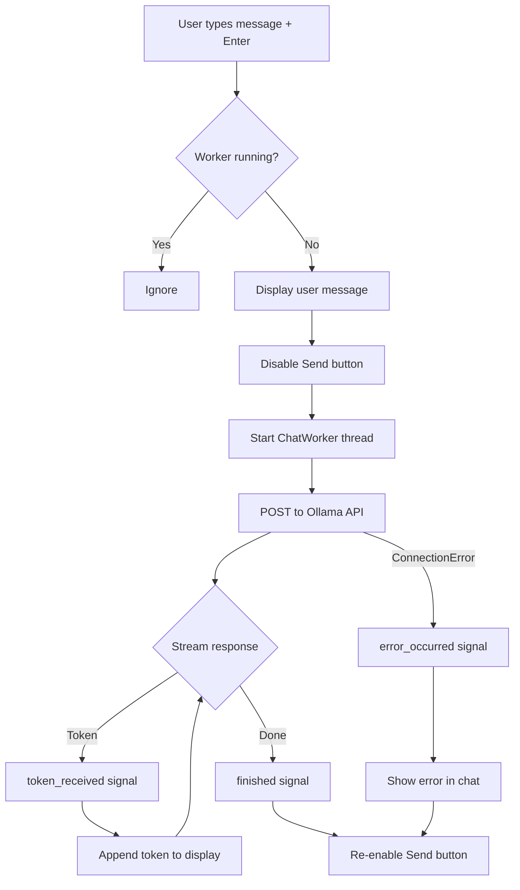

# Gilfi - Frontend Documentation

## Table of Contents

- [Overview](#overview)
- [Directory Structure](#directory-structure)
- [Setup](#setup)
- [Architecture](#architecture)
- [Class Diagram](#class-diagram)
- [Component Overview](#component-overview)
- [Flow Charts](#flow-charts)
- [Module Interface](#module-interface)
- [Threading Model](#threading-model)
- [Styling](#styling)
- [Future: API Client Migration](#future-api-client-migration)

---

## Overview

The Gilfi frontend is a PyQt6-based desktop application that provides a unified GUI for all Gilfi security modules. It follows a modular plugin-style architecture where each tool implements a simple `create_page()` interface and gets registered in the main navigation.

The frontend runs **natively** on the user's machine. Backend services (hash-lib, RSA binary, Ollama chatbot) are accessed either through direct imports, subprocess calls, or HTTP requests.

## Directory Structure

```
src/frontend/
├── main.py                      # Application entry point
├── ui/
│   ├── __init__.py
│   ├── mainwindow.py            # Main window with navigation + chatbot dock
│   ├── toolpage.py              # Reusable widget template for tool modules
│   ├── chatwidget.py            # Ask Gilfi chat interface (Ollama API)
│   └── style.py                 # Global dark theme stylesheet (QSS)
└── modules/
    ├── __init__.py
    ├── network_scanner.py       # Network scan module (placeholder)
    ├── port_scanner.py          # Port scan module (placeholder)
    ├── rsa_encryption.py        # RSA module (calls C binary)
    └── hash_module.py           # Hash module (uses backend hash_lib)
```

## Setup

### Dependencies

```bash
pip install PyQt6 requests
```

### Run

```bash
cd src/frontend
python main.py
```

### Ask Gilfi Chatbot (optional)

Requires a running Ollama instance on `localhost:11434`:

```bash
# via container
podman start ollama

# or install Ollama natively: https://ollama.com
ollama pull granite4:350m
ollama create ask-gilfi -f src/backend/ask-gilfi-module/models/ask-gilfi-4:350m/modelfile.dockerfile
```

## Architecture

```
┌──────────────────────────────────────────────────────────────┐
│                         main.py                              │
│                    (Application Entry)                       │
│                           │                                  │
│              ┌────────────▼────────────┐                     │
│              │      MainWindow         │                     │
│              │    (QMainWindow)        │                     │
│              └──┬──────────┬───────┬───┘                     │
│                 │          │       │                          │
│      ┌──────────▼──┐  ┌───▼────┐  ▼─────────────┐           │
│      │  QListWidget │  │QStack- │  │  QDockWidget │           │
│      │  (navList)   │  │Widget  │  │  (chatDock)  │           │
│      │              │  │        │  │              │           │
│      │ - Network    │  │ Tool   │  │  ChatWidget  │           │
│      │ - Port       │◄─┤ Pages  │  │   (Ollama)   │           │
│      │ - RSA        │  │        │  │              │           │
│      │ - Hash       │  │        │  │              │           │
│      └──────────────┘  └────────┘  └──────────────┘           │
└──────────────────────────────────────────────────────────────┘
```

The left navigation (`QListWidget`) controls which `ToolPage` is shown in the `QStackedWidget`. The Ask Gilfi chatbot lives in a `QDockWidget` that can be toggled, moved, or closed independently.

## Class Diagram



## Component Overview

| Component | File | Responsibility |
|---|---|---|
| `MainWindow` | `ui/mainwindow.py` | Top-level window, navigation, menu bar, tool registration, chatbot dock |
| `ToolPage` | `ui/toolpage.py` | Reusable input/output template for every module |
| `ChatWidget` | `ui/chatwidget.py` | Chat UI for Ask Gilfi, manages `ChatWorker` thread |
| `ChatWorker` | `ui/chatwidget.py` | Background thread for streaming Ollama API responses |
| `RSAWorker` | `modules/rsa_encryption.py` | Background thread for running the C binary |
| `STYLESHEET` | `ui/style.py` | Global QSS dark theme |

## Flow Charts

### Application Startup



### Tool Execution Flow (Generic)



### RSA Encryption Flow (Threaded)



### Ask Gilfi Chat Flow



## Module Interface

Every tool module follows the same pattern. To add a new module:

**1. Create** `modules/your_module.py`:

```python
from ui.toolpage import ToolPage

def create_page():
    page = ToolPage(
        title="Your Module",
        description="What it does."
    )
    page.add_field("Some Input", "placeholder text")
    page.set_button_text("Run")
    page.on_run = run
    return page

def run(page):
    value = page.get_input("Some Input")
    if not value:
        page.set_status("Missing input", error=True)
        return

    page.clear_output()
    page.set_status("Working ...")

    # do stuff
    page.append_output(f"Result: {value}")
    page.set_status("Done")
```

**2. Register** in `ui/mainwindow.py`:

```python
from modules import your_module

# inside register_tools():
tools = [
    ...
    ("Your Module", your_module.create_page()),
]
```

### ToolPage API

| Method | Description |
|---|---|
| `add_field(label, placeholder)` | Add a labeled input field |
| `get_input(label) -> str` | Get the trimmed text from a field |
| `set_button_text(text)` | Change the run button label |
| `clear_output()` | Clear the output area |
| `append_output(text)` | Append a line to output |
| `set_status(text, error=False)` | Show status message (green or red) |

## Threading Model

Long-running operations use `QThread` to keep the GUI responsive:

| Operation | Thread Class | Communication |
|---|---|---|
| RSA encryption (C binary) | `RSAWorker` | `output_ready`, `error_occurred`, `finished_ok` signals |
| Ask Gilfi chat (Ollama API) | `ChatWorker` | `token_received`, `error_occurred`, `finished` signals |

Both workers follow the same pattern: the main thread creates the worker, connects signals to slots, and starts the thread. The worker emits signals that update the UI from the main thread (Qt requirement).

```
Main Thread                    Worker Thread
     │                              │
     ├── create worker ────────────►│
     ├── connect signals            │
     ├── worker.start() ──────────►│
     │                              ├── do work
     │◄── signal (token/output) ────┤
     ├── update UI                  │
     │◄── signal (finished) ────────┤
     ├── re-enable button           │
     │                              ▼
```

## Styling

The application uses a global QSS stylesheet defined in `ui/style.py`. The theme is a dark color scheme with the following palette:

| Element | Color | Hex |
|---|---|---|
| Background | Dark navy | `#1a1a2e` |
| Navigation / Menu | Darker navy | `#16213e` |
| Accent / Borders | Deep blue | `#0f3460` |
| Primary accent | Light blue | `#53a8d8` |
| Success / Output text | Green | `#4ade80` |
| Error | Red | `#f06b78` |
| Muted text | Gray-purple | `#8a8aa0` |
| Input background | Near black | `#0f0f23` |

All widgets are styled via `objectName` selectors (e.g. `#btnRun`, `#navList`, `#chatToggle`) to keep styles scoped and avoid conflicts.

## Future: API Client Migration

When the backend is containerized, the modules will switch from direct imports / subprocess calls to HTTP requests via a central `GilfiAPIClient`:

```
Current:    module → hash_lib (direct import)
            module → rsa-module (subprocess)

Future:     module → GilfiAPIClient → Backend API (HTTP)
```

The `ToolPage` interface stays the same. Only the `run()` functions inside each module need to be updated to use the API client instead of local calls.
